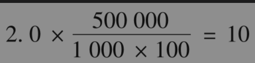
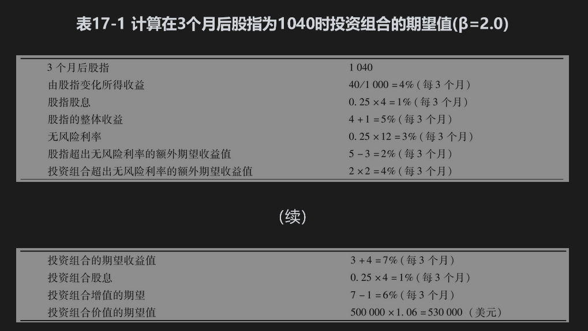
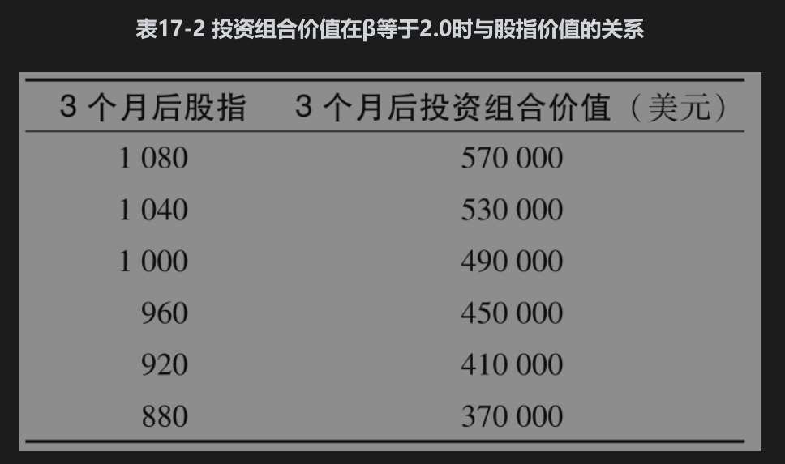

# 17.1 股指期权

有若干家交易所交易股指期权。这些股指中有的反映市场的整体走向，而其他一些是基于某个行业的行情（例如，计算机技术、原油与天然气、交通或电信等行业）。芝加哥期权交易所(CBOE)交易的股指期权包括标准普尔100指数上的美式与欧式期权（OEX与XEO）、标准普尔500指数上的欧式期权(SPX)、道琼斯工业平均指数上的欧式期权(DJX)，以及纳斯达克100指数上的欧式期权(NDX)。在第10章里，我们曾提到过芝加哥期权交易所交易个体股票上的LEAPS与灵活期权，该交易所也提供关于股指上的这些期权交易。

每份股指期权合约的标的资产通常为指数值的100倍（注意，用于道琼斯指数上期权的股指为道琼斯指数报价的0.01倍）。股指期权是以现金形式结算的，这意味着在行使期权时，看涨期权持有者收入的现金额(S-K)×100，而期权承约者则需要支付这个数量的现金，这里的S为期权行使日休市时的指数值，K为执行价格。看跌期权持有者在行使时收入现金额(K-S)×100，而期权承约人则需要支付这个数量的现金。

## 17.1.1 投资组合保险

投资组合管理人可以利用股指期权控制价格下跌的风险。假定今天的股指值为S0，考虑某个风险分散程度很好的投资组合管理人，假设其组合的β系数为1.0。这意味着该组合的收益与股指的收益互相对应。假定投资组合的股息收益率与股指的股息收益率相同，这样我们认为投资组合价值的百分比变化大约等于股指值百分比的变化。由于每份期权合约的标的资产为指数值的100倍，如果对于投资组合中的每100S0美元资产买入一份执行价格为K的看跌期权，那么组合管理人就可以使投资组合价值在股指低于K时得到保护。假定投资组合的价值为500000美元，而股指的取值为1000。这时，组合的价值等于500乘上指数值，所以投资组合管理人买进5份3个月期限、执行价格为900的看跌期权就可以得到在3个月后投资组合价值不会低于450000美元的保险。

为了说明这一保险的运作过程，我们假定在3个月后股指下跌到了880。这时投资组合的价值大约为440000美元。期权的收益为5×(900-880)×100=10000美元，这就将投资组合的总价值提到了所保的450000美元。

## 17.1.2 当投资组合的β不等于1.0时

如果投资组合的β不等于1.0，那么对于投资组合中每100S0的价值，我们必须买入β数量的看跌期权，这里S0为股指的当前值。假定我们刚才所讨论的价值为500000美元投资组合的β为2.0，而不是为1.0，我们仍假设股指取值为1000，这时需要买入的看跌期权数量为

而不是前面计算的数量5。

为了确定合适的执行价格，我们可以采用资本资产定价模型（见附录3A）。假定无风险利率为12%，投资组合与股指的股息收益率均为4%，我们买入保险的目的是使得在3个月后投资组合的价值不低于450000美元。由资本资产定价模型得出，投资组合超出无风险利率之上的额外收益等于β乘以股指组合超出无风险利率之上的额外收益。这个模型使得我们能够由股指在3个月后的不同取值来计算组合价值的期望值。表17-1给出了股指取值为1040的情形。这时，投资组合价值在3个月后的期望值为530000美元。当股指为其他值时，我们也可以通过类似的计算得出组合的值。表17-2给出了计算结果。买入期权的执行价格应等于投资组合被保护的目标价值所对应的股指取值。这样当投资组合的保护价值为450000美元，买入的10份看跌期权的执行价格为960。

为了说明保险的作用，假定股指在3个月后下跌到880，由表17-2所示，投资组合价值大约为370000美元，看跌期权的收益为(960-880)×10×100=80000美元，这一数量刚好是投资组合管理人将投资组合价值由370000美元提到450000美元所需要的资金数量。

以上例子说明了当β增大时，对冲的成本也会增大的两个理由：所需的看跌期权数量增加，同时期权的执行价格也会提高。

