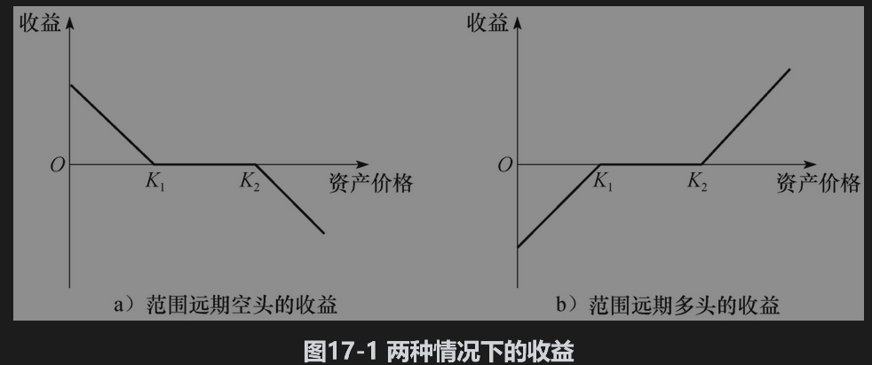
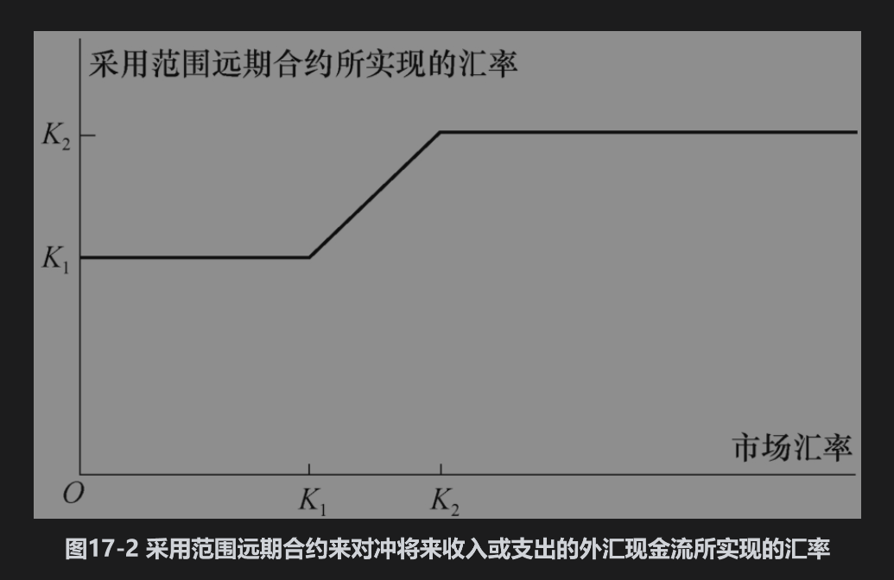

# 17.2 货币期权

货币期权主要在场外市场上交易。该市场的优点是交易者可以进行大额交易，并且该市场可以对产品的执行价格、到期日及其他特征进行特殊设计来满足公司资金部的需要。虽然美国纳斯达克也进行货币期权交易，但对于这类期权，交易所交易市场的规模远小于场外市场。

一个欧式看涨期权的例子如下：期权持有人有权以汇率1.1000的价格买入100万欧元。假设在期权到期时实际汇率为1.1500，期权收益为1000000×(1.1500-1.1000)=50000美元。与此相似，一个欧式看跌期权的例子是给期权持有者以汇率0.7000的价格卖出1000万澳元的权利。假如在期权到期时实际汇率为0.6700，期权收益为10000000×(0.7000-0.6700)=300000美元。

一家希望对冲外汇头寸风险的公司可以用外汇期权替代外汇远期合约。在未来某一确定时间会收到英镑的公司可以买入在同一时间到期的英镑看跌期权来对冲风险，这种对冲策略将保证英镑汇率不低于执行价格，而且同时允许公司从有利的汇率变动中获利。与此类似，在未来某个确定的时间将支付英镑的公司可以买入在同一时刻到期的英镑看涨期权来对冲风险。这时期权会保证购买英镑的费用不高于某一水平，而且同时允许公司从有利的汇率变动中获利。远期合约锁定了将来某笔外汇交易中的汇率，而期权则提供了一种保险。这种保险并不是没有代价的：签订远期合约时无须付费，但获得期权时则需要首先付出一定的费用。

## 范围远期合约

范围远期合约(range forward contract)是标准远期合约的变形，这一合约可用于对冲外汇风险。考虑某家美国公司，该公司得知在3个月后将接受100万英镑。假定3个月期的远期汇率为每英镑1.3200美元。这家公司可以签订在3个月后卖出100万英镑的远期合约空头来锁定汇率。这样做的结果是确定在3个月后公司付出100万英镑的同时将收入132万美元。

另一种做法是买入执行价格为K1的欧式看跌期权，同时卖出执行价格为K2的欧式看涨期权，其中K1<1.3200< K2。 这种策略称为范围远期合约的空头，其收益显示在图17-1a中，该交易策略的两个期权都是针对100万英镑。在3个月后，如果汇率低于K1，这时看跌期权将被行使，因此公司能够以K1的价格卖出100万英镑；当汇率介于K1与K2之间时，两个期权均不会被行使，公司以市场汇率价格卖出英镑；如果汇率高于K2，这时看涨期权将被行使，从而公司可以按汇率K2卖出100万英镑。图17-2显示了100万英镑外汇交易所实现的汇率。

如果该公司知道3个月后将支出而不是收入100万英镑，这时公司可以卖出执行价格为K1的欧式看跌期权并同时买入一个执行价格为K2的欧式看涨期权。这种策略称为范围远期合约的多头，其收益显示在图17-1b中。如果在3个月后汇率低于K1，看跌期权将被行使，公司以汇率K1买入100万英镑；如果汇率介于K1与K2之间，两个期权均不会被行使，公司能够以市场汇率买入100万英镑；如果汇率高于K2，看涨期权将被行使，从而公司能够以K2的汇率买入100万英镑。买入100万英镑所付汇率与前面收入100万英镑的汇率相同（见图17-2）。

在实际中，构造范围远期时往往会使看跌期权价格等于看涨期权价格，从而范围远期合约的成本为零，这与建立普通远期合约的成本为零相似。假定美国与英国的利率均为2%，外汇即期汇率为1.3200（与远期汇率相同）。进一步假设汇率波动率为14%。我们可以利用DerivaGem来说明执行价格为1.3000的看跌期权与执行价格为1.3414的看涨期权价格相同（均为0.0273）。因此，令K1=1.3000,K2=1.3414，这样我们例子中的合约成本将为零。

当一个范围远期合约中看涨与看跌期权的执行价格越来越接近时，范围远期合约会成为一个普通远期合约。图17-1a中范围远期合约的空头会变为远期合约的空头，而图17-1b中范围远期合约的多头则会变成远期合约的多头。