# 17.3 支付

已知连续股息率的股票期权在这一节里，我们会建立一个简单规则，利用这一规则我们可以将无股息股票上欧式期权公式的结果推广到支付已知连续股息率的股票期权上，然后我们将说明如何利用这些结果来推导关于股指与货币期权的定价公式。

假设股息收益率为每年q（连续复利）。股息会使得股票价格在除息日的价格下跌幅度等于股息量。连续股息收益率q会使得股票价格增长幅度比无股息的同样股票价格增长幅度减少q。如果支付连续股息收益率q，股票价格将从S0增长到T时刻的价格ST，那么在没有股息的情况下，该股票将从今天的价格S0增长到T时刻的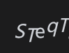。换句话讲，在没有股息时股票价格会从今天的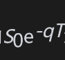增长到T时刻的价格ST。

这一分析说明，在以下两种情形下股票价格在时间T会有相同的概率分布：

(1)股票起始价格为S0，该股票支付连续股息收益率q。

(2)股票起始价格为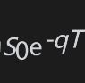，该股票无任何股息。

这样我们可以得出一个简单规则：当我们对于期限为T而且支付股息收益率为q的股票上欧式期权进行定价时，我们可以将今天的股票价格由S0降至S0e-qT，然后我们可以将期权按无股息的股票期权来处理。

## 17.3.1 期权价格的下限

作为以上规则的第一个应用，我们考虑如何确定一个股息收益率为q的股票上欧式看涨期权价格的下限。将不等式(11-4)中的S0用S0e-qT来代替时，我们得出一个欧式看涨期权价格c的下限

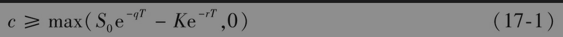

我们也可以通过考虑以下两个投资组合来直接证明这一点：

组合A：一份欧式看涨期权加上数量为Ke-rT的现金。

组合B：e-qT股股票，其中股息被投资于股票上。

为了取得欧式看跌期权的下限，我们可以类似地将式(11-5)中的S0用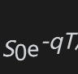代替而得出

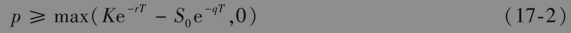

这一结果也可以通过考虑以下两个投资组合来直接得出：

组合C：一份欧式看跌期权加上e-qT股股票，其中股息被投资于股票上。

组合D：数量为的现金。

## 17.3.2 期权平价关系

将式(11-6)中的S0由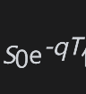代替，我们可以得出股息收益率为q的股票期权的期权平价关系

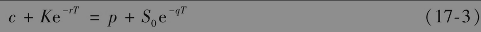

这一结果也可以通过考虑以下两个投资组合来直接证明：

组合A：一份欧式看涨期权加上数量为Ke-rT的现金。

组合C：一份欧式看跌期权加上e-qT只股票，其中股息又被投资于该股票上。

以上两个投资组合在时间T的价值均为max(ST,K)，因此它们今天的价格必须相同，从而我们可得出由式(17-3)所表达的期权平价关系。对于美式期权，看跌-看涨关系式如下（见练习题17.16）

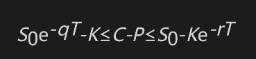

## 17.3.3 定价公式
将式(15-20)和式(15-21)中的S0由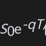代替，我们可以得出股息收益率为q的股票上欧式看涨期权价格c与欧式看跌期权价格p

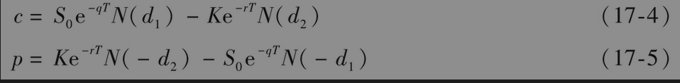

因为

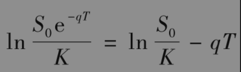

所以d1、d2分别由以下公式给出

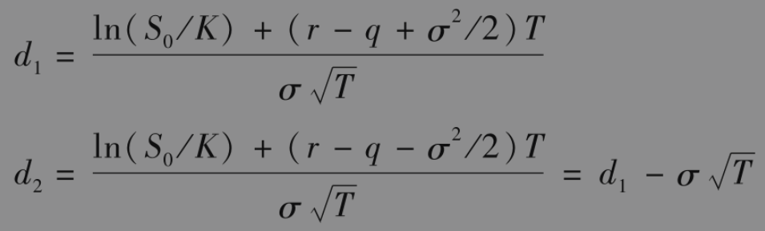

这些结果最早是由默顿给出的。如在第15章中讨论的那样，为了定价的目的，这里的股息应被定义成在除息日由于所宣布支付券息而引起股票价格下跌的数量。如果在期权有效期内股息收益率为已知，但并不是常数，式(17-4)和式(17-5)仍然成立。这时公式中的q等于期权期限内股息的平均年收益率。

## 17.3.4 微分方程和风险中性定价

通过求解期权价格所满足的微分方程或者利用风险中性定价公式，我们可以更正式地证明式(17-4)和式(17-5)。

当我们在第15.6节的分析里包括股息收益率q时，微分方程式(15-16)变为

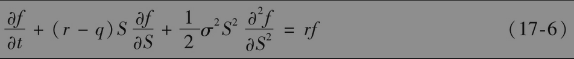

与式(15-16)相似，这个方程中也不含有任何关于风险偏好的变量。因此，我们可以采用在第15.7节中所描述的风险中性定价方法。

在风险中性世界里，股票的整体收益率一定等于r。因为股息收益率为q，所以股票的预期增长率等于r-q。因此，股票价格服从以下风险中性过程

为了给出关于股息收益率为q的股票上期权的等价公式，我们可以将股票的增长率期望设成r-q，然后以贴现率r对期望收益贴现。当股票的增长率期望为r-q时，股票在T时刻价值的期望值为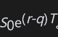 。利用与附录15A中类似的分析，我们可以得出看涨期权收益在风险中性世界里的期望值为

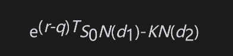

其中d1和d2由上面表达式给出。以利率r进行贴现后，我们可以得到式(17-4)。