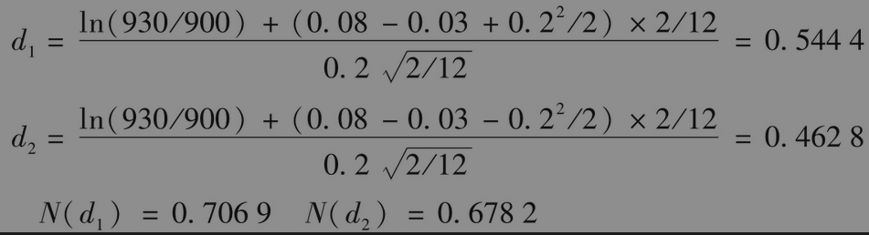
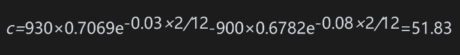
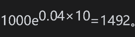
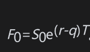
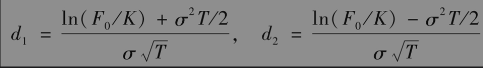
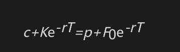
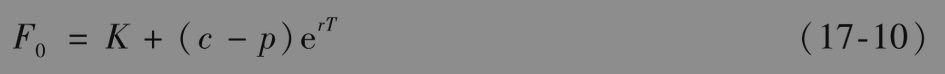
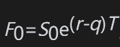
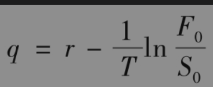
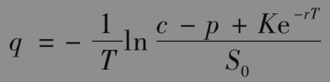

# 17.4 欧式股指期权的定价

在第5章里对股指期货定价时，我们曾假设可以将股指看作支付已知股息收益率的股票。在对股指期权定价时，我们也可以采用类似的假设。这意味着：不等式(17-1)与式(17-2)提供了关于欧式股指期权的下限，式(17-3)是关于欧式股指期权的期权平价关系，式(17-4)和式(17-5)可用来对欧式股指期权定价，二叉树可以用来对美式期权定价。在所有这些情形下，S0等于当前股指值，σ为股指的波动率，q为期权期限内股息按连续复利的平均年收益率。

【例17-1】 考虑一个标准普尔500指数上的欧式看涨期权，期权期限为2个月，股指的当前值为930，执行价格为900，无风险利率为每年8%，波动率为每年20%。在第1个月与第2个月内预计股指将分别支付收益率为0.2%和0.3%的股息。这时S0=930,K=900,r=0.08，σ=0.2，T=2/12。在期权期限内的总股息率为0.2%+0.3%=0.5%，所对应的年股息率为3%，因此q=0.03和

因此由式(17-4)给出的期权价格c为

如果一份合约的标的资产是100乘以股指，其价值则为5183美元。

在计算q时，我们应该只考虑除息日在期权有效期内的股息。在美国，股票除息日往往是在2月、5月、8月和11月的第1周，因此在任意给定时刻，q往往会与期权的期限有关。对于其他国家的股票指数，情况更是如此。例如，日本所有的公司往往都采用同一个除息日。

如果我们假设股指中所含股息的绝对数量（而不是连续收益率）是已知的，我们可以采用标准布莱克-斯科尔斯-默顿公式，这时只需在初始股票价格中除去股息的贴现值。在第15章里对提供已知股息的股票期权定价时，我们曾推荐了这一方法，但这一方法可能很难适用于一个包含许多股票的股指，这是因为在计算过程中我们将会需要股指所含每只股票的股息信息。

有时人们会认为从长远来讲，一个充分分散的股票组合收益肯定会好过一个具有同样初始价值的债券组合收益。如果真是这样的话，那么一个有权将股指卖出价等于债券组合价格的长期看跌期权会非常便宜。但事实上，就像业界事例17-1指出的那样，这种看跌期权的价格非常昂贵。

## 业界事例17-1

## 我们是否可以保证从长远来讲股票收益一定优于债券的收益

人们常说，长线投资者应该购买股票而不是债券。考虑某个美国基金经理，他试图说服那些作为长线投资的人应当购买一个模拟标准普尔500指数的股票基金。该投资经理可能向投资者保证其基金在今后10年内的收益至少要好过无风险债券的收益率。从历史数据来看，在美国几乎在每个10年时间段内股票收益都要好过债券收益。似乎看来基金经理的承诺不太值钱。事实上，这种承诺非常昂贵。假定股指今天的值为1000，股息收益率为每年1%，股指波动率为15%，10年的无风险利率为每年5%。要想比债券投资绩效好的话，股指每年的收益要高于5%。因为股息收益率为1%，因此资本收益增长率至少为4%，这意味着10年后的股指水平至少为

基金经理在这里对标准普尔500指数上的1000美元投资进行保证，保证投资的收益高于债券收益，该基金经理的保证等价于一个10年期限执行价格为1492美元的看跌期权。这一看跌期权可由式(17-5)来定价：在计算中输入的参数为S0=1000,K=1492，r=5%，σ=15%，T=10,q=1%，看跌期权价格为169.7美元。这说明基金经理所做出的承诺大约等于股指基金价格的17%，这种承诺显然是不能随便给出的。

## 17.4.1 远期价格与股息收益率

估计定义F0为股指上在时间T到期的远期价格。如式(5-3)所示，。这意味着式(17-4)和式(17-5)中的欧式看涨期权价格c和欧式看跌期权价格p为

其中

期权平价关系式(17-3)变为

或

使用远期价格以及式(17-8)和式(17-9)的优势是避免了估计股指上的股息收益率。市场对股指所预期的股息收益率已经反应在远期价格上了。股指上的期货价格可以假设与远期价格相同，因此可以利用期货市场上的期货价格来估计相应期限的远期价格。假设同时有相同执行价格、相同期限的欧式看跌与看涨期权的市场交易（这并不罕见），式(17-10)可用来对相应权限的股指远期价格进行估计。

一旦得到了对于一系列期限的远期价格后（至少近似地），我们可以估计描述远期价格作为期限函数的光滑曲线，利用式(17-8)和式(17-9)可以确定一系列不同期限的欧式指数期权价格。

当计算指数上美式期权价格时，需要估计在期权期限内的平均股息收益率。因为，在远期合约期限内的平均股息收益率可以估计为

也可以利用具有相同执行价格与期限的欧式看涨期权和看跌期权来估计：由(17-3)得出

对于一个特定的执行价格和期限，由以上表达式估计的q不一定可靠，但如果将许多配对的看涨和看跌期权汇集到一起，我们将可以得出有关市场上对于股息收益率结构所做假设的清晰图像。

