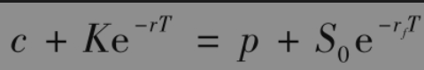
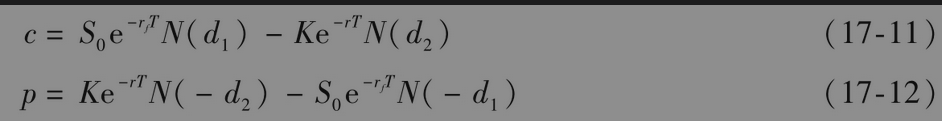
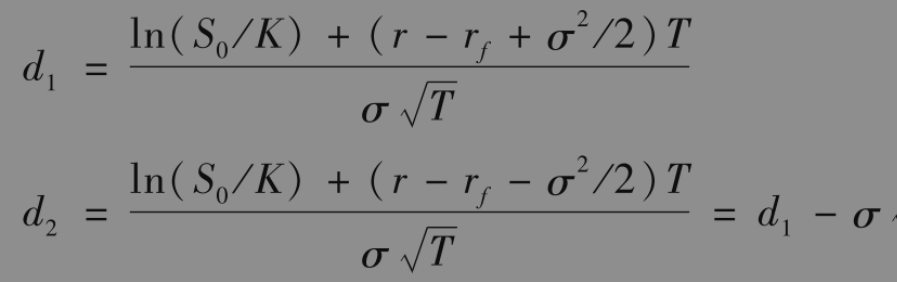
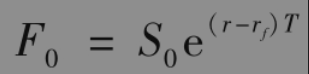
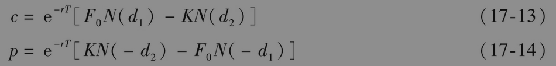
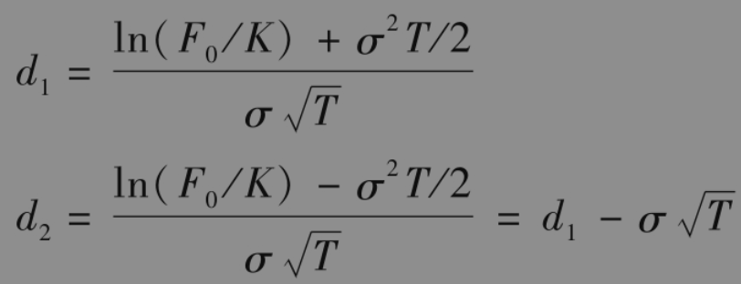

# 17.5 欧式货币期权的定价

为了对货币期权定价，我们定义S0为即期汇率。精确地讲，S0为一个单位的外币所对应的美元数量。在第5.10节中我们曾讲过，外币与支付连续股息收益率的股票相似：外币持有者收入的股息收益率等于外币无风险利率rf（以外币计）。将不等式(17-1)和式(17-2)中的q由rf替代，我们得出欧式看涨期权c和欧式看跌期权p的下限

将式(17-3)中的q由rf替代，我们可以得出对于货币期权的期权平价关系

最后，将式(17-4)和式(17-5)中的q由rf替代，我们可得出欧式货币期权的定价公式

其中

国内和国外的无风险利率分别对应于期限为T的利率。

【例17-2】 考虑一个4个月期限的英镑/美元欧式看涨期权。假定当前英镑/美元汇率为1.6000，期权执行价格为1.6000，美国无风险利率为每年8%，英国无风险利率为每年11%，期权价格为4.3美分。这里S0=1.6，K=1.6，r=0.08，rf=0.11，T=0.3333与c=0.043。我们可以通过试错法来求取隐含波动率：波动率为20%时，期权价格为0.0639；波动率为10%，期权价格为0.0285；依此类推，最终我们得出隐含波动率为14.1%。

货币上的看跌与看涨期权具有对称性质：以货币B买入货币A，执行价格为K的看跌期权等价于对于以货币A买入单位货币B的执行价格为1/K的看涨期权（见练习题17.12）。

## 17.5.1 使用远期汇率

于银行与其他金融机构很频繁地交易远期汇率合约，因此常常会利用远期汇率为期权定价。由式(5-9)得出，对应于期限T的远期汇率为

这一结果可将式(17-11)和式(17-12)简化为

其中

式(17-13)和式(17-14)与式(17-8)和式(17-9)相似。在第18章里，我们将看到对任何资产的即期价格上的欧式期权，我们均可以通过由式(17-13)和式(17-14)所给出的对于资产远期或期货上的期权形式来定价。注意，期货或远期的期限与欧式期权的期限必须相同。

