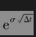
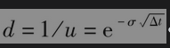
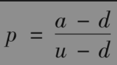
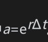
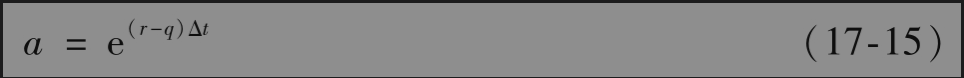
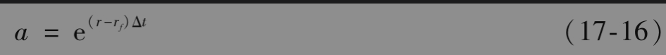

# 17.6 美式期权

如第13章中所述，二叉树可以用来对美式股指和货币期权定价。与无股息股票的情形相同，我们将决定价格上涨幅度的参数u取为，其中σ为波动率，Δt为时间步长，决定价格下跌幅度的参数。对于无股息股票，价格上涨所对应的概率

其中。对于股指和货币期权，计算p的公式不变，但是要将a的定义做些变化：对于股指期权

其中q为股息收益率；对于货币期权

其中rf为外国的无风险利率。第13.11节中的例13-1展示了如何利用两步二叉树来对一个股指期权定价。例13-2展示了如何构造一个三步二叉树来对一个货币期权定价。在第21章里，我们将给出更多关于利用二叉树来对股指和货币期权定价的例子。

在某些情形下，提前行使美式货币期权或股指期权会是最优的选择。因此，美式货币期权和股指期权比相应的欧式期权价值会更高。一般来讲，高利率货币上的看涨期权和低利率货币上的看跌期权更可能会被提前行使。这是因为高利率货币会更容易贬值，而低利率货币会更容易升值。还有，高股息收益率股指上的看涨期权与低股息收益率股指上的看跌期权更可能会被提前行使。