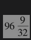
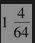

# 18.1 期货期权的特性

期货期权给予持有者权利（而非义务）在将来某一时刻以一定的期货价格签订期货合约。具体地讲，看涨期货期权给持有者在将来某时刻以一定期货价格持有期货合约多头的权利；看跌期货期权给持有者在将来某时刻以一定期货价格持有期货合约空头的权利。大多数期货期权为美式期权，也就是说期权持有者在合约有效期内随时可以行使期权。

当看涨期货期权被行使时，期权持有者签订一个期货合约的多头，收入等于最新期货结算价格减去执行价格后与合约数的乘积；当看跌期货期权被行使时，期权持有者签订一个期货合约的空头，收入等于执行价格减去最新期货结算价格后与合约数的乘积。以下的例子说明，一个关于看涨期货期权的实际收益等于max(F-K，0)，而一个关于看跌期货期权的实际收益等于max(K-F，0)，F是执行期权时的期货价格，K为执行价格

【例18-1】 假定现在是8月15日，某投资者持有一份9月的黄铜期货的看涨期权合约，期权执行价格为每磅320美分。一份合约的规模是25000磅黄铜。假定当前9月交割的黄铜期货价格为331美分，8月14日（最近一个结算日）黄铜期货的结算价格为330美分。如果行使期权，投资者收入的现金为

                  25000×(330-320)=2500（美元）

与此同时，投资者承约了一个在9月买入25000磅黄铜期货合约的多头。如果投资者愿意，他可以立即将期货平仓，从而收入2500美元外再加上以下数量的现金

                 25000×(331-330)=250（美元）

这一数量反映了在最近一次结算后期货价格的变化。在8月15日行使期权的整体收益为2750美元，该数量正好等于25000×(F-K)，其中F为行使期权时的期货价格，K为执行价格。

【例18-2】 某投资者持有一份12月玉米期货的看跌期权合约，执行价格为每蒲式耳600美分。每份合约的规模是5000蒲式耳玉米。假定当前12月交割的玉米期货价格为580美分，在最近一个结算日，玉米期货的结算价格为579美分。如果行使期权，那么投资者收入的现金数量为

                        5000×(600-579)=1050（美元）

同时投资者承约了一个在12月卖出5000蒲式耳玉米期货合约的空头。如果投资者愿意，他可以立即将期货平仓，投资者收入1050美元，但同时要付出以下数量的现金

                       5000×(580-579)=50（美元）

这一数量反映了在最近一次结算后期货价格的变化。投资者的净收益为1000美元，该数量等于5000×(K-F)，其中F为行使期权时的期货价格，K为执行价格。

## 18.1.1 到期月

期货期权是按标的期货到期月（而不是按期权到期月）来识别的。上面讲过，大多数期货期权为美式期权。期货期权到期日通常是标的期货最早可以交付日期的前几天（例如，CME的长期国债期货期权到期日在期货合约到期月前一个月，具体日期为距月底至少2个交易日之前的倒数第1个星期五）。CME中线欧洲美元(mid-curve Eurodollar)合约和中线3个月期的SOFR合约是例外，期货合约的到期时间比期权合约要晚得多。

## 18.1.2 利率期货期权

在第6章，我们讨论了CME交易的利率期货合约，利率期货的期权也由该交易所交易。例如，长期国债期货期权的持有者有权承约一个长期国债期货合约。一份长期国债期货合约的规模是交割100000美元的长期国债。长期国债期货期权的报价是以标的长期国债面值的百分比给出的，价格被近似到面值1%的1/64。

如第6章所述，在CME交易的3个月期欧洲美元期货合约是一种最为普遍的利率期货合约。随着LIBOR逐渐被淘汰，LIBOR期货合约将被3个月期的SOFR期货合约取代。欧洲美元期货的期权一直很受欢迎，预计将被CME于2020年1月推出的3个月期的SOFR期货的期权所取代。欧洲美元汇率是一个前瞻性利率（未来3个月的借款利率），而SOFR是一个逆向利率（由前3个月的隔夜复合利率计算）。当欧洲美元期货和3个月期的SOFR期货的报价变化1个基点（即0.01%）时，期货合约的损益为25美元。这些期货合同上的期权也是如此。

利率期货期权合约的运作方式与本章中所讨论的其他期货期权合约相同。例如，在行使期权后，除现金收益外，看涨期权持有者还要同时得到期货合约的多头，而期权承约方将会持有相应期货合约的空头。期权的整体收益（包括期货交易的头寸）为max(F-K,0)，其中F为行使期权时的期货价格，K为执行价格。

当债券价格增长时（即利率下降时），利率期货价格会随之增长；当债券价格下降时（即利率增长时），利率期货价格会随之下降。如果一个投资者认为短期利率会增长，他可以买入关于欧洲美元期货的看跌期权来进行投机；如果一个投资者认为短期利率会下降，他可以买入关于欧洲美元期货的看涨期权来进行投机。如果一个投资者认为长期利率会增长，他可以买入关于长期或中期国债期货的看跌期权来进行投机；如果一个投资者认为长期利率会下降，他可以买入关于长期或中期国债期货的看涨期权来进行投机。

【例18-3】 假定6月份SOFR合约的期货价格为99.35美元（表示每年的利率为0.65%），并且投资者预计短期利率将下降，因此6月到9月的隔夜利率将低于0.5%。同时假设执行价格为99.50的看涨期权的价格为0.05美元（即5个基点）。投资者可以买入一份执行价格为99.50美元的看涨期权，期权合约的费用为25×5=125美元。如果投资者在期货价格为99.70美元（表示每年利率为0.3%）时行使看涨期权，期权合约的收益为25×20=500美元，因此投资者的盈利为375美元。

【例18-4】 现在是8月，12月长期国债合约期货的价格为96-09（即=96.28125）。长期国债的收益率大约为每年6.4%。某投资者认为这一利率到12月时会下降，他可以买入在12月到期，执行价格为98的看涨期权。假定期权价格为1-04（价格为面值的=1.0625%）。如果长期利率确实下降到每年6%，长期国债期货价格上升到100-00，投资者在每100美元债券期货上的净盈利为

                      100.00-98.00-1.0625=0.9375

因为一个期权合约是关于面值为100000美元的产品买卖，因此投资者从每份买入的期权中盈利937.50美元。