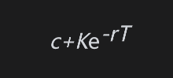
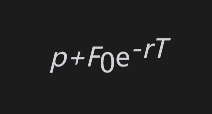
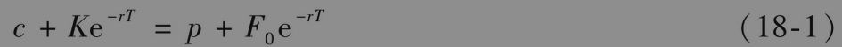
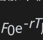
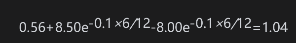

# 18.4 看跌-看涨平价关系式

在第11章里，我们得出了欧式股票期权的看跌-看涨平价关系式。我们现在采用类似的方法来推导对于欧式期货期权的看跌-看涨平价关系式。考虑具有相同执行价格K与期限T的两个欧式看涨和看跌期货期权。我们可以构造以下两个交易组合：

组合A：一份欧式看涨期货期权加上数量为Ke-rT的现金；

组合B：一份欧式看跌期货期权加上一份期货合约多头，再加上数量为F0e-rT的现金，其中F0为期货价格。

在组合A中，现金可以按无风险利率r进行投资，在T时刻，该投资会增长到K。令FT为期权到期时的期货价格。如果FT>K，组合A中的期权会被行使，这时组合A的价值为FT；如果FT≤K，组合A中的期权不会被行使，这时组合A的价值为K。因此在T时刻，组合A的价值为

                      max(FT,K)

在组合B中，现金按无风险利率进行投资。在T时刻，该投资会增长到F0。看跌期权收益为max(K-FT,0)，期货提供的收益为FT-F0。因此组合B在时刻T的价值为

                  F0+(FT-F0)+max(K-FT,0)=max(FT,K)

因为以上两个交易组合在T时刻的价值相等，并且欧式期权不能被提前行使，所以这里的两个交易组合在今天的价值应该相等。组合A在今天的价值为

其中c为看涨期货期权的价格。每日结算过程保证组合B中的期货在今天的价格为0，所以组合B的价值为

其中p为看跌期货期权的价格，因此

以上看跌-看涨平价关系式与式(11-6)中关系式之间的区别是股票价格S0被贴现后的期货价格所取代。

如第18.3节所示，当期权与标的期货合约同时到期时，欧式现货期权与欧式期货期权是等价的。当两种期权的到期日与期货相同时，式(18-1)给出了现货看涨期权、现货看跌期权和期货价格之间的关系式。

【例18-5】 假定一个对于现货白银的欧式看涨期权价格为每盎司0.56美元，期权期限为6个月，执行价格为8.5美元。假定在6个月期限的白银期货价格为8美元，投资6个月的无风险利率为每年10%。将式(18-1)变形后可以得知一个具有同样期限和执行价格的欧式现货看跌期权价格为

对于美式期货期权，看跌-看涨平价关系式是（见练习题18.21）

