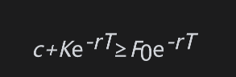
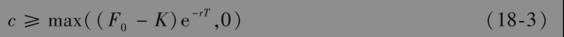
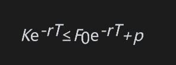
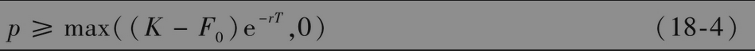

# 18.5 期货期权的下限

看跌-看涨平价关系式(18-1)给出了欧式看涨期权和看跌期权的下限。因为看跌期权的价格p不能为负值，由式(18-1)得出

即

类似地，因为看涨期权的价格c不能为负值，由式(18-1)得出

即

以上得出的下限与第11章中推导出的欧式股票期权的下限类似。当期权为深度实值状态时，欧式看涨和看跌期权会与它们的下限价格非常接近。为了说明这一点，我们重新考虑由式(18-1)所表达的看跌-看涨期权平价关系式。当一个看涨期权为深度实值状态时，相应的看跌期权为深度虚值状态，这意味着p会接近于0,c与其下限的差等于p。因此看涨期权会与其下限非常接近。对看跌期权，我们也可以进行类似的讨论。

由于美式期货期权可以在任何时刻被行使，因此，我们有以下关系式

                    C≥max(F0-K,0)

与

                    P≥max(K-F0,0)
               
               
               
因此，假设利率为正，美式期权的下限一定会高于相应的欧式期权的下限，美式期货期权总是有被提前行使的可能。