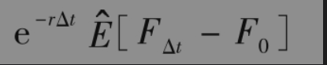
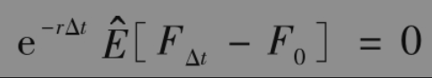
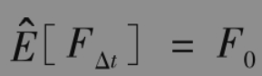
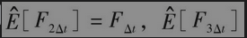
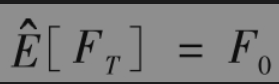
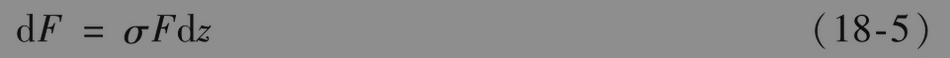
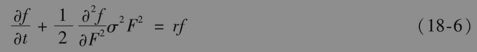

# 18.6 期货价格在风险中性世界的漂移率

我们可以利用一种更普遍的结果来将第17.3节中的分析用到期货期权上。这一结果是：在风险中性世界里，期货价格的表现与在国内无风险利率r下支付连续股息收益率的股票一样。

其中一些线索是期货期权的看跌-看涨期权平价关系式与将股票价格换成期货价格、令q=r时等同（比较式(18-1)和式(17-3)）。

为了严格地证明以上结果，我们需要计算期货价格在风险中性世界里的漂移率。定义Ft为时刻t的期货价格，并且假设结算日期为时刻0，Δt，2Δt,…,如果在0时刻承约期货多头，其价值为0。在时刻Δt，期货的收益为FΔt-F0。如果r为时刻0这一极短期（Δt区间）的利率，那么由风险中性定价方法得出在0时刻，合约收益的价值为

其中为风险中性世界的期望。因此我们必须有

从而

类似地，我们可以证明=F2Δt，等等。将所有这些结果放在一起后，我们可以看到对于任意时刻T

因此，在风险中性世界里，期货价格的漂移率为0。由式(17-7)得出，期货价格类似于股息收益率q等于r的股票价格。这一结果具有一般性，它对所有的期货价格均成立，并且与关于利率、波动率等的假设无关。

在风险中性世界里，通常假设F服从以下过程

其中σ为常数。

## 微分方程

为了从另外一个角度来说明期货价格类似于股息收益率为q的股票，我们可以推导期货价格上衍生产品所满足的微分方程。推导方法类似于在第15.6节中无股息股票上衍生产品所满足的微分方程的推导。期货价格上衍生产品的价格满足微分方程

这与在式(17-6)中将q取成r的形式相同。这验证了在对衍生产品定价时，我们可以将期货价格看成是股息收益率为r的股票收益值。