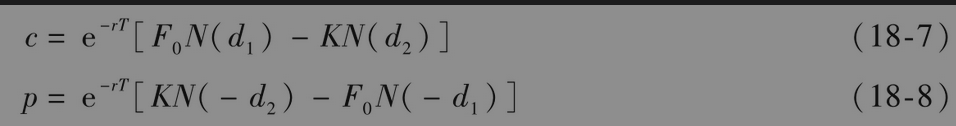
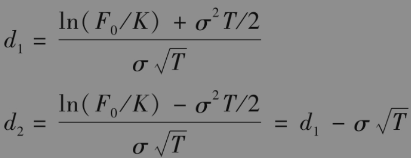
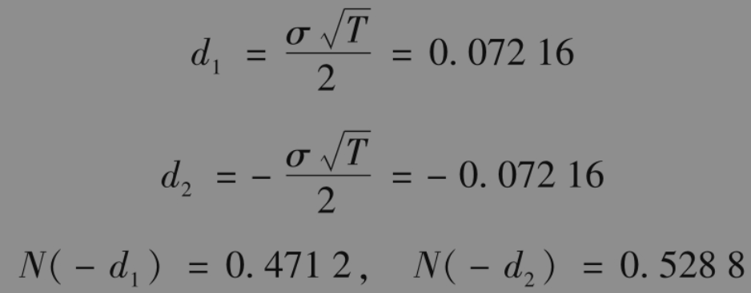
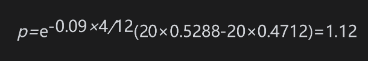

# 18.7 期货期权定价的布莱克模型

通过将以上结果进行推广，我们可以对欧式期货期权定价。布莱克在1976年发表的一篇文章中首先证明了这一点。假设标的期货价格服从式(18-5)中的对数正态过程，期货上的欧式看涨期权价格c和看跌期权p可以将式(17-4)与式(17-5)中的S0由F0取代，同时令q=r而给出

其中

其中σ为期货价格的波动率。当持有费用和便利收益率均为时间的函数时，我们可以证明期货价格的波动率等于标的资产的波动率。

【例18-6】 考虑一个原油期货上的欧式看跌期权，期权的期限为4个月，当前的期货价格为20美元，执行价格为20美元，无风险利率为每年9%，期货波动率为每年25%。这时F0=20,K=20,r=0.09,T=4/12，σ=0.25和ln(F0/K)=0，因此

看跌期权价格p为

即1.12美元。