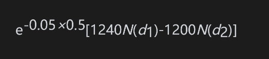
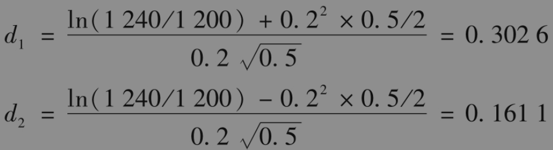

18.8 由布莱克模型代替布莱克-斯科尔斯-默顿模型

第18.3节中的结果说明当期权期限与期货期限相同时，期货期权与现货期权等价。因此式(18-7)和式(18-8)也提供了一种对于现货资产上期权定价公式的方法，其中F0是与期权同时到期合约的资产的期货价格。

【例18-7】 考虑一个6个月期限，标的资产为现货黄金价格的欧式看涨期权，即在6个月后买入1盎司黄金的期权。期权执行价格为1200美元，6个月期限的黄金期货价格为1240美元，无风险利率为每年5%，期货波动率为20%，这一期权等价于在6个月期限的期货价格上的欧式期权。式(18-7)可以给出这个期权的价格为

其中

计算出的期权价格为88.37美元。

与布莱克-斯科尔斯-默顿模型相比，交易员更喜欢采用布莱克模型来对欧式现货期权定价。这种用法非常广泛。标的资产既可以是消费资产也可以是投资资产，而且资产也可以给持有人提供收入。通常F0等于远期价格而不是期货价格。当利率确定时，远期价格和期货价格相等，所以这是有效的。正如我们在书中所看到的，当利率随机时，如果r是期限为T的到期无风险利率，设置F0等于远期价格是有效的。

布莱克模型的优点是我们不需要去估计标的资产的收入（或方便收益）。模型中的期货或远期价格已经将这些收入考虑在内。(17-13)和(17-14)展示了如何使用布莱克模型来根据货币的现货价格估计欧式期权的价格。在这种情况下，我们不需要去估计外国的到期无风险收益率，因为有关该利率的所有信息都被F0捕获。

(17-8)和(17-9)则展示了如何将布莱克模型应用到关于股指现货期权的定价上。在这种情况下，我们不需要去估计股票投资组合的股息，因为关于股息的所有信息都将被F0捕获。

在第17.4节里，当考虑股指情形时，我们解释了由看跌-看涨平价关系式出发，如何从市场交易活跃的指数期权中隐含地计算相应期限的远期价格，通过对这些远期价格进行插值，我们还可以估计对应于其他期限的远期价格。对于许多其他标的资产，我们都可以进行类似的处理。