18.9 采用二叉树对期货期权定价

在本节里我们将比在第13章中更正式地探讨如何用二叉树对期货期权定价。期货期权与股票期权的关键区别是承约期货合约时无须付费。

假定当前的期货价格为30，在1个月后，期货价格将上涨到33或者下跌到28。我们考虑对于在期货上执行价格为29的看涨期权。在分析过程中，我们忽略期货每日结算的性质。这一情形显示在图18-1中。当期货价格上涨到33时，期权的收益为4，同时期货合约的价值为3；当期货价格下跌到28时，期权的收益为0，同时期货合约的价值为-2。

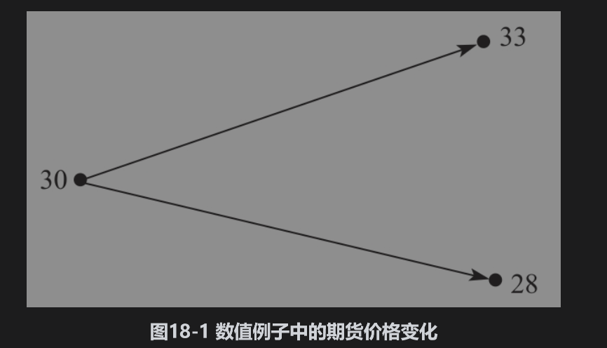

为了构造无风险对冲，我们考虑由一个期权的空头与Δ份期货的多头所组成的交易组合。当期货价格上涨到33时，交易组合价值为3Δ-4；当期货价格下跌到28时，交易组合价值为-2Δ。当交易组合的终端价格一样，即以下公式满足时

                           3Δ-4=-2Δ

或Δ=0.8时，交易组合为无风险。

当Δ取值为0.8时，交易组合在1个月后的价值为3×0.8-4=-1.6。假定无风险利率为6%，交易组合今天的价值为

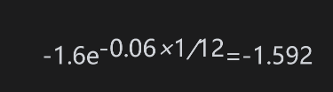

交易组合包含一份期货期权合约的空头与Δ份期货合约。因为今天的期货合约价值为0，因此今天的期权价格必须是1.592。

## 18.9.1 推广

我们可以将以上分析进行推广。假定F0为期货的初始价格，在时间段T以后，期货价格会上涨到F0u或下跌到F0d。我们考虑一个在时间T到期的期权，当期货价格上涨时，期权收益为fu，当期货价格下跌时，期权收益为fd。图18-2是对这一情形的总结。

这时的无风险交易组合包括一份期权的空头和Δ份期货的多头，其中

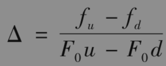

交易组合在T时刻的价值总是

                        (F0u-F0)Δ-fu

将无风险利率记为r，我们得出交易组合在今天的价值为

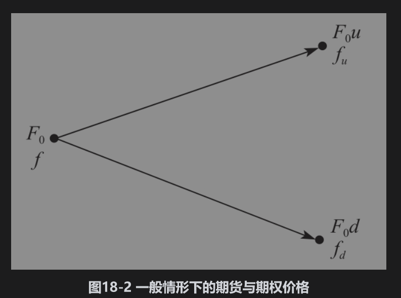

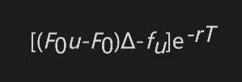

另外一种表达交易组合今天价值的表达式为-f，其中f为期权今天的价格。因此

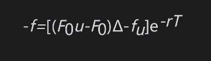

将Δ代入以上表达式，f可以被简化为

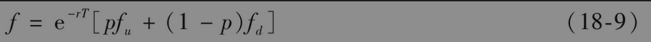

其中

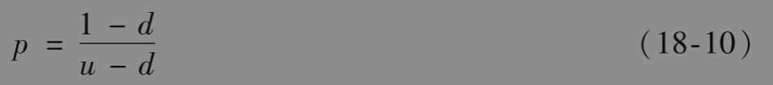

这与第13.9节里的结果一致。式(18-10)给出了在风险中性世界里标的资产价格上涨的概率。

在上面的数值例子中（见图18-1），u=1.1，d=0.9333，r=0.06，T=1/12，fu=4,fd=0。由式(18-10)，我们可以得出

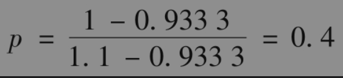

由式(18-9)得出

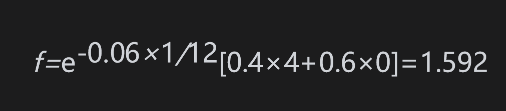

这与我们以前所得结果是一致的。

## 18.9.2 多步二叉树应用

多步二叉树对美式期货期权定价与对股票期权定价的方式是基本相同的，这在第13.9节中曾解释过。对应于期货价格上涨的参数u等于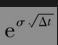，其中σ为期货价格的波动率，Δt为步长，期货价格上升的概率由式(18-10)给出

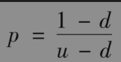

例13-3说明了如何利用多步二叉树来对期货期权定价。第21章中的例21-3给出了进一步的描述。