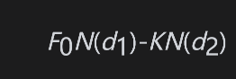

# 18.11 期货式期权

有些交易所谓的期货式期权(futures-style options)，这是关于期权收益的期货合约。一般来讲，交易员在买入（卖出）现货或期货期权时要首先支付（收入）现金。与此不同的是，买入或卖出期货式期权的交易员要缴纳保证金，这一点与一般的期货交易没有什么两样（见第2章）。与其他期货一样，期货式期权要每天进行结算，而最终的结算为期权的收益。期货合约是对资产的将来价格下注，而期货式期权是对期权将来的收益下注。当利率为常数时，期货式期权中的期货价格等价于关于期权收益的远期合约中的远期价格。我们在第5章中对远期合约的分析表明，期货式期权价格等于现货期权价格以无风险利率复利至到期的价格。

式(18-7)和式(18-8)中的布莱克模型给出了一个普通欧式期权的价格，其中期货（远期）价格F0对应于一个与期权具有同样期限的期货。因此，看涨期货式期权中的期货价格为

看跌期货式期权中的期货价格为

其中d1和d2由式(18-7)和式(18-8)给出。这些公式不依赖于无风险利率，并且对于期货合约上的期货式期权和资产现货价格上的期货式期权都是正确的。在第1种情形下，F0为期权标的合约的当前期货价格；在第2种情形下，F0为与期权具有同样期限的期货合约的当前期货价格。

期货式期权的看跌-看涨平价关系式为

                       p+F0=c+K

一个美式期货式期权可以被提前行使，这时要马上结算期权的内涵价格。事实上，提前行使美式期货式期权肯定不是最优的决策，这是因为期权的期货价格永远大于内涵价格，因此我们可以将这种美式期货式期权视为相应的欧式期货式期权。