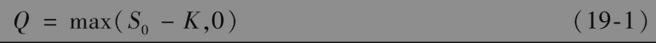
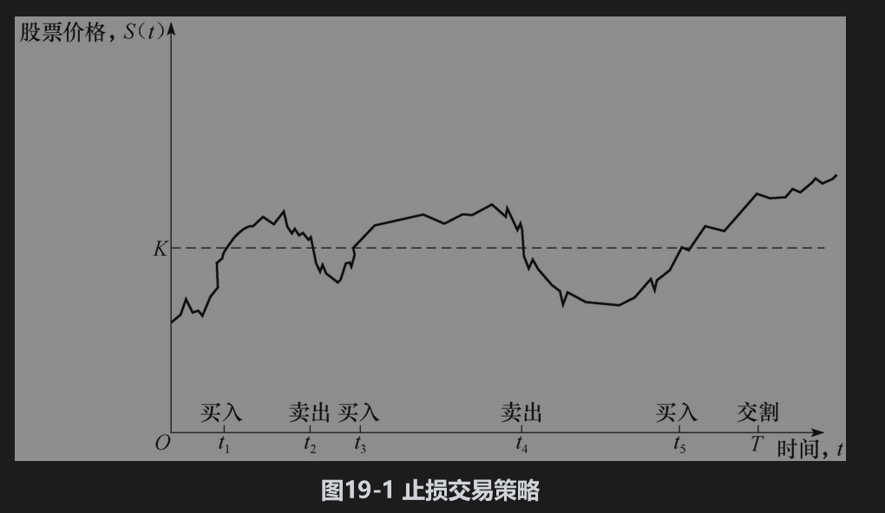
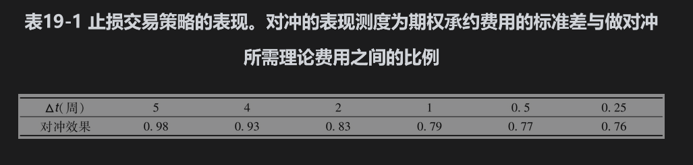

19.2 裸露头寸和带保头寸

金融机构可采用的一种策略是对期权头寸不采取任何对冲措施，这种做法称为持有裸露头寸(naked position)。在20周后，如果股票价格低于50美元，这种策略的收益会很好。期权最终没有给金融机构带来任何费用，整个交易给金融机构带来净利润300000美元。如果在20周后期权被行使，这种策略的收益将不会这么好。在期权到期时，金融机构必须在市场上以市价买入100000股股票来兑现期权承诺。这样给金融机构带来的费用是100000乘以股票价格高于执行价格的数量。例如，如果在20周后，股票价格为60美元，期权会给金融机构带来1000000美元的费用。这一费用远远大于期权所带来的300000美元收入。

金融机构可以采用的另一种策略是带保头寸(covered position)。在这种策略中，金融机构在卖出期权的同时也买入100000股股票。如果期权被行使，这一交易策略会很好，而在其他情形下可能会导致很大的损失。例如，假如股票价格降到40美元，金融机构持有的股票将损失900000美元，这一数量也同样远远大于期权所带来的300000美元收入。

裸露头寸和带保头寸都不是很好的对冲交易策略。如果布莱克-斯科尔斯-默顿公式的前提假设成立，这两种策略给金融机构产生的平均费用应当总是240000美元。[插图]但是，在以上各种情况下，成本从0～1000000美元以上不等。理想对冲交易策略的费用应当接近于240000美元。

## 止损交易策略

止损交易策略(stop-loss strategy)是一种常被提到的对冲方法。为了解释这种方法，假定某金融机构卖出了一份以价格K买进1股股票的看涨期权。止损交易策略的思路是这样的：在股票价格刚刚高于K时马上买入股票，而在股票价格刚刚低于K时马上卖出股票。这一对冲的核心思想就是当股票价格低于K时，采用裸露头寸策略，而当股票价格高于K时，采用带保头寸策略。对冲的设计过程保证了在时间T如果期权处于实值状态，金融机构会持有股票，如果期权处于虚值状态，金融机构不持有股票。如图19-1所示，这一策略在t1时刻买入股票，在t2时刻卖出股票，在t3时刻买入股票，在t4时刻卖出股票，在t5时刻买入股票并在时刻T交割。

与以往一样，我们假定股票的初始价格为S0，当S0>K时，建立对冲策略的初始费用为S0，否则为0。这样一来，卖出期权并进行对冲后的全部费用为期权的内含价值

这是因为在时间0之后的买入以及卖出交易的价格均为K。如果以上公式正确，在没有交易费用的情况下，该对冲策略会是完美的。此外，这种交易的对冲费用永远小于由布莱克-斯科尔斯-默顿公式所给出的期权价格。因此投资者通过卖出期权并以这一方式对冲后即可以获得无风险收益。

式(19-1)并不正确，关键原因有两个：第一个原因是对冲者的现金流发生在不同时刻，对这些现金流必须贴现；第二个原因是股票的买入与卖出不可能总是正好发生在价格等于K的时刻。这里的第二个原因很关键。假如我们处在利率为零的风险中性世界里，可以忽略货币的时间价值。但我们并不能合理地假定股票的买入与卖出刚好发生在价格等于K的时刻。如果市场是有效的，在股票市场价格为K时，对冲者并不知道股票价格会变得高于K还是低于K。

一种可行的做法是在以上描述的过程中，股票的买入价格必须为K+ε，股票的卖出价格必须为K-ε，这里的ε为一个小的正数。因此每一笔买入与卖出股票的费用为2ε（在这里我们忽略交易手续费）。对冲者一个自然的做法是增大价格观测的频率来使得ε变得更小。但当ε变得更小时，交易也会更加频繁，因此交易费用的减低会被交易频率的增加所抵消。但当ε→0时，交易次数的期望值会趋向于无穷大。

尽管止损交易策略从表面上看起来很诱人，但这一策略并不是个有效的对冲手段。例如，考虑一虚值期权。如果股票价格从来都达不到K的价格，那么止损交易策略的费用为0。如果股票价格与执行价格水平线交叉很多次，止损交易策略的费用将会很高。蒙特卡罗模拟法(Monte Carlo simulation)可用于检验止损交易策略的整体效果：该方法先随机地产生股票价格的路径，然后再计算采用止损交易策略的结果。表19-1显示了关于第19.1节里期权的结果。假定在时间间隔为Δt的末尾观察股票价格，对冲的表现（对冲表现测度）以期权对冲费用的标准差与期权布莱克-斯科尔斯-默顿价格的比率来衡量（对冲费用的计算是除去支付利息与贴现影响后的累积费用）。每一个结果都是基于1000000个股票价格路径抽样来计算的。有效对冲策略将会使对冲表现测度接近于0，但在这里我们可以看出，无论Δt如何小，止损交易策略的对冲表现测度都不小于0.70。这说明止损交易策略并不是一个有效的对冲方法。

