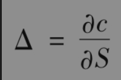
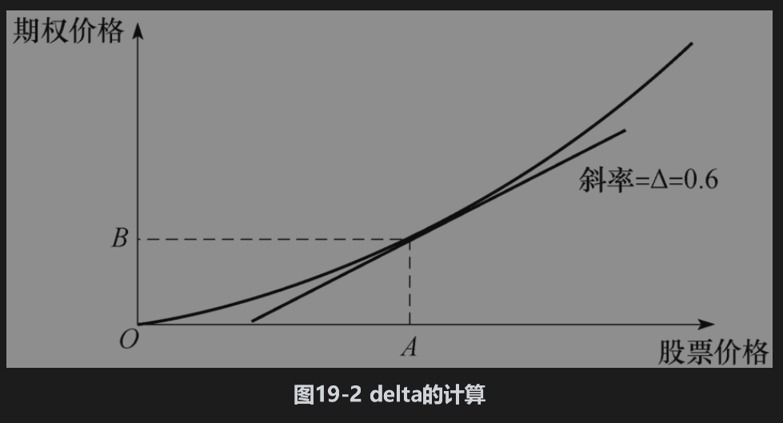
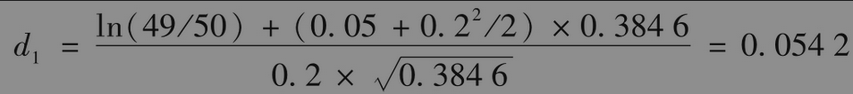
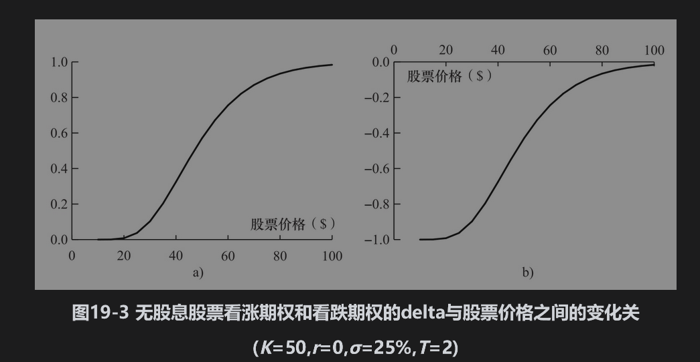
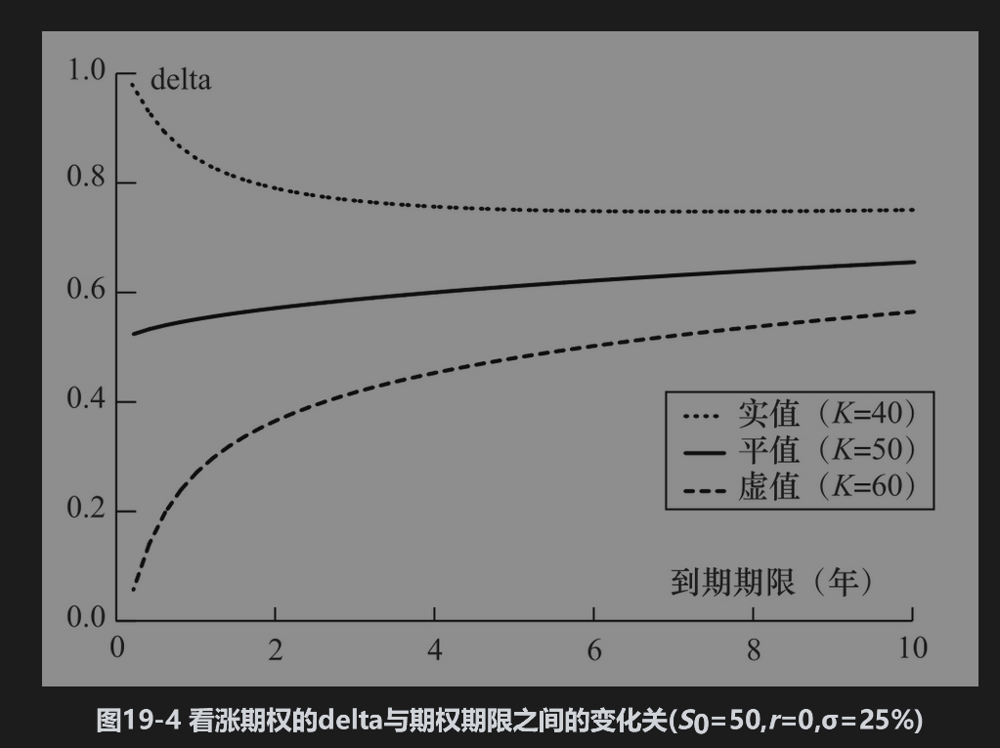
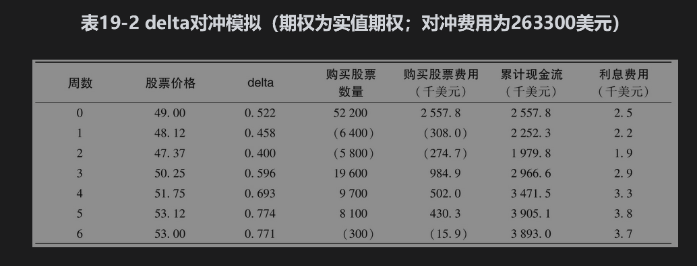
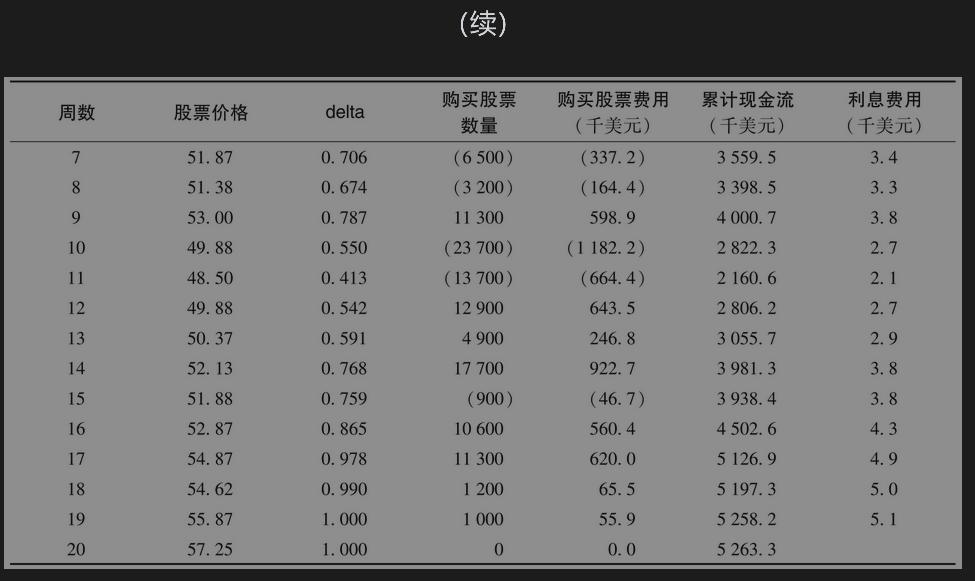
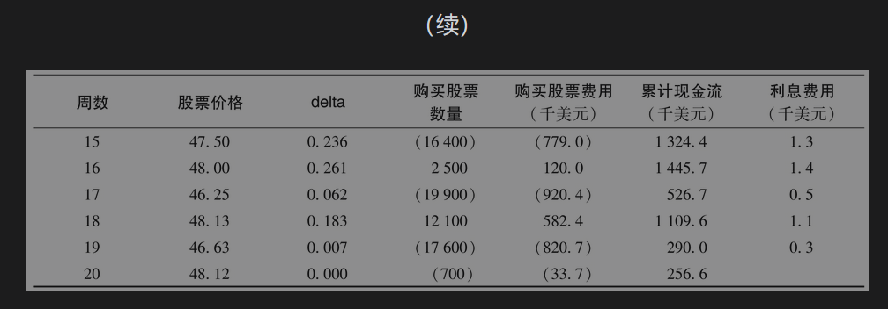
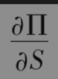

# 19.4 delta对冲

在第13章里，我们引入了期权的delta(Δ)：该变量定义为期权价格变动与其标的资产价格变动的比率。它是描述期权价格与标的资产价格之间关系曲线的切线斜率。假定某看涨期权delta为0.6，这意味着当股票价格变化一个很小的数量时，相应的期权价值变化大约等于股票价值变化的60%。图19-2展示了期权价格随标的资产价格变化的关系。当股票价格对应于点A时，期权价格对应于点B，而Δ为图中所示直线的斜率。一般来讲

其中c是看涨期权的价格，S是股票的价格。

假设在图19-2中股票价格为100美元，期权价格为10美元。假设投资者卖出了有权购买2000股股票的看涨期权。投资者的头寸可以通过购买0.6×2000=1200股股票来进行对冲。期权头寸所对应的盈利（亏损）可由股票头寸上的亏损（盈利）来抵消。例如，如果股票价格上涨1美元（买入的股票会升值1200美元），期权价格将会上涨大约0.6×1=0.6美元（卖出期权会带来损失1200美元）；如果股票价格下跌1美元（买入股票会损失1200美元），期权价格将会下跌大约0.6美元（卖出期权会带来收益1200美元）。

在本例中，交易员的2000份期权空头的delta为

                    0.6×(-2000)=-1200

这意味着当股票上涨ΔS时，交易员期权的空头就会损失1200ΔS。1股股票本身的delta为1.0，于是持有1200股股票的delta值为+1200，因此，投资者整体头寸的delta为0：股票头寸的delta与期权头寸的delta相互抵消。delta为0的头寸称为delta中性(delta neutral)。

我们应当认识到由于delta会变动，投资者的delta对冲状态（或delta中性状态）只能维持在一段较短的时间里，所以对冲策略要不断地调整。这种调整过程称为再平衡(rebalancing)。在我们的例子中，在3天后的股票价格也许会升到110美元。如图19-2所示，股票价格上涨时会使delta变大，假设delta从0.6增加到0.65，如果仍要保持delta中性，投资者需要再买入0.05×2000=100股股票。当对冲头寸需要不断调整时，这种策略叫动态对冲(dynamic hedging)。这与静态对冲(static hedging)策略形成了对比：静态对冲在最初设定后无须再进行调整。静态对冲有时也称为“保完即忘”(hedge-and-forget)策略。

delta对冲与布莱克-斯科尔斯-默顿分析密切相关。如第15章所述，通过由股票期权和标的股票建立的无风险交易组合，我们可以推导出布莱克-斯科尔斯-默顿偏微分方程。以Δ表示，所建立的交易组合为

采用新的术语，我们可以将这种方法描述如下：在建立delta中性的头寸后，可以通过论证该交易组合的收益率等于（瞬时）无风险利率来为期权定价。

## 19.4.1 欧式股票期权的delta

对于无股息股票期权上看涨期权的delta，我们可以证明（见练习题15.25）

                           Δ=N(d1)

其中d1由式(15-20)给出，N(x)是标准正态分布的累积分布函数。以上公式为一个欧式看涨期权多头的delta。欧式看涨期权空头的delta为-N(d1)。对一个看涨期权空头做对冲时，对卖出的每个期权，需要维持拥有N(d1)只股票的多头。类似地，对一个看涨期权多头做对冲时，对买进的每个期权，需要维持拥有N(d1)只股票的空头。

无股息股票上看跌期权的delta为

                         Δ=N(d1)-1

这里的delta为负值，这意味着看跌期权的多头应该由标的股票的多头来对冲，而看跌期权的空头应该由标的股票的空头来对冲。图19-3显示了看涨与看跌期权的delta和股票价格之间的变化关系。

图19-4显示了实值期权、平值期权和虚值期权的delta与期权期限之间的变化关系。【例19-1】 再次考虑第19.1节中无股息股票上的看涨期权，其中股票价格为49美元，执行价格为50美元，无风险利率为5%，期限为20周（=0.3846年），股票价格波动率为20%。这时，我们有

delta为N(d1)，即0.522。当股票价格变化为ΔS时，期权价格变化为0.522ΔS。

## 19.4.2 delta对冲的动态特性

表19-2和表19-3给出了两个对第19.1节中出售100000看涨期权的例子做delta对冲的例子。在这里我们假设对冲交易是每个星期再平衡一次。在例19-1中，我们计算了所卖出期权在最初的delta为0.522，因而所有期权空头的delta为-100000×0.522，即-52200。这意味着在出售看涨期权的同时，交易员必须借入2557800美元并按每股49美元价格购买52200股股票。借入资金的利率为5%，第一周的利息费用大约为2500美元。

在表19-2中，1周以后股票价格降到48.12美元，期权的delta也随之降到0.458，期权头寸新的delta为-45800。要想保持delta中性，这时需要从已持有的股票中卖出6400股股票。卖出股票所得现金收入为308000美元，因此第1周后的累计借款余额减至2252300美元。在第2周内，股票价格降到47.37美元，期权的delta也随之降低，依此类推。在期权接近到期时，很明显期权将会被行使，期权的delta接近于1.0。因此在第20周结束时，对冲者会拥有100000股股票，期权持有人会在此时行使期权，对冲者以执行价格卖出股票而收到500万美元，卖出期权与对冲风险的总费用为263300美元。

表19-3给出了另一组股票模拟价格：期权在期满时成为虚值期权，在第20周结束时，对冲人不持有任何股票，这里的总费用为256600美元。

在表19-2和表19-3中，贴现后的对冲成本很接近于布莱克-斯科尔斯-默顿公式所给出的理论价格（240000美元），但这些近似值与布莱克-斯科尔斯-默顿价格并不完全相同。如果对冲是完美的话，对每一组模拟的股票价格变化，贴现后的对冲费用与理论价格都应当完全相等。delta对冲费用与理论值之间的差别是因为对冲交易的频率仅为一周一次。当对冲再平衡的频率增大时，对冲费用与理论值的差距将会减小。当然，表19-2和表19-3中的例子是建立在波动率为常数，而且没有交易费用的假设之上。

表19-4给出在上面例子中模拟100万条股票随机路径后所对应的delta对冲效果。与表19-1类似，对冲效果由对冲费用的标准差与期权的布莱克-斯科尔斯-默顿价格的比率来衡量。显然，delta对冲比止损策略有很大改进。与止损策略不同的是随着调整频率的提高，delta对冲的效果也逐步改善。

delta对冲的目的是使金融机构所持头寸的价值尽量保持不变。最初卖出期权的价值为240000美元，在表19-2所示的情况下，第9周时的期权价值为414500美元（由布莱克-斯科尔斯-默顿模型得出，其中股票价格为53美元，期限为11个星期），由于卖出期权而使金融机构损失了174500美元。现金累计费用在第9周时比第10周时要多出1442900美元，所持有股票的价值由最初的2557800美元上涨为4171100美元。将所有头寸汇总在一起，金融机构的交易组合价值从第0周到第9周的变化仅为4100美元。

## 19.4.3 费用由何而来

由表19-2与表19-3所示的delta对冲机制构造出一个等价于期权多头方的交易，从而与金融公司所持的空头相互抵消。如表所示，对空头进行的对冲会使在价格下跌时卖出股票，而在价格上涨时买进股票。我们可以称此为“买高卖低”。数量为240000美元的费用来自购买股票所付价格与卖出股票收入价格之间差别的贴现值。

## 19.4.4 投资组合的delta

依赖于单一资产价格S的期权或其他衍生产品组合的delta为

其中Π为投资组合的价值。

投资组合的delta值可以从投资组合内各个期权的delta来计算。如果一个交易组合由数量为wi的期权i(1≤i≤n)组成，那么投资组合的delta值为

其中Δi为第i个期权的delta。该公式可以用来计算使投资组合的delta为零而需要持有的标的资产头寸。当持有这个头寸时，我们称投资组合为delta中性。

假定一个金融机构持有以下3个关于某股票的头寸：

(1)100000份看涨期权的多头，执行价格为55美元，期限为3个月，每份期权的delta为0.533。

(2)200000份看涨期权的空头，执行价格为56美元，期限为5个月，每份期权的delta为0.468。

(3)50000份看跌期权的空头，执行价格为56美元，期限为2个月，每份期权的delta为-0.508。这时整个投资组合的delta为

        100000×0.533-200000×0.468-50000×(-0.508)=-14900

这意味着金融机构可以买入14900只股票来使该投资组合成为delta中性。

## 19.4.5 交易费用

衍生产品交易商一般每天都会将其头寸重新平衡一次，以便使其为delta中性。如果交易商持有关于某种资产上少量的期权，这时按以上所描述方式进行对冲将会引发大量的交易费用，但对一个很大的期权组合进行对冲时，delta中性就会切实可行。此时只需要进行一笔标的资产交易就可以将整个期权组合的delta中性化，交易费用也会被许多其他交易盈利所承受。