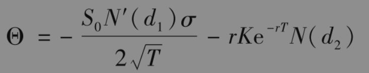
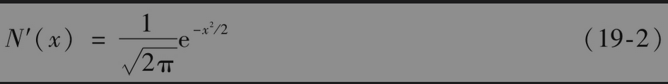
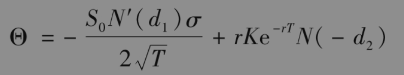
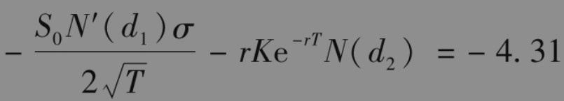
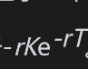
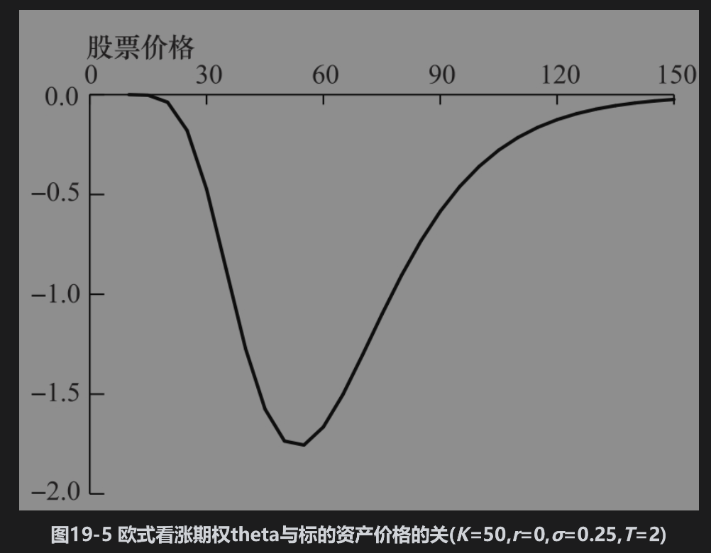

# 19.5 theta

期权组合的theta(Θ)定义为在其他条件不变时，投资组合价值变化与时间变化的比率。theta有时称为组合的时间损耗(time decay)。对于一个无股息股票上的欧式看涨期权，计算theta的公式可以从布莱克-斯科尔斯-默顿公式得出（见练习题15.25）

其中d1与d2由式(15-20)给出

为标准正态分布的密度函数。

对于股票上的欧式看跌期权，计算theta的公式为

因为N(-d2)=1-N(d2)，看跌期权的theta比相应看涨期权的theta高出。

在这些公式中的时间是以年做单位。而通常在计算theta时的时间是以天为单位，因此theta为在其他变量不变时，在一天过后交易组合价值的变化。我们可以计算“每日历天”的theta或“每交易日”的theta。为了计算每日历天的theta，上面计算theta的公式必须除以365；为了计算每个交易日的theta，上面计算theta的公式则除以252（DerivaGem计算的是每日历天的theta）。

【例19-2】 采用例19-1中的数据，考虑一个对于无股息股票上的看涨期权，其中股票价格为49美元，执行价格为50美元，无风险利率为5%，期限为20周（=0.3846年），股票价格波动率为20%，这时S0=49，K=50,r=0.05，σ=0.2，和T=0.3846，期权的theta为

因此，每日历天的theta为-4.31/365=-0.0118，每交易日的theta为-4.31/252=-0.0171。

期权的theta一般是负的，这是因为在其他条件不变的情况下，随着期限的减小，期权价值会降低。图19-5显示一个股票上看涨期权的theta与标的资产价格之间关系的曲线。当股票价格很低时，theta接近于零。对应于一个平值看涨期权，theta很大而且是负值。当股票价格很高时，theta接近于。图19-6显示实值期权、平值期权、虚值看涨期权的theta随期权期限变化的规律。

作为对冲参数，theta与delta属于不同类型。这是因为未来股票的价格有很大的不定性，但时间走向没有不定性。通过对冲来消除交易组合关于标的资产价格变化的风险很有意义，但对冲交易组合对于时间的变化就毫无意义。即使如此，许多交易员仍把theta作为对交易组合有用的一种描述。正如我们在今后会看到的那样，在一个delta中性的交易组合中，theta是gamma的近似。