# 19.6 gamma

一个期权交易组合的gamma(Γ)是指交易组合delta的变化与标的资产价格变化的比率。这是交易组合关于标的资产价格的二阶偏导数

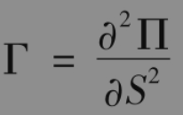

当gamma很小时，delta变化缓慢，这时为保证delta中性并不需要做太频繁的调整。但是当gamma的值很大（正值或负值）时，delta对标的资产价格的变动就会很敏感，此时在一段时间内不对一个delta中性的投资组合做调整都将会是非常危险的。图19-7展示了这一点：当股票价格由S变成S′时，delta对冲时假设期权价格由C变成C′，而事实上期权由C变成了C″。C′与C″的不同导致了对冲误差。这一误差的大小取决于期权价格与标的资产价格关系的凸性。gamma值正是对这一凸性的度量。

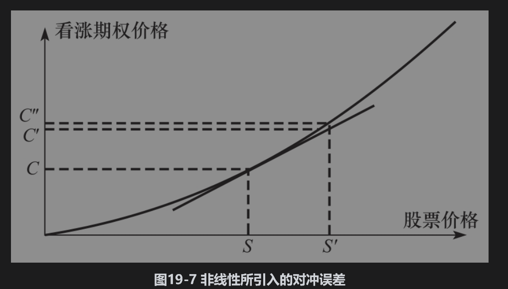

假定ΔS为在很短时间区间Δt内股票价格的变化，ΔΠ为相应的投资组合价格变化。对于delta中性的交易组合，本章末的附录证明了当忽略高阶项后，

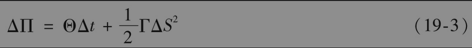

其中Θ为投资组合的theta。图19-8展示了ΔΠ与ΔS之间的关系。当gamma为正时，Θ往往是负值。这时如果S没有什么变化，交易组合的价值将会下降。但如果标的资产价格S变化幅度较大，交易组合的价值将会上升；当gamma为负时，Θ往往为正值，这时会有与上面相反的结论：当标的资产价格S不变时，组合价值上升，而当标的资产价格S变化很大时，组合价值将会下降。当gamma的绝对值增加时，组合价值对于S的敏感性会相应增大。

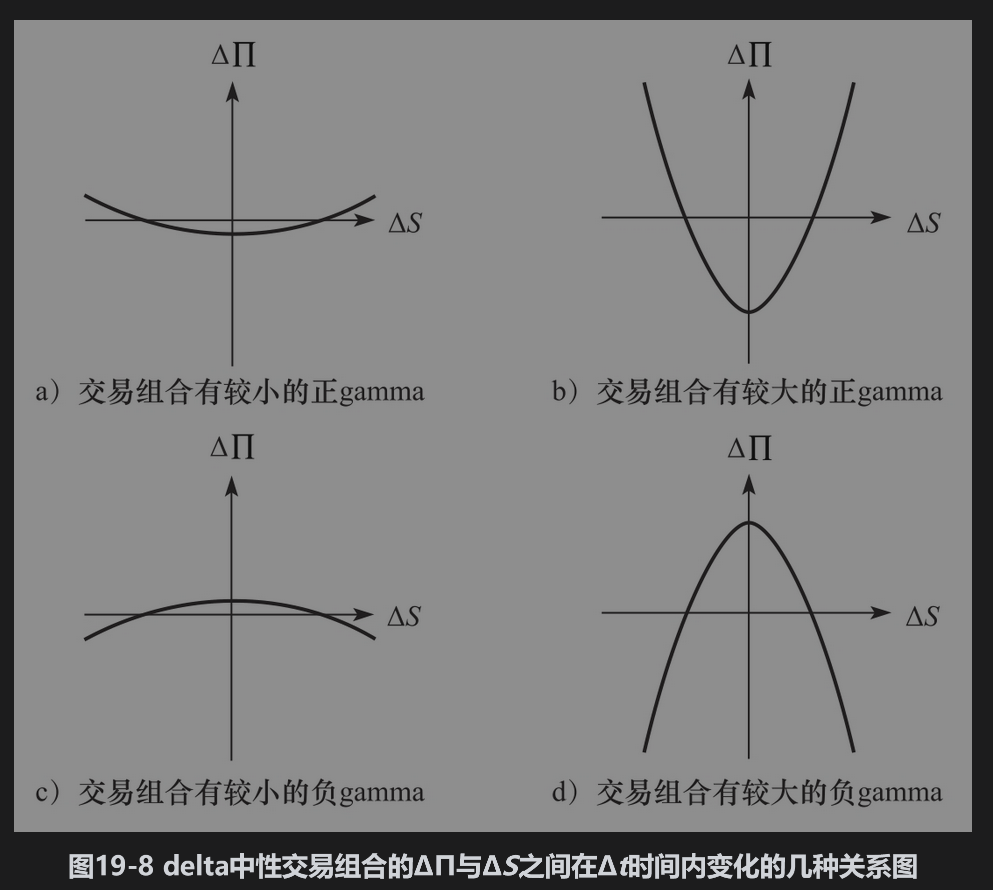

【例19-3】 假定某一标的资产上的期权组合为delta中性，gamma为-10000。式(19-3)表明，如果标的资产价格在较短时间内变化+2或-2，交易组合价值大约下跌

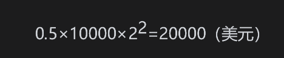

## 19.6.1 使投资组合gamma中性

标的资产的gamma总是为0，因此不能用来改变交易组合的gamma。改变交易组合的gamma必须采用价格与标的资产价格呈非线性关系的产品，例如期权。

假如一个delta中性交易组合的gamma为Γ，而一种正在交易的期权的gamma为ΓT。如果决定将wT数量的期权加入交易组合中，此时交易组合的gamma为

因此要使交易组合为gamma中性，期权头寸应为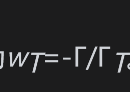。引入新的期权很可能会改变交易组合的delta，因此必须调整标的资产数量以便保证新的交易组合delta中性。值得注意的是交易组合仅仅在较短时间内能做到gamma中性，随着时间的变化，只有不断调整期权数量以便使成立，这样才能保证交易组合为gamma中性。

使一个交易组合既gamma中性又delta中性可以看作是对于图19-7中所示对冲误差的校正。delta中性保证了在对冲再平衡之间交易组合价值不受股票价格微小变化的影响，而gamma中性则保证了在对冲再平衡之间交易组合价值不受股票价格较大变化的影响。假设某一交易组合为delta中性，而gamma为-3000。某个正在交易的期权的delta和gamma分别为0.62和1.50。在交易组合中加入

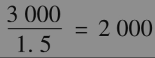

份期权会使得此交易组合变成gamma中性。但这时交易组合的delta也从0变成了2000×0.62=1240。因此为保证新的交易组合delta中性，我们必须卖出1240份标的资产。

## 19.6.2 gamma的计算

无股息股票上欧式看涨与看跌期权的gamma由以下关系式给出

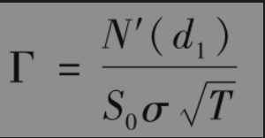

其中d1由式(15-20)定义，N′(x)由式(19-2)给出。多头的gamma总是为正，它与S0之间的变化关系如图19-9所示。图19-10展示了虚值期权、平值期权、实值期权的gamma与期限变化的关系。对于平值期权，gamma随期限的缩短而增大。短期限平值期权的gamma很高，这意味着这种期权持有者的头寸价值对于股票价格变动是非常敏感的。

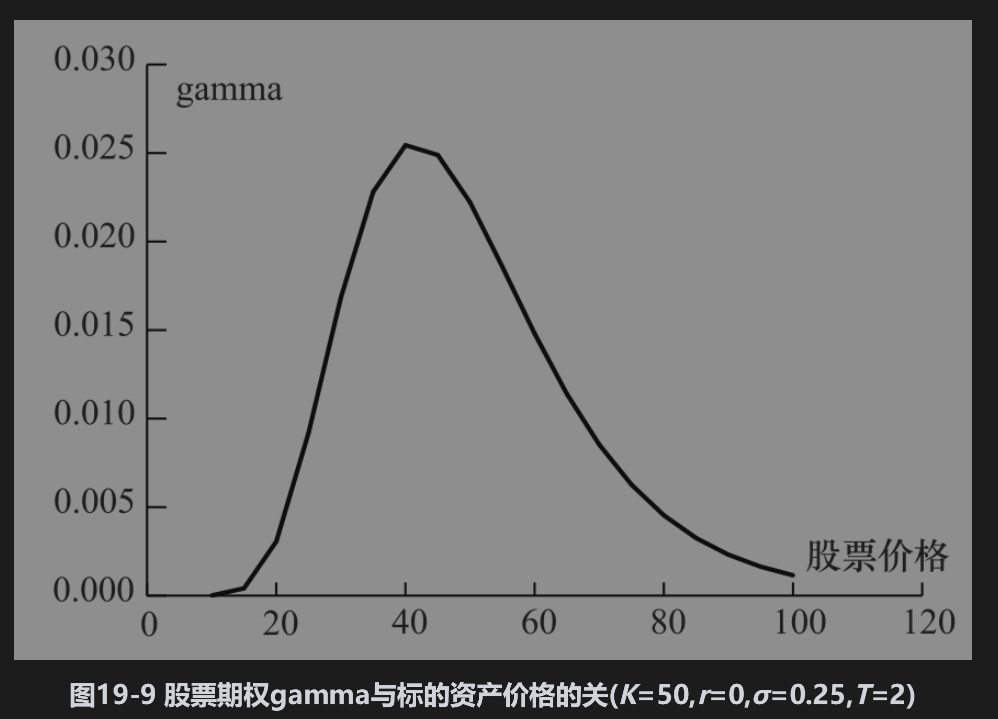

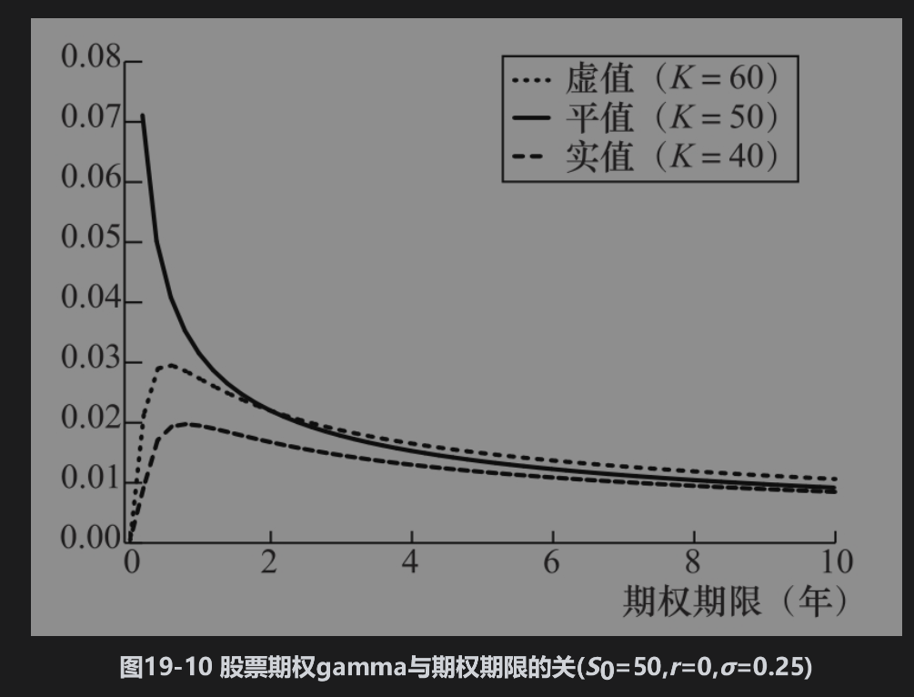

【例19-4】 与例19-1一样，考虑一个无股息股票上的看涨期权，其中股票价格为49美元，执行价格为50美元，无风险利率为5%，期权期限为20周（0.3846年），股票价格波动率为20%。这时S0=49,K=50,r=0.05,σ=0.2,T=0.3846，期权的gamma为

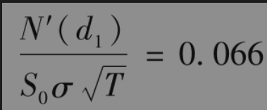

当股票价格变化为ΔS时，期权delta的变化为0.066ΔS。