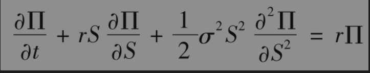
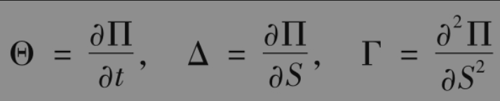
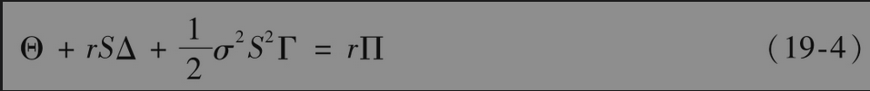
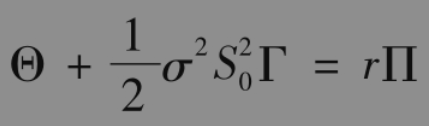

# 19.7 delta、theta和gamma之间的关系

无股息股票上单个衍生产品的价格必须满足微分方程式(15-16)。因此，由这些衍生产品所组成的资产组合Π也一定满足以下微分方程

因为

所以

对于其他标的资产，我们可以取得类似的结果（见练习题19.25）。

对于delta中性交易组合，Δ=0，因此

这一公式说明当Θ很大并且为正时，交易组合的gamma也很大，但为负，这一结论反过来也成立。这与图19-8所示结果是一致的，从而解释了为什么对于delta中性的交易组合，我们可以将theta作为gamma的近似。