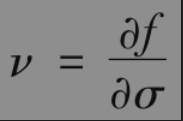
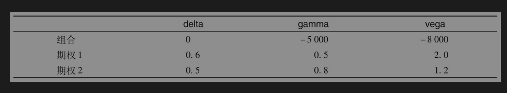
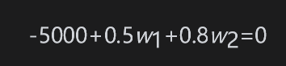
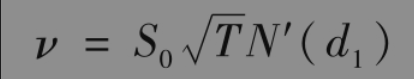
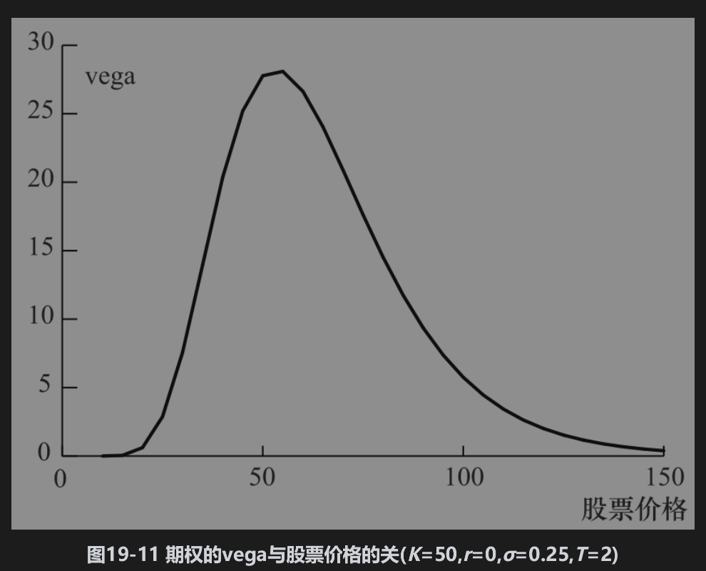
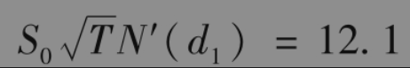

# 19.8 vega

如第19.3节所述，计算希腊值时通常将波动率设成其隐含波动率。在布莱克-斯科尔斯-默顿模型中，我们假设期权标的资产的波动率为常数，这意味着标的资产上所有期权的隐含波动率均为常数，并且与隐含波动率相等。

但在实际中，波动率会随时间变化，这意味着衍生产品价格会既随着标的资产价格与期限的变化而变化，同时也会随波动率的变化而变化。期权的vega(ν)是指期权价值变化与标的资产波动率变化的比率

其中f为期权价格，波动率σ通常取为期权的隐含波动率。如果一个交易组合的vega绝对值很大，此交易组合的价值会对波动率的细微变化非常敏感，当一个交易组合vega接近于零时，资产波动率的变化对交易组合价值的影响也会很小。

标的资产的头寸具有零vega，因此通过改变持有标的资产的头寸并不能改变vega。这一点与gamma相似。另一个使问题变得复杂的原因是组合中的不同期权具有不同的隐含波动率。假定在一小段时间内组合里所有期权的隐含波动率都改变同样数量的话，与gamma一样，组合的vega风险可以通过持有单一期权的头寸而得到对冲。假设某交易组合的vega为ν，正在交易的期权vega为νT，在交易组合中加入头寸为-ν/νT的这个期权可以使交易组合瞬时vega中性。但不幸的是，一个gamma中性的交易组合一般不会是vega中性，反之亦然。投资者要想使得一个交易组合同时达到gamma和vega中性，通常必须至少引入与标的产品有关的两种不同衍生产品才能达到目的。

【例19-5】 考虑delta中性的交易组合，其gamma为-5000，vega（衡量隐含波动率的灵敏度）为-8000。可以交易下表所列期权：购买数量为4000份期权1会使组合成为vega中性，这样做同时会使得delta增至2400，因此为了保证delta中性必须卖出2400个单位的标的资产，交易组合的gamma也会从-5000变成-3000。

为了保证交易组合既gamma中性又vega中性，我们需要同时将期权1与期权2加入组合中。用w1和w2来代表期权1与期权2的头寸，我们需要

和

以上方程的解是w1=400,w2=6000。因此分别加入400份期权1和6000份期2权会使得交易组合gamma和vega都成为中性。加入这两种期权后，交易组合的delta变为400×0.6+6000×0.5=3240，因此必须卖出3240份标的资产才能保持交易组合为delta中性。

无股息股票上欧式看涨期权或看跌期权的vega由以下公式给出

其中d1由式(15-20)定义，N′(x)由式(19-2)给出。欧式与美式期权多头的vega总为正，vega与S0变化的一般形式如图19-11所示。

【例19-6】 如例19-1一样，考虑一份无股息股票上的看涨期权，其中股票价格为49美元，执行价格为50美元，无风险利率为5%，期限为20周（=0.3846年），隐含波动率为20%。这时，S0=49,K=50,r=0.05,σ=0.2,T=0.3846。

期权的vega为

因此，当隐含波动率增加1%(0.01)时（由20%增长到21%），期权价格会相应增长大约0.01×12.1=0.121。

由布莱克-斯科尔斯-默顿模型及其推广形式来计算vega看起来有些奇怪，因为这个模型的一个基本假设就是波动率为常数。从理论上讲，由一个假定波动率为随机变量的模型来计算vega更为合理。然而交易员更喜欢测量由于布莱克-斯科尔斯-默顿隐含波动率变动而得gamma的简单处理方式。

gamma中性保证了在重新平衡对冲交易之间，交易组合价格不会因为标的资产大幅度的变动而产生很大变动，而vega中性则保证当σ变动时，交易组合的价值会得到保护。就像所期望的那样，采用正在交易的期权来做vega与gamma对冲是不是最好的选择将取决于对冲的再平衡时间间隔以及波动率的波动率。

当波动率变化时，短期限期权隐含波动率的变化要比长期限期权的隐含波动率要大，因此在计算组合的vega时，长期限期权波动率改变的幅度常常比短期限期权波动率的改变幅度要小。我们在第23.6节中讨论了其中一种这样的处理方法。