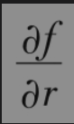
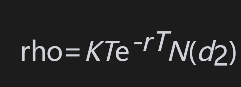
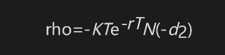
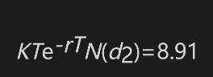

# 19.9 rho

期权交易组合的rho为交易组合价值变化与利率变化的比率

这一测度用于衡量当其他变量保持不变时，交易组合价值对于利率变化的敏感性。在实际中（至少对欧式期权）r通常取为对应于期权期限的无风险利率（见第28.6节）。这意味着当组合中的期权有不同期限时，交易员对整个利率期限结构具有风险敞口。对于无股息股票上的欧式看涨期权，rho由以下公式给出

其中d2由式(15-20)定义。对于欧式看跌期权

【例19-7】 如例19-1一样，考虑一个对于无股息股票上的看涨期权，其中股票价格为49美元，执行价格为50美元，无风险利率为5%，期限为20周（=0.3846年），股票价格波动率为20%。这时，S0=49,K=50,r=0.05,σ=0.2和T=0.3846。

期权的rho为

因此，当利率增加1%(0.01)时（由5%增长到6%），期权价格相应增长大约0.01×8.91=0.0891。