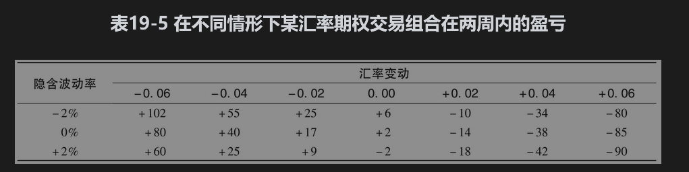

# 19.11 情景分析

除了观察诸如delta、gamma和vega等风险度量之外，期权交易员也常常做情景分析(scenario analysis)。这种分析包括计算在某一指定时间内许多不同情形下交易组合的盈亏，分析中时间长度的选择通常与产品的流通性有关。分析中所采用的情形可由管理人员选定，也可由模型来产生。

考虑如下情况：一家银行持有一个依赖美元/欧元汇率的期权组合，交易组合的价值取决于两个主要变量：汇率与汇率波动率。银行可以采用类似于表19-5一样的表格来计算在两周内不同情形下交易组合的盈亏。在表中，我们考虑了7种不同的汇率变动与3种不同的隐含波动率变动。在表中，我们假设组合中所有期权的隐含波动率变化大小都一样（注意，+2%表明波动率由10%变为12%，而不是由10%变为10.2%）。

在表19-5中，最大损失位于该表的右下角。这一损失对应的是波动率上涨2%、汇率上涨0.06的情形。在类似于表19-5的情景分析中，最大损失（像表19-5）通常位于表格的角落位置，但这一特性并不是永远正确的。例如，当银行的头寸为蝶式差价的空头时（见第12.3节），最大损失是对应于标的资产市场价格不变时的情形。