# 19.12 公式的推广

到目前为止，我们所推导出的delta、theta、vega与rho只适用无股息股票上的期权。表19-6给出了当标的股票支付连续股息收益率q时，这些公式相应的形式，其中d1和d2与式(17-4)和式(17-5)中一样。将q取为股指的股息收益率时，我们可以得出欧式股指期权的希腊值；将q取为外币无风险利率时，我们可以得出欧式货币期权的希腊值；当取q=r时，我们可以得出欧式期货期权的delta、gamma和vega值。欧式期货看涨期权的rho等于-cT，而看跌期货期权的rho等于-pT。

对于外汇期权，对于两种不同的利率有两个不同的rho值：国内利率的rho由表19-6中公式给(d2与(17-11)中一样），欧式看涨期权对于外币利率的rho是

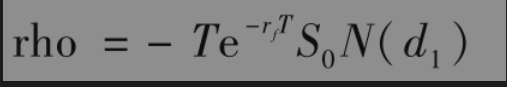

欧式看跌期权对于外币利率的rho是

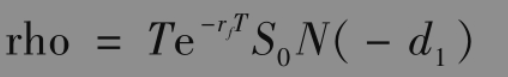

其中d1与式(17-11)中一样。

在第21章里，我们将讨论如何计算美式期权的希腊值。

## 19.12.1 远期合约的delta

delta的概念也适用于期权以外的其他金融产品。考虑一个无股息股票上的远期合约，式(5-5)表示远期合约的价值为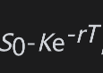，其中K为交割价格，T为远期合约的期限。在其他变量不变的情况下，当股票价格变化为ΔS时，股票上远期合约的价格变化也为ΔS，因此远期合约多头的delta永远为1.0。这说明一个股票上远期合约的多头可以用1股股票的空头来对冲，而远期合约的空头可以用买入1股股票来对冲其风险。

对于支付连续股息收益率q的资产，式(5-7)说明远期合约的delta为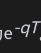。对于股指合约，q等于股息收益率。对于外汇远期合约，q等于外币无风险利率rf。

## 19.12.2 期货合约的delta

由式(5-1)可知，一个无股息股票的期货价格为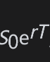，其中T为期货的期限。这一公式说明在其他变量不变的情况下，当股票价格变化为ΔS时，期货价格的变化为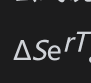。因为期货价格每天都按市场定价，期货合约多头的持有者几乎马上会得到数量的收益，因此期货合约的delta为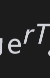。对于股息收益率为q的股票，利用式(5-3)我们可以得出delta为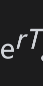。我们应当注意，合约每日结算会造成期货合约delta与远期合约delta之间的轻微差别。在利率为常数，而且远期价格等于期货价格时，这一结论仍成立（与其相关的讨论，见业界事例5-2）。

有时会用期货合约来构造delta中性的头寸。定义

T：期货合约的到期日；

HA：delta对冲所需持有的资产头寸；

HF：delta对冲时需要的期货合约数量。

如果标的资产不支付股息，上面的分析说明

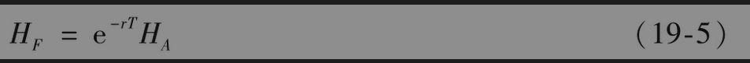

如果标的资产支付的连续股息收益率为q

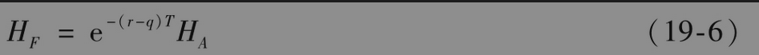

对于股指，q等于股指收益率；对于货币，q等于外币汇率，因此

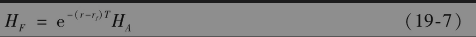

【例19-8】 假设一家美国银行持有一个外汇期权交易组合，并可以通过持有458000英镑的空头来达到delta中性。假定美国无风险利率为4%，英国无风险利率为7%。由式(19-7)可知当利用9个月期的货币期货做对冲时需要的空头为

即468442英镑。因为每一个期货合约是关于卖出或买入62500英镑。这时，该银行持有7份期货合约的空头（这里的合约数量7是与468442/62500最接近的整数）即可以达到对冲目的。

