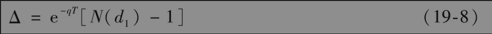
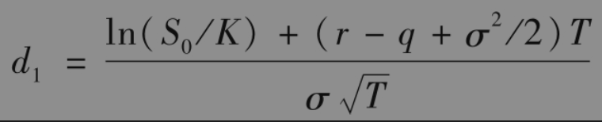
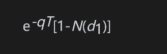
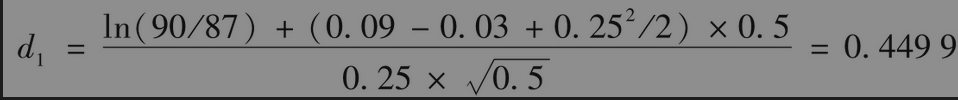
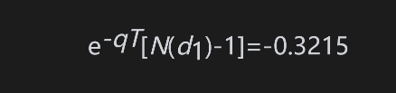
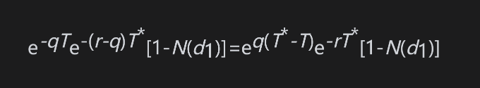
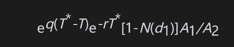
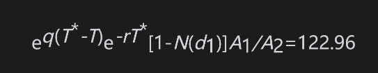

# 19.13 资产组合保险

投资组合的管理人常常想获取其管理投资组合上的看跌期权：在市场下跌时，看跌期权会对投资组合提供保护，而在市场上涨时，投资组合仍有潜在的上涨空间。一种做法（在第17.1节里曾有过讨论）是买入像标准普尔500这样的股指看跌期权，而另外一种做法则是以合成的方式构造期权。

按合成的方式构造期权需要持有一定数量的标的资产（或标的资产上的期货），所持资产头寸的delta应当与所需期权头寸的delta相同。构造合成期权所需的头寸与对冲该期权所需要的头寸刚好相反，这是因为对期权的对冲过程涉及构造一个相同但具有相反头寸的合成期权。

对投资组合管理人而言，有两种原因可能会使构造合成看跌期权比在市场上买入期权更有吸引力：第一个原因是期权市场可能不具备足够大的流通性来提供大型基金经理所需要的产品；第二个原因是基金经理所需要期权的执行价格和到期日与交易所里的期权不同。

合成期权可以通过交易投资组合或交易期货合约来完成。我们首先描述如何由交易投资组合来构成一个看跌期权。

由表19-6得出，投资组合欧式看跌期权的delta为

与通常一样

S0为投资组合价值，K为执行价格，r为无风险利率，q为投资组合的股息收益率，σ为投资组合波动率，T为期权期限。组合的波动率通常假设为其beta乘以一个风险充分扩散的市场指数的波动率。

为了以合成的方式构造看跌期权，基金经理应当保证在任意给定时刻，原组合中比例为

的股票被卖掉，并且将所得资金投入无风险资产。当原投资组合价值下跌时，由式(19-8)给出的看跌期权的delta会变得越来越小，因此投资组合卖出的份额必须增加；当原投资组合的价值上涨时，看跌期权变负的程度会有所减少，因此投资组合卖出的份额要减少（即需购回原投资组合的一部分）。

采用这种策略来构造投资组合保险意味着在任意给定时刻，基金被分为两部分：一部分基金为需要为其提供保险的股票组合；另一部分为无风险资产。当股票组合价格上涨时，无风险资产要被变卖，股票组合头寸会有所增大；当股票价格下跌时，股票组合头寸要被减小，无风险资产要被买回。保险的成本是由于证券管理人买高卖低而造成的。

【例19-9】 一投资组合价值为9000万美元。为了在市场下滑时对投资组合提供保护，投资组合经理需要持有一个执行价格为8700万美元，期限为6个月的看跌期权。这里无风险利率为每年9%，股息收益率为每年3%，波动率为每年25%，标准普尔500股指的当前价格为900。投资组合的结构很接近标准普尔500，因此投资组合经理的一种做法是买入1000份标准普尔500上执行价格为870的看跌期权合约（在第17.1节中讨论过）。另外一种做法则是构造合成期权。这里，S0=9000,K=8700,r=0.09，q=0.03，σ=0.25，T=0.5，因此

初始时刻所需期权delta为

这说明最初要卖出32.15%的投资组合来匹配所需期权的delta。卖出证券的收入将被投资于无风险资产上。需要经常调整需要卖出投资组合的数量。例如，如果在一天后投资组合价值下跌到8800万美元，这时所需期权的delta变为0.3679，因此需要再卖出原来投资组合的4.64%，并将所得收入投资于无风险资产上。如果交易组合价值增至9200万美元，所需期权的delta变为-0.2787，这时应买回原投资组合的4.28%。

## 19.13.1 利用指数期货

我们也可以利用指数期货来构造合成期权，而且这种做法有时比利用标的股票来构造合成期权更受欢迎，这是因为交易股指期货的费用要比交易相应标的资产的费用更低。由式(19-6)和式(19-8)，指数期货合约空头的金额占投资组合价值的比例应为

其中T*为期货的到期日。如果投资组合价值等于A1乘以指数，指数期货的规模等于A2乘以指数，那么在任意时刻所持指数期货合约空头的数量为

【例19-10】 假设在前一个例子中我们采用9个月期的标准普尔500期货来构造合成期权，这时T=0.5，T*=0.75，A1=100000,d1=0.4499，每个股指期货是关于股指的250倍，因此A2=250，最终需要期货合约空头的数量为

即123（近似到最近的整数）。随着时间的推移与指数的变化，期货的头寸要随时加以调整。

在这里的分析中，我们假定投资组合的收益与指数一样。当实际情况不是这样时，我们需要：①计算资产组合的beta：②计算提供保护所需的股指期权头寸数量：③选择股指期货头寸来构造合成期权。如第17.1节所述，期权的执行价格应等于投资组合价格达到保险水平时所对应的市场指数的预期水平。所需指数期权的数量等于投资组合的β乘以在投资组合β值为1时所对应的期权数量。

## 19.13.2 对于波动率的影响

在第15章里，我们曾经讨论过究竟是纯粹由于新信息的出现还是交易本身也会引起股票波动率的问题。像以上所描述的这种投资组合保险交易策略有可能会使市场波动率增大：当市场下跌时，这些策略会使投资组合管理人要么卖出股票要么卖出指数期货。这两种交易都会加重市场的下跌幅度（见业界事例19-2）。抛售股票会直接导致股指进一步下跌，而卖出股指期货也往往会使期货价格下跌。根据指数套利机制（见第5章），这同样会对股票产生抛售的压力，市场指数也会因此下跌。类似地，当市场价格上涨时，投资组合保险会使投资组合管理人或者买入股票或者买入期货，这会进一步加剧市场价格上涨的幅度。

除了这些正式的投资组合保险交易策略外，我们还可以想象许多投资者在有意或无意之中实施自己的投资组合保险策略。例如，某投资者可能在市场下跌时出售证券以便限制自己的损失。

投资组合保险交易策略（正式或非正式）是否会影响市场波动率取决于市场对组合保险策略所产生交易量的容纳程度。如果组合保险交易仅仅占市场交易中很少一部分，那么这种交易策略对市场可能不会有太大的影响。但当投资组合保险变得越来越普遍时，这种交易策略往往会使市场产生不稳定的影响，在1987年就发生了这种情况。

## 业界事例19-2

## 投资组合保险是造成1987年股票暴跌的元凶吗

1987年10月19日，星期一，道琼斯工业平均指数的下跌幅度超过了20%。对于市场暴跌，许多人认为组合保险策略扮演了重要的角色。1987年10月，有近600亿~900亿美元的股票资产受组合保险交易策略影响，这种保险策略利用我们在第19.13节中所述的方法以合成的形式构造看跌期权。在1987年10月14日星期三至1987年10月16日星期五这段时间里，市场暴跌了近10%，其中大部分下跌发生在星期五的下午。由于这一下跌，由交易组合保险策略程序显示至少有120亿美元的股票或股指期货需要出售。但事实上，交易组合保险持有人的销售量只达到40亿美元。在接下来的一周开始时，需要卖出大量股票或股指期货来达到满足他们的模型所要求的数量。据估计，在10月19日星期一由三家交易组合保险持有人所卖出股票的数量几乎占整个纽约股票交易所交易量的10%，而整个交易组合保险策略所产生的交易占整个股指期货交易的21.3%。其他投资者预见到交易组合保险持有人会大量抛售股票，这些投资者也纷纷将自己的股票抛出，这也可能进一步加剧了股票市场的下跌幅度。

股票市场下跌得如此之快造成了整个交易市场的超负荷运作。许多组合保险持有人不能够及时完成模型所要求的交易，因此组合保险也没有带来预定的效果。当然在1987年后，交易组合保险策略的使用大幅减少。这一故事说明当所有市场参与者都在使用类似的交易策略时，这种交易策略（甚至对冲策略）是非常危险的。