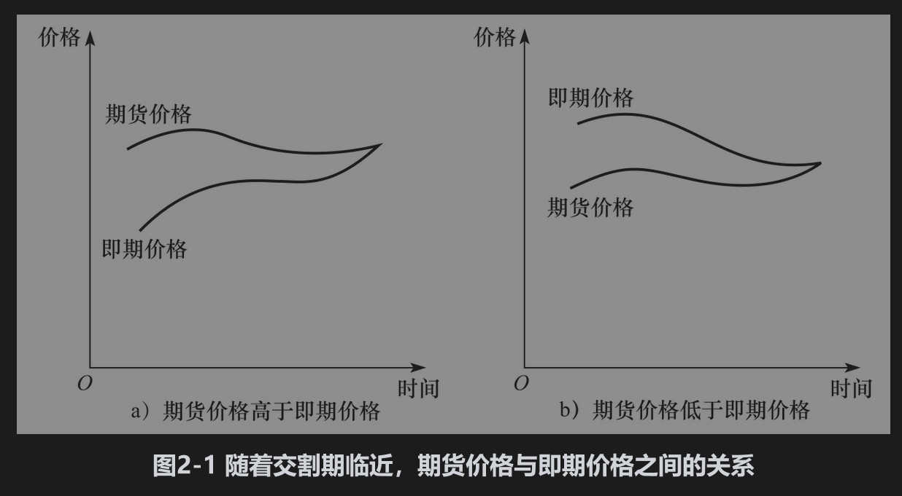

# 2.3 期货价格

收敛到即期价格随着期货合约交割月份的逼近，期货价格会逐渐收敛到标的资产的即期价格。在到达交割期后，期货价格会等于（或非常接近）即期价格。

为了说明原因，我们首先假定在交割期内期货的价格高于即期价格，这时，交易员有明显的套利机会：

(1)卖出一份期货合约（即持有空头）；

(2)买入资产；

(3)进行交割

以上交易一定会盈利：其金额等于期货价格和即期价格的差价。当交易员利用这种套利机会后，期货价格将会下降。接下来假定在交割期间内期货价格低于即期价格。想获得该标的资产的公司会发现承约期货多头然后等待空头方交割资产更加有利。一旦公司这么做，期货的价格将会上涨。

因此，在交割期内，期货价格与即期价格会十分接近。图2-1显示的是期货价格收敛于即期价格的情形。在图2-1a中，在交割期之前，期货价格高于即期价格；在图2-1b中，在交割期之前，期货价格低于即期价格。第5章将讨论在什么情况下我们会观察到以上不同的变化形式。

