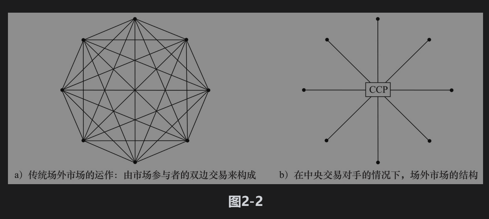

# 2.5 场外市场

第1章介绍的场外市场是指公司之间不通过交易所而进行衍生产品交易的市场。信用风险通常是场外市场的一个特征。考虑两家公司A和B之间进行的一些衍生产品交易。当交易的净价值对B为正值时，如果A违约，B将会受到损失；类似地，当交易的净价值对A为正值时，如果B违约，A将会受到损失。为了降低信用风险，场外市场借用了交易所采用的一些机制，下面我们将讨论这些机制。

## 2.5.1 中央交易对手

我们曾在第1.2节中简单地提到过中央交易对手(CCP)的概念，中央交易对手为标准的场外交易进行结算，其功能与交易所的清算中心类似，而CCP的成员与清算中心成员类似：他们需要提供初始保证金和追加保证金，同时也要提供担保基金。

在场外市场上，当两个交易商A和B就某衍生产品达成交易意向后，他们会同时将交易提交给CCP。当CCP同意交易时，它将同时成为A和B的交易对手（这一点类似于期货交易所清算中心分别是期货多头和空头的交易对手）。例如，如果在一个远期合约中，A同意在一年后以指定价格从B买入某资产，CCP将进行以下交易：

(1)在1年后，以指定价格从B买入资产；

(2)在1年后，以指定价格向A卖出同一资产。

CCP将同时承担A和B的信用风险。

所有CCP成员都要向CCP提供初始保证金，每天都要对每笔交易定价，每天都会向CCP成员支付或收取追加保证金。非CCP成员的场外市场参与者必须经过CCP成员来进行交易。在交易中，CCP成员要向CCP提供保证金，该参与者与CCP成员之间的关系类似于在交易所里经纪商与清算中心会员之间的关系。

在2007年开始的信用危机之后，市场监管变得更加关注市场系统性风险（见业界事例1-2）。我们在1.2节提到过，许多地区都通过立法来要求大多数的标准衍生产品通过CCP来进行交易。

## 2.5.2 双边清算

在场外衍生产品市场上，不能通过CCP结算的产品都要进行双边清算。在双边清算场外市场，公司A和B通常可以签署一项覆盖双方之间所有交易的主协议[注]，这种主协议通常包括称为信用支持的附件(credit support annex, CSA)，该附件要求A或B（或双方）提供抵押品，抵押品的功能类似于交易所清算中心或CCP对其会员所要求的保证金。

在CSA的抵押品协议中通常会要求每天都要对交易进行定价。A和B之间可能有以下形式的简单双边协议：如果从一天到下一天，两者之间的交易对A的价值增加了X（对B而言，价值减少了X），B需要向A支付价值为X的抵押品；相反，如果对于B而言，两者之间交易的价值增加了X（对于A而言，价值减少了X），A要向B支付价值为X的抵押品（采用交易所市场的术语，X对应于追加保证金）。在第24章中我们将进一步讨论双边清算交易的抵押品协议和对手信用风险的评估问题。

在传统上，CSA协议要求提供初始保证金的情况相对比较罕见，但最近市场上有了一些新的变化。从2016年开始，监管规定要求凡是在金融机构[注]之间进行的双边清算交易中，交易方既要提供初始保证金也要提供追加保证金，初始保证金的计算要提交给第三方进行。

抵押品大大减少了双边清算场外交易的信用风险（因此，一旦金融机构之间的交易通过CCP以及双边清算交易有初始保证金和追加保证金的规定后，信用风险将会减少）。20世纪90年代，长期资本管理公司(Long-Term Capital Management,LTCM)曾对其双边清算衍生产品使用了抵押品协议，这些协议使LTCM能够取得很高的杠杆。抵押品协议确实为LTCM提供了信用保护，但如业界事例2-2所示，LTCM过高的杠杆造成了这家对冲基金所面临的其他风险。

### 业界事例2-2

### 长期资本管理

公司的巨大损失长期资本管理公司(LTCM)是在20世纪90年代中期成立的对冲基金。在所做的双边清算交易中，LTCM一直使用抵押品。这家对冲基金使用的投资策略是收敛套利(convergence arbitrage)，这一策略的简单例子如下：假如X和Y是同一家公司发行的两种债券，X和Y承诺相同的收益，但X的流动性比Y要差（X的交易没有Y活跃），在市场上对流动性会给予一定的价值，因此X的价格比Y要低一些。LTCM会同时对X持多头，对Y持空头，然后等待两个债券的价格在将来趋向一致。

当利率增长时，LTCM预计债券价格下降的数量基本相同，因此对于X债券付出的抵押品与Y债券收入的抵押品基本相同；类似地，当利率下降时，LTCM预计债券价格上涨的数量也会基本相同，因此由抵押条约造成的资金外流不会很大。

1998年8月，俄罗斯对其自身国债违约，因此造成了资本市场的“安全投资转移”(flight to quality)现象，这一现象造成流动性好的产品价格与流动性差的产品价格之间的差价比平时要高得多，因此在LTCM投资组合中流动性好的产品与流动性差的产品之间的差价急剧增大：买入的债券价格大幅下降，而卖出的债券价格急剧上升，这时无论对多头方还是空头方交易都必须注入抵押品，由于具有高杠杆，LTCM经历了巨大的困难。LTCM必须对交易进行平仓，从而其造成了40亿美元的损失。假如财务并不处于高杠杆状态的话，LTCM也许能够承受安全投资转移现象所带来的压力，这样公司就有机会生存到流动性好的产品价格和流动性差的产品价格趋向一致的时候。

图2-2显示了双边清算和CCP结算的运作机制（这里我们假设市场上总共有8个参与者，而且只有一个CCP）。在双边清算机制下，在市场参与者之间会产生如图2-2a所示的多个协议。如果所有交易都通过CCP进行结算，这时的情形如图2-2b所示。在实际中，并非所有的场外衍生产品均由CCP来结算，市场上也存在多个CCP，因此，实际市场具备图2-2a及图2-2b所示的两种特点。

## 2.5.3 期货交易与场外交易

无论以何种方式对交易进行结算，现金形式的初始保证金都会赚取利息，而期货交易中的结算会员提供的追加保证金却不会赚取利息，这是因为追加保证金是用在每日结算上。无论是通过双边清算还是CCP结算，在场外市场都不是每日结算。正是由于这个原因，由CCP成员提供的每日追加抵押品，或由于CSA而提供的抵押品，当抵押品是现金时都会赚取利息。

证券常常可以用来作为抵押品，[注]但是在决定将证券作为抵押品的价值时，通常会将其市值降低一定数量。所降低的数量叫折扣(haircut)。