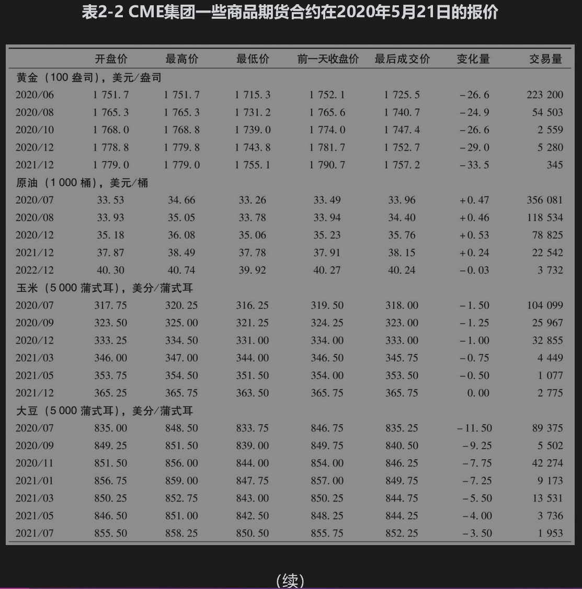
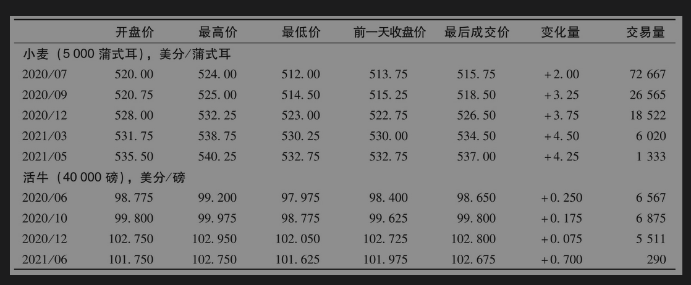

# 2.6 市场报价

在交易所和互联网上可以得到有关期货行情的报价。根据CME集团提供的数据，表2-2是一些商品期货合约在2020年5月21日的报价。第3章、第5章和第6章将分别给出有关股指期货、外汇期货以及利率期货的报价。

在表2-2中每部分的前面列有期货标的资产、期货的规模以及报价方式。第1项资产为黄金，期货规模为100盎司，报价方式为每盎司的美元价格。期货的到期月列在表中的第1列。

## 2.6.1 价格

表2-2中每一行的前三个数字分别代表为开盘价、当天交易的最高价和当天交易的最低价。开盘价是合约交易开始后立即成交的期货合约价格。对于2020年6月的黄金期货合约，2020年5月21日的期货开盘价为1751.7美元，在当天最高价是每盎司1751.7美元，最低价是每盎司1715.3美元。

## 2.6.2 结算价格

结算价格(settlement price)用于计算每天合约的盈亏以及所需要的保证金数量。该价格通常为在交易日结束之前最后成交的期货合约价格。表2-2中每行的第4个数字是交易日前一天期货合约的结算价格，第5个数字为最新交易价格，第6个数字为和上一个交易日结算价格相比时价格的变化量。对2020年6月的黄金期货，前一天的结算价格为1752.1美元，最新交易价格为1725.5美元，比前一天下跌了26.6美元。这时，如果2020年5月21日的结算价格为1725.5美元，持有一份合约多头的投资者在5月21日会发现其保证金账户的余额减少了2660美元；类似地，持有一份合约空头的投资者在这一天会发现其保证账户的余额增加了2660美元。

## 2.6.3 交易量和未平仓合约数量

表2-2中的最后一列显示了合约交易量。交易量是在一天内交易的合约总份数。我们可以将交易量与未平仓数量(open interest)进行比较，未平仓数量是尚未平仓合约份数的总量，它是所有多头的总和，也是所有空头的总和。

如果在一天内短线交易员进行了很大数量的交易（在一天中承约合约的某种头寸，并在休市前将交易平仓），与刚刚开盘时未平仓数量以及休盘时未平仓数量相比，一天的交易量可能会更大。

## 2.6.4 期货价格的规律

期货价格可以呈现不同的规律。这个价格可以随着期货合约到期而增加，也可以随着期货合约到期而减少，或者表现出随着期货到期有时上升有时下降的混合模式，期货价格随着到期而增加的期货市场被称为正常市场(normal market)，期货价格随着到期而下降的期货市场被称为反向市场(inverted market)。在表2-2中，黄金、原油、玉米以及小麦在2020年5月21日在一定程度上表现为正常市场。大豆和活牛表现出两种模式的混合：有时是正常市场，有时是反向市场。