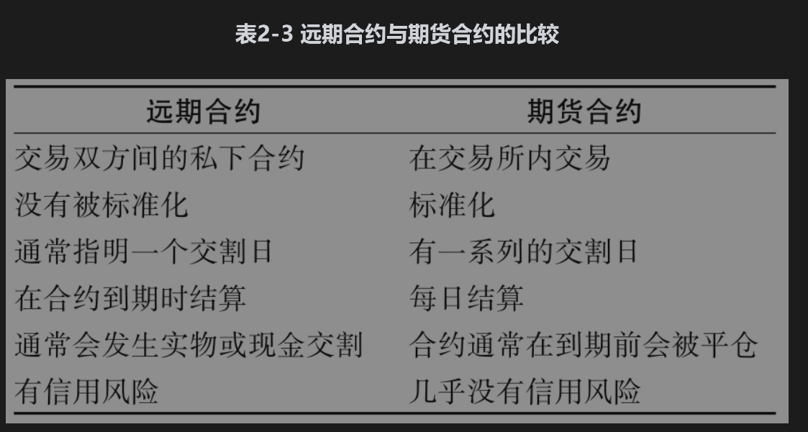

# 2.11 远期与期货合约的比较

表2-3总结了远期合约与期货合约的主要区别。两种合约均是在将来特定时刻以某种价格买入或卖出某种资产的协议。远期合约的交易在场外市场进行，并且没有标准的合约规模与交割安排，这种合约通常会指定一个交割日期，一般会持有至到期日，然后进行交割。期货合约是在交易所交易的标准合约，交割日期通常为一段时间，这种合约每天结算，并且一般在到期日之前会被平仓。

## 2.11.1 期货和远期合约的盈利

假定英镑的90天远期汇率为1.2000（每英镑所对应的美元数量），这一汇率也正好是在90天后交割的外汇期货价格。那么，这两个合约的损益有何区别呢？

在远期合约中，全部的损益均在合约到期时实现。在期货合约中，由于每日结算，损益每天被实现。假设投资者A承约了90天期限、面值100万英镑的远期合约多头，而投资者B承约了90天期限、面值也为100万英镑的期货合约多头（因为1份期货合约是关于62500英镑，所以投资者B应持有16份合约）。假定在90天后，即期汇率为每英镑1.4000美元，投资者A在90天后收入200000美元；投资者B也有收益，但其收益分散在90天内。在某些天投资者B可能会有损失，而在其他天会有收益。但是总体来讲，将损失和收益相抵后，B在90天内的总收益为200000美元。

## 2.11.2 外汇报价

外汇上的远期和期货交易都十分活跃。但是，有时在这两个市场上汇率的报价是有区别的。例如，在期货中有美元时，期货的报价总是一个外币单位所对应的美元数量，或者一个外币单位所对应的美分数量。远期报价永远同即期市场报价一样。这意味着对于英镑、欧元、澳元以及新西兰元，远期报价为一个外币单位所对应的美元数量（这与期货报价相同）。对于其他主要货币，远期报价为1美元兑换的外币数量。考虑加元(CAD)的情形，期货报价为每加元0.7500美元，与之对应的远期报价为每美元1.3333加元(1.3333=1/0.7500)。