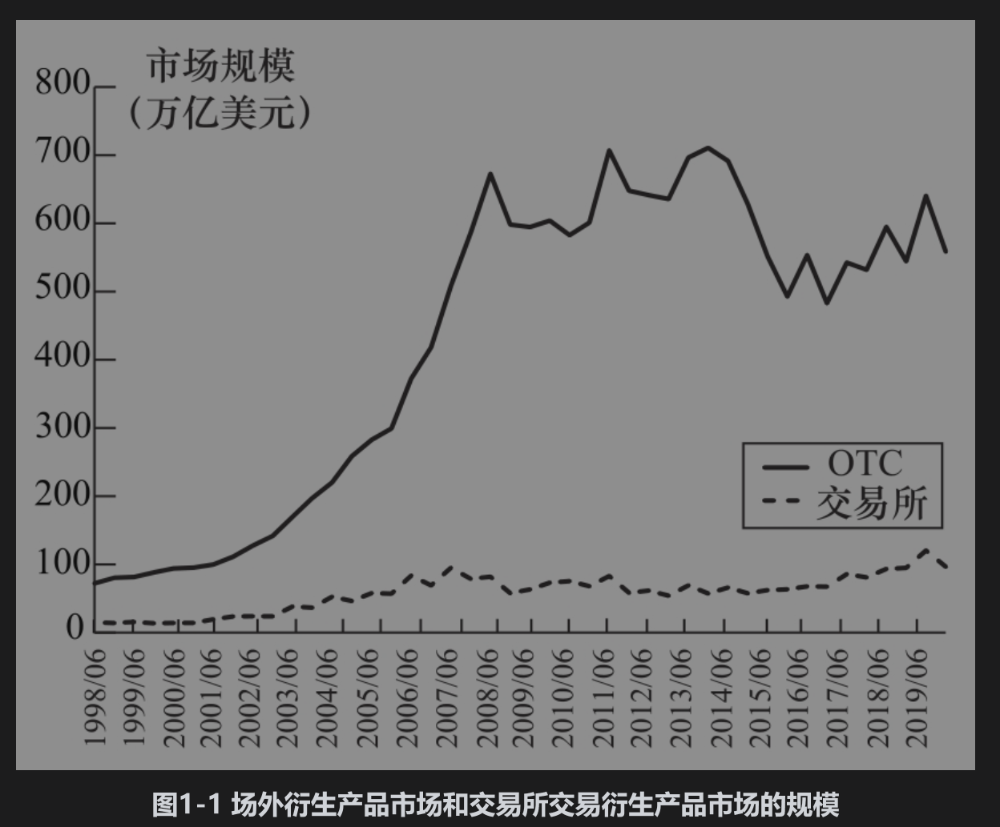

# 1.2 场外交易市场

并不是所有的衍生产品交易都是在交易所里进行的，场外市场(over-the-counter,OTC)上也有许多交易。银行与其他大型金融机构、基金经理以及一些大公司都是衍生产品场外市场的主要参与者。一旦同意了场外交易，双方可以将交易递交到中央交易对手(central counterparty, CCP)，或进行双边清算，中央交易对手的作用如同交易所的清算中心：它介于两个交易对手之间，从而使交易的一方不用顾虑对手的违约风险。当双边清算时，交易双方通常会签署一份覆盖他们之间所有交易的协约，在协约中常常会说明在什么情况下可以终止现存的交易，在终止交易时如何计算最终结算数量，以及如何计算双方必须缴纳的抵押品（如果需要的话）数量。在第2章里我们将更详细地讨论中央交易对手与双边清算。大型银行常常是市场上流行产品的做市商(market maker)。这意味着他们在随时准备提供买入价(bid price)（即以这一价格买入产品）的同时，也提供卖出价(ask price)（即以这一价格卖出产品）。

大型银行常常是市场上流行产品的做市商(market maker)。这意味着他们在随时准备提供买入价(bid price)（即以这一价格买入产品）的同时，也提供卖出价(ask price)（即以这一价格卖出产品）。

在2007年开始的信用危机之前（详见第8章中的讨论），很大程度上衍生产品场外市场是不受监管约束的。在信用危机与雷曼兄弟倒闭之后（见业界事例1-1），场外市场受到许多新规则的影响，这些规则的目的是改善场外市场的透明度与降低系统风险（见业界事例1-2）。从某些方面来看，场外交易被强制性地变得越来越像交易所市场。三项重要的变化是：

(1)在可能的情况下，美国的场外标准衍生产品必须按互换执行场所(swap execution facilities, SEF)中所述的方式进行交易。在这样的交易平台上，市场参与者可以出示买入价与卖出价，并且一个市场参与者可以选择接受另一个市场参与者所出示的报价而进行交易。

(2)对金融机构之间的大多数标准衍生产品交易，世界上许多地区都要求使用中央交易对手。

(3)所有交易都必须向登记中心提供备案。

## 业界事例1-1

雷曼兄弟的破产2008年9月15日，雷曼兄弟向法庭提出破产保护，这是美国历史上最大的一起破产案，整个衍生产品市场都受到震动。直到破产的最后时刻，雷曼兄弟一直好像都有生存的机会。几家公司（比如韩国产业银行、英国巴克莱银行以及美国银行）都曾表示有购买雷曼的愿望，可是一直到最后都没有达成交易。许多人认为雷曼会是“大而不倒”(too big to fail)的公司，同时认为在最终没有买主的情况下，政府也会出资救助雷曼兄弟，但事实并非如此。

究竟发生了什么呢？雷曼兄弟的破产是高杠杆、高风险投资以及流动性问题等多种原因导致的。商业银行因承接存款，故而必须按照监管规定设定一定数量的资本金，但雷曼兄弟是一家投资银行，从而不受这一资本金监管规则的约束。2007年，雷曼兄弟的杠杆比率高达31:1，这意味着资产跌价3%～4%就会消耗掉整个银行的资本金。当时雷曼兄弟的主席与首席执行官理查德·福尔德(Richard Fuld)崇尚激进的风险文化，据说他曾对自己的高管讲：“每天都是在打仗，你们必须去消灭敌手。”雷曼兄弟的首席风险官很有能力，但其影响却有限，这位风险官甚至在2007年被高管委员会免职。雷曼兄弟最终承担的风险产品包括大量由次债派生出的债券（我们将在第8章对这些产品进行描述）。雷曼兄弟的运作大多依赖于短期债务，但是当市场对雷曼兄弟失去信心时，这些贷款人拒绝将贷款进行延期，因此造成了雷曼兄弟的破产。

雷曼兄弟在场外衍生产品市场上非常活跃，其交易对手数量高达8000多个，交易数量在百万笔以上。雷曼兄弟的交易对手在交易中常常要支付抵押品，但这些抵押品却被雷曼兄弟用于不同的目的。在银行破产之后，光到底谁欠谁的钱与欠多少的官司就打了好多年。

## 业界事例1-2

## 系统风险

系统风险是指当一家金融机构宣布破产时，它所产生的连锁反应会导致其他金融机构破产，从而威胁整个金融系统的稳定性。在银行之间有很多场外交易，如果银行A破产，和银行A所做的许多交易将会给银行B带来重大损失，从而可能导致银行B的破产，与银行A和银行B有许多交易的银行C也许同样会有巨大损失，从而产生严重困难，等等。

尽管金融系统挺过了1990年德崇证券(Drexel)的破产以及2008年雷曼兄弟的破产，但监管部门仍然对此非常关注。由于对系统风险的顾虑，政府在2007年和2008年的市场动荡期间营救了许多大型金融机构，使它们避免了破产。

## 市场规模

场外市场与交易所里的衍生产品交易数量都很庞大。尽管与交易所市场相比，场外市场每年的交易次数相对较少，但是交易的平均规模却大得多。虽然这两个市场的统计结果不具有完全可比性，但很显然场外市场规模远远大于交易所市场。国际清算银行(Bank for International Settlements, www.bis.org)从1998年起开始统计市场交易数据，图1-1比较了：①1998年6月～2019年6月场外市场未平仓交易的面值总和；②同一段时间内，交易所合约中的标的资产的总价值。这些数据显示，2019年6月，场外市场交易量为558.5万亿美元，而交易所市场交易量为96.5万亿美元。[注]如图1-1所示，在2007年之前场外市场规模迅速扩大，但此后净增长不大。缺乏增长的其中一个原因是“收缩”(compression)变得越来越流行，这种做法是指两个或更多个交易对手重组相互之间的交易，从而降低标的本金数额。

在分析这些数据时，我们应该认识到场外市场交易产品的合约金额（面值）与其价值并不是一回事。例如，某场外市场交易为1年期按某一指定汇率以英镑买入1亿美元的合约，这一交易的合约金额为1亿美元，但是这一交易的价值可能只有100万美元。据国际清算银行估计，2019年12月所有场外市场合约的市场总价值大约为11.6万亿美元。

