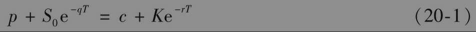
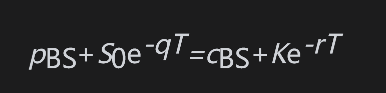
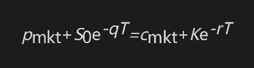
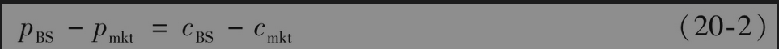
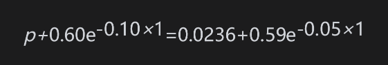

# 20.1 为什么波动率微笑对看涨期权与看跌期权是一样的

在本节里，我们将说明当欧式看涨期权和欧式看跌期权具有同样的执行价格和期限时，它们的隐含波动率是一样的。这个结论会给我们带来方便：它说明当讨论波动率微笑时，我们没有必要明确指出期权是看涨还是看跌。在前面几章里我们讲过，当欧式看涨期权与看跌期权具有同样的执行价格和期限时，看跌-看涨平价关系式提供了它们之间的一个等式：当标的资产提供股息收益率q时，这个关系式为

与通常一样，c和p分别代表欧式看涨和看跌期权的价格，它们具有同样的执行价格K与期限T。变量S0为今天的标的资产价格，r为对应于期限T的无风险利率。

看跌-看涨平价关系式的一个重要特征是它建立在比较简单的无套利机会基础上。这一结果并不需要对资产价格的分布做任何假设：无论资产价格是否服从对数正态分布，这个关系式都是成立的。

假定对于某个给定的波动率，pBS与cBS是由布莱克-斯科尔斯-默顿模型得出的欧式看跌与看涨期权的价格。再假定pmkt及cmkt为这些期权的市场价格。因为看跌-看涨平价关系式对于布莱克-斯科尔斯-默顿模型也成立，因此我们有

在无套利的前提下，看跌-看涨平价关系式对市场价格也成立

以上两个公式相减，我们得出

以上公式说明：当采用布莱克-斯科尔斯-默顿模型对具有相同期限与执行价格的看跌及看涨期权定价时，公式所产生的误差应完全相同。

假定欧式看跌期权的隐含波动率为22%。这意味着当布莱克-斯科尔斯-默顿模型中的波动率为22%时，pBS=pmkt。由式(20-2)得出，当采用同一波动率时cBS=cmkt，因此看涨期权的隐含波动率也是22%。这里的分析说明，欧式看涨期权的隐含波动率与具有相同执行价格和期限的看跌期权隐含波动率总是一样的。换句话讲，对于给定的执行价格与期限，利用布莱克-斯科尔斯-默顿模型对欧式看涨期权定价与对欧式看跌期权定价必须要采用同样的波动率。这说明看涨期权与看跌期权的波动率微笑（即固定期限时，隐含波动率与执行价格之间的关系）相同。更一般地讲，这说明波动率微笑曲面（隐含波动率作为执行价格与期限的函数）对看涨期权与看跌期权是一样的。在近似意义下，以上结论对美式期权也是成立的。

【例20-1】 某一外币的目前价格为0.60美元。美国的无风险利率为每年5%，外币的无风险利率为每年10%。外币1年期限、执行价格为0.59美元的欧式看涨期权市场价格为0.0236。DerivaGem给出的隐含波动率为14.5%。为了保证无套利，式(20-1)所示的看跌-看涨平价关系式必须成立，其中q为外国无风险利率。1年期限、执行价格为0.59美元的欧式看跌期权价格p满足以下关系式

因此p=0.0419。根据这一看跌期权价格，DerivaGem所得的隐含波动率也是14.5%，这正是我们上面分析所得的结果。