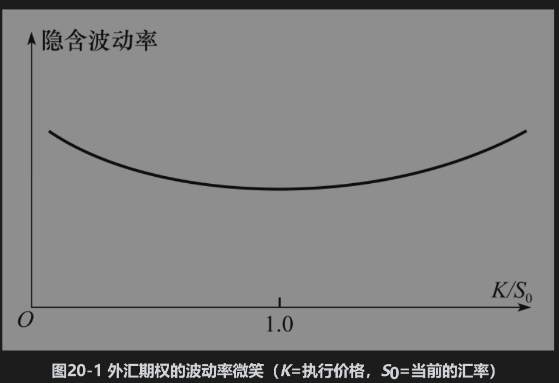
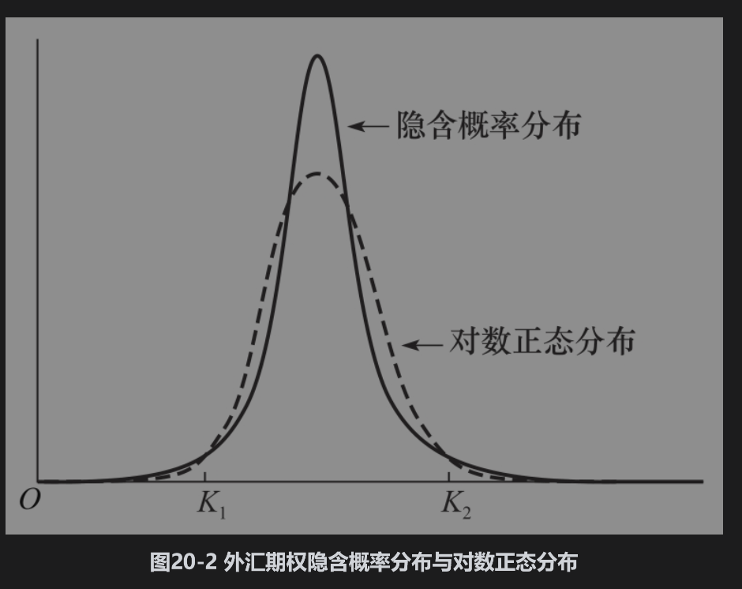
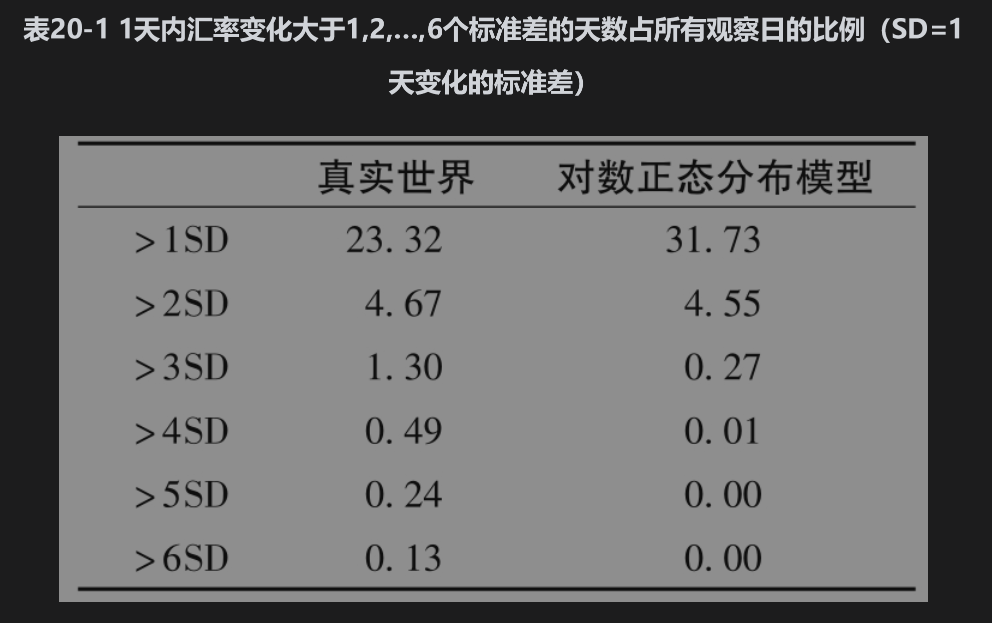

# 20.2 外汇期权的波动率微笑

对外汇期权定价时，交易员所采用的波动率微笑一般具有如图20-1所示的形状：平值期权的波动率相对较低，但波动率随着期权实值程度或虚值程度的增大而逐渐升高。

在本章末附录里我们将说明，通过在某一时间到期的期权波动率微笑，我们可以确定对应这一时间的资产价格风险中性概率分布。我们将这一概率分布称为隐含概率分布(implied distribu-tion)。图20-1中的波动率微笑对应于图20-2中由实线表达的概率分布。图20-2中的虚线代表一个与隐含分布有同样期望值和标准差的对数正态分布。我们从中可以看出隐含分布比对数正态分布更具有肥尾特征。

为了说明图20-1与图20-2的一致性，我们首先考虑一个具有很高执行价格K2（K2/S0远高于1.0）的深度虚值看涨期权。这一期权只有在汇率高于K2时才会产生收益。图20-2说明这一期权在隐含概率分布下产生收益的概率比在对数正态分布下要大。因此我们期望对于这一期权，隐含概率分布所产生的价格会相对较高，而较高的价格会对应于较高的隐含波动率，这刚好是我们在图20-1中所观察到的现象。因此对于较高的执行价格，这两个图形是一致的。接下来，我们考虑一个具有很低执行价格K1（K1/S0远低于1.0）的深度虚值看跌期权。这一期权只有在汇率低于K1时才会产生收益。图20-2显示这一期权在隐含概率分布下产生收益的概率大于在对数正态分布下产生收益的概率。因此我们期望对于这一期权，由隐含分布所产生的价格会相对较高，从而期权的隐含波动率也会较高。这正是我们在图20-1中所观察到的现象。

## 20.2.1 实证结果

以上分析说明，外汇期权交易员采用的波动率微笑意味着他们认为对数正态分布会低估汇率的极端变动。为了验证这一观点是否正确，我们在表20-1中检验了10种不同的汇率在2005～2015年10年之间的日收益率变化。这些汇率是指美元与以下货币的汇率：澳元、英镑、加元、丹麦克朗、欧元、日元、墨西哥比索、新西兰元、瑞典克朗以及瑞士法郎。产生这个表格的第一步需要计算每一种汇率百分比变化的标准差，第二步是观察有多少百分比变化超出1个标准差、2个标准差，等等。最后，我们计算在正态分布情况下这些百分比变化出现的频率（对数正态分布模型说明在一天的时间区间内，百分比的变化几乎完全是正态分布）。

一天内变化超过3个标准差的天数占所有观察数据的比例为1.30%，而对数正态分布所对应的比例却只有0.27%。每天价格百分比变化超出4个、5个和6个标准差的天数占所有观察日的比例分别为0.49%、0.24%以及0.13%，而对数正态分布认为这些事件几乎不可能发生。因此，这一表格提供了（汇率收益）肥尾形态（见图20-2）确实存在的证据，以及交易员确实采用波动率微笑（见图20-1）的证据。业界事例20-1指出你如何能在其他市场参与者之前做出类似于表20-1中的分析时仍可以赚钱。

## 业界事例20-1

## 如何从外汇期权中赚钱

在布莱克、斯科尔斯和默顿的期权定价公式中假设标的资产在将来的价格服从对数正态分布，这等价于假设资产价格在短时间（比如1天）内的变化服从正态分布。假设大多数市场参与者认为布莱克-斯科尔斯-默顿模型对于汇率的假设是正确的。如果你刚刚分析了表20-1中的结果而知道利用对数正态分布描述汇率并不是好的假设后，你如何才能赚钱呢？

这一问题的答案是你应该买进一些深度虚值的欧式看涨和看跌期权，然后等待。这些期权相对来讲比较便宜并且成为实值期权的可能性比对数正态分布模型所预测得要高，你所持期权的平均收益要远远大于这些期权的成本。

20世纪80年代中期，有一些交易员认识到汇率分布中的肥尾形态，而其他的交易员仍然认为布莱克-斯科尔斯-默顿模型中的对数正态分布假设是合理的，对汇率分布有正确认识的交易员采用了我们描述的策略，并且赚到了很多钱。到了80年代后期，所有的人都认识到对外汇期权定价时应当利用波动率微笑，因而利用这种交易策略赚钱的机会也就随之消失了。

## 20.2.2 外汇期权波动率微笑存在的原因

为什么汇率不服从对数正态分布呢？资产价格服从对数正态分布的两个条件是：

(1)标的资产的波动率为常数；

(2)标的资产价格变化平稳并且没有跳跃。

在实际中，以上假设对于汇率来讲均不成立。汇率的波动率与常数相差甚远，并且汇率变化常常显示跳跃性。非常数波动率和跳跃都会使得汇率变化产生极端情形的次数更多。

跳跃和非常数波动率对期权价格的影响与期权的期限有关：当期权期限增大时，非常数波动率对期权价格变化百分比影响的程度就会变得越来越大，但同时对隐含波动率变化百分比影响的程度越来越小。当期权期限增大时，跳跃性对期权价格变化以及隐含波动率变化的影响越来越小。这一结果的直接推论是当期权期限增大时，波动率微笑变得越来越弱。