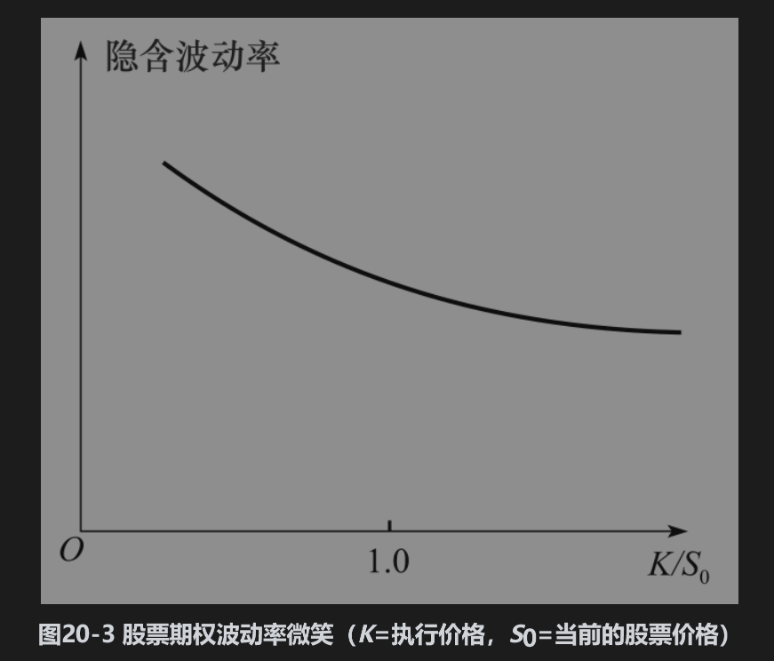
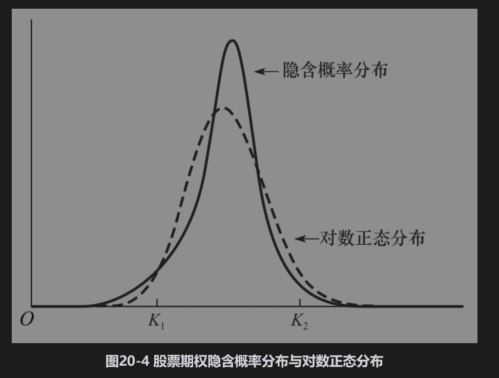

# 20.3 股票期权的波动率微笑

在1987年股票暴跌之前，市场上没有明显的波动率微笑现象。自1987年以来，交易员在股票期权（包括股指期权）定价中所采用波动率微笑的一般形式如图20-3所示，这种形式的波动率微笑也被称为波动率倾斜(vola-tility skew)。波动率随着执行价格的增加而下降：低执行价格期权（也就是深度虚值看跌期权与深度实值看涨期权）所对应的隐含波动率要远高于高执行价格期权（也就是深度实值看跌期权及深度虚值看涨期权）。

股票期权波动率微笑对应于图20-4中由实线所表达的概率分布，其中的虚线代表一个与隐含概率分布有同样期望值和标准差的对数正态分布。我们从中可以看出隐含概率分布比对数正态分布有更肥的左端尾部和更瘦的右端尾部。

为了说明图20-3与图20-4是一致的，我们利用与图20-1和图20-2同样的论证，考虑深度虚值期权。图20-4说明执行价格为K2（K2/S0远高于1.0）的深度虚值看涨期权在假设隐含概率分布时的价格低于在假设对数正态分布时的价格，这是因为这一期权只有在股票价格高于K2时才会产生收益，而隐含概率分布与此所对应的概率低于对数正态分布所对应的概率。因此，我们会期望由隐含概率分布得出的期权价格会低于由对数正态分布得出的期权价格。较低的价格会对应于较低的隐含波动率，而这正如图20-3所示。接下来，我们将考虑一个执行价格为K1（K1/S0远低于1.0）的深度虚值看跌期权。这一期权只有在股票价格低于K1时才会产生收益。图20-4显示这一期权在隐含概率分布下产生收益的概率将大于在对数正态分布下产生收益的概率。因此对于这一期权，隐含概率分布所对应的价格也会偏高，因而隐含波动率也应该偏高。这正是我们在图20-3中所观察到的现象。

## 股票期权波动率微笑存在的原因

股票价格与波动率之间呈现负相关性：当公司股票价格下跌（上涨）时，波动率往往会增大（减小）。有几种原因可能会导致这种现象，其中一个是杠杆：当公司股票价格下跌（上涨）时，公司杠杆效应增加（减小），因此波动率也会上涨（下降）。另一个可能的原因是波动率反馈效应(volatility feedback effect)：当外部原因使波动率上涨（下降）时，投资者需要更高（更低）的回报，因此股票价格下降（上涨）。再有一个解释就是暴跌恐惧症（见业界事例20-2）。

## 业界事例20-2

## 暴跌恐惧症

值得注意的是如图20-3中所示的微笑形状只是在1987年10月股票暴跌后才出现的。在1987年10月之前，隐含波动率与执行价格之间没有太大的关系，因此马克·鲁宾斯坦(Mark Rubinstein)提议，波动微笑存在的原因也许是人们对股票市场暴跌的恐惧症(crashophobia)。交易员害怕市场上会出现类似1987年10月那样的暴跌，因此对于深度虚值看跌期权赋予较高的价值（这也导致了较高的波动率）。

际数据给以上的解释提供了一些证据。标准普尔500指数的下跌往往会伴随着波动率倾斜程度的增加，这是因为交易员在股票下跌时会对可能出现的暴跌更加担心，当标准普尔500指数上涨时，倾斜程度会变小。

无论负相关性的原因是什么，这都意味着波动率上涨会伴随着股票价格下跌，从而导致更大幅度下跌的可能性更大。而波动率下跌会伴随着股票价格上涨，从而导致更大幅度上涨的可能性更小。这就解释了图20-4中隐含分布左边肥尾与右边瘦尾的现象。