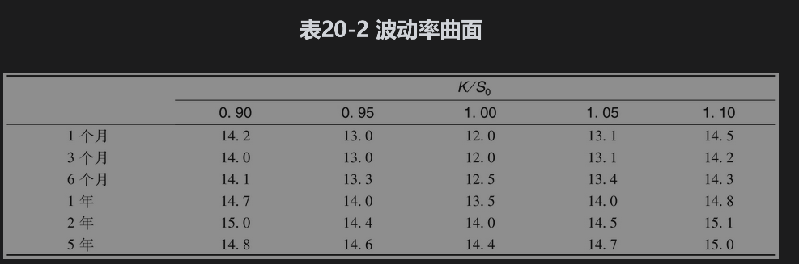
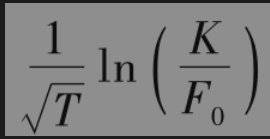

# 20.5 波动率期限结构

与波动率曲面交易员允许隐含波动率既依赖执行价格，也依赖期限。当短期限波动率在历史低位时，隐含波动率往往是期限的递增函数，因为这时人们认为波动率将会上涨。类似地，当短期限波动率在历史高位时，波动率往往是期限的递减函数，因为这时人们认为波动率将会下降。

波动率曲面是将波动率期限结构与波动率微笑结合在一起所产生的表格，这一表格可用于对不同执行价格与不同期限的期权进行定价。表20-2是一个可用于汇率期权定价的波动率曲面。

表20-2中波动率曲面的其中一个变量为K/S0，另一个变量为期限。波动率曲面的数值是由布莱克-斯科尔斯-默顿模型得出的隐含波动率。在任意给定时间，波动率曲面的某些点对应于市场价格比较可靠的期权价格数据，对应于这些点的隐含波动率可以直接由期权市场价格求得，并记录在表中。其他数据常常是通过插值得出的。从表中我们可以发现当期权期限变长时，波动率微笑变得不太明显。如前所述，这正是在汇率期权上可以观察到的现象（在其他资产的期权上，也常常会看到同样的现象）。

当我们需要对一个新的期权定价时，金融工程师会从表中得到适当的数据。例如，为了对9个月期限，K/S0的比为1.05的期权进行定价，金融工程师可以将表20-2中13.4与14.0之间的插值作为对波动率的估计，所得结果为13.7%。这个值可以用于布莱克-斯科尔斯-默顿模型或二叉树。对于一个1.5年期限，K/S0的比为0.925的期权进行定价时，我们可以采用二维线性插值求得隐含波动率为14.525%。

波动率微笑的形状与期权的期限有关。如表20-2所示，随着期权期限的增大，波动率微笑的幅度变得越来越小。假如T代表期限，F0代表期限与所考虑期权相同的远期价格，有些金融工程师将波动率微笑定义为隐含波动率与变量

之间的函数，而不是将波动率直接定义为隐含波动率与执行价格K之间的函数。这种方式所定义的微笑对期限T的依赖性要小很多。