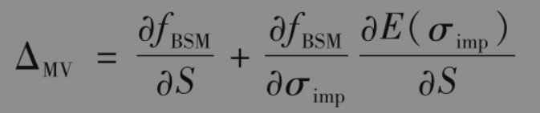
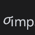
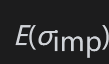
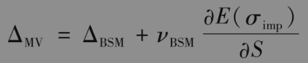

# 20.6 最小方差delta

在第19章中计算delta与其他希腊值的公式时，我们假设当资产价格变动时隐含波动率保持不变，但这是不现实的。例如，考虑股票或股指期权。如在第20.3节中所述，股权价格波动率之间具有负相关性，将隐含波动率与股票价格之间的这种关系考虑在内时所得delta称为最小方差delta(minimum variance delta)，即

其中fBSM为期权的布莱克-斯科尔斯-默顿价格，为期权的隐含波动率，表示当作为股票价格S函数时的期望值。因此

其中ΔBSM与νBSM为由布莱克-斯科尔斯-默顿（常数波动率）模型计算的delta与vega。由于νBSM为正，且我们刚刚解释过∂E(σimp)/∂S为负，所以最小方差delta小于由布莱克-斯科尔斯-默顿模型计算的delta值。

