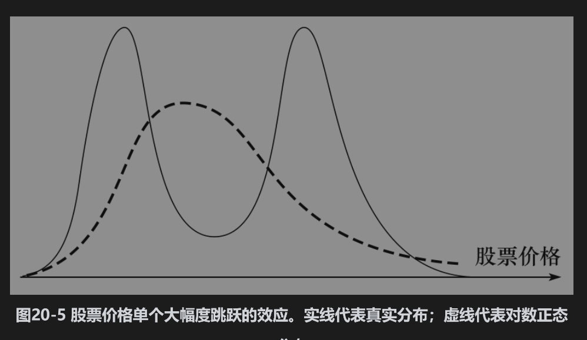
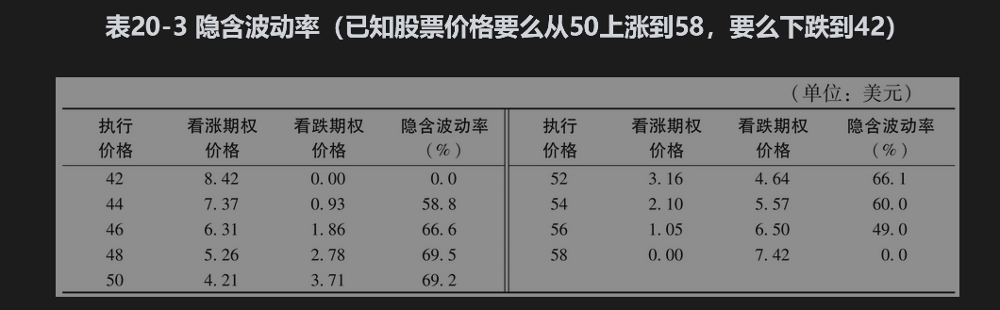
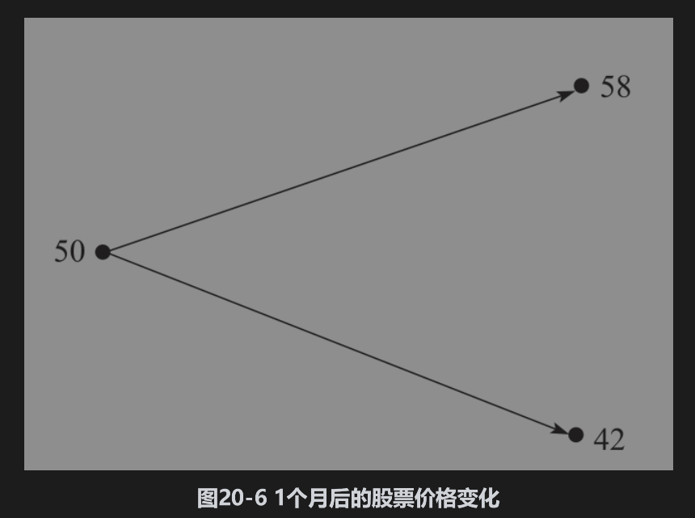
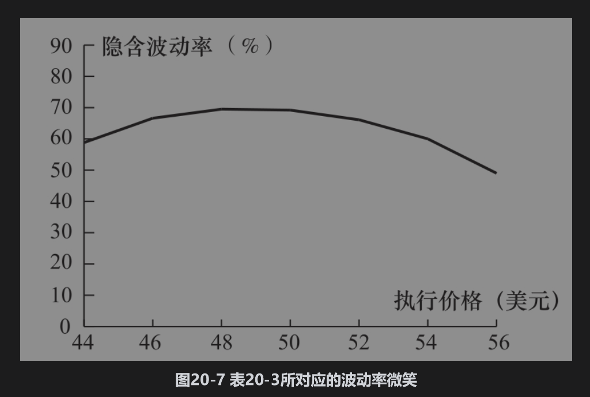

# 20.8 当预计有大幅度价格跳跃时

我们现在用一个例子说明一种奇怪的波动率微笑会如何出现在股票市场上。假定股票的目前价格为50美元，今后几天的一个消息会使得股票价格或者上涨8美元或者下跌8美元（这一消息可能是关于一个并购计划的最终结果或者是关于一项重要法律诉讼的最终宣判）。股票价格在1个月以后的分布可能由两个对数正态分布叠加而成：一个对数正态分布对应于好消息，而另一个对数正态分布对应于坏消息。这一情形如图20-5所示。其中实线所表达的概率分布为1个月后由两个对数正态分布叠加而成的股票价格分布。图中虚线代表一个与以上概率分布有同样期望值和标准差的对数正态分布。

真正的概率分布具有双峰(bimodal)（该分布显然不是对数正态分布）。一种研究双峰股票价格分布效应的简单方法是考虑只有2个可能取值的极端情形。下面我们将考虑这种情况。

假设股票的当前价格为50美元。在1个月后，股票价格会变为42美元或58美元。假定无风险利率为每年12%。这一情形如图20-6所示。我们可以通过由第13章中所描述的二叉树模型对期权定价：这时，u=1.16，d=0.84，a=1.0101，p=0.5314。表20-3列出了不同期权的价格。表中的第1列为不同的执行价格；第2列为1个月期限的欧式看涨期权价格；第3列为1个月期限的欧式看跌期权价格；第4列为隐含波动率（如第20.1节所述，对于同一执行价格与期限，欧式看涨期权的隐含波动率等于欧式看跌期权的隐含波动率）。图20-7展示了由表20-3中的隐含波动率微笑，其实更像“皱眉”（与在货币中观察到的波动率微笑形状相反）。当期权变得更加实值或虚值时，波动率有所减小。当使用执行价格为50美元的期权隐含波动率对执行价格为44美元或56美元的期权进行定价时，所得价格将会太高。

