# 21.1 二叉树

我们在第13章中介绍了二叉树方法。这种方法既可以用于对欧式期权定价，也可用于对美式期权定价。在第15章、第17章和第18章中给出的布莱克-斯科尔斯-默顿模型及其推广形式为欧式期权提供了解析定价公式，但美式期权价格的解析公式不存在。二叉树最有用的地方正是对美式期权定价。

如第13章所述，在二叉树方法中，我们首先将期权的期限分成许多长度为Δt的很小时间区间，并假定在每一个时间区间里股票价格从开始的价格S变为两个新价格Su与Sd中的一个。这一模型如图21-1所示。一般来讲，u＞1，d＜1。因此，我们称S到Su的变化为价格上涨，S到Sd的变化为价格下跌。价格上涨的概率记为p，价格下跌的概率为1-p。

## 21.1.1 风险中性定价

第13章与第15章中所讨论的风险中性定价原理说明，对期权（或其他衍生产品）定价时，我们可以假定世界是风险中性的。这意味着出于定价的目的，我们可以采用以下步骤：

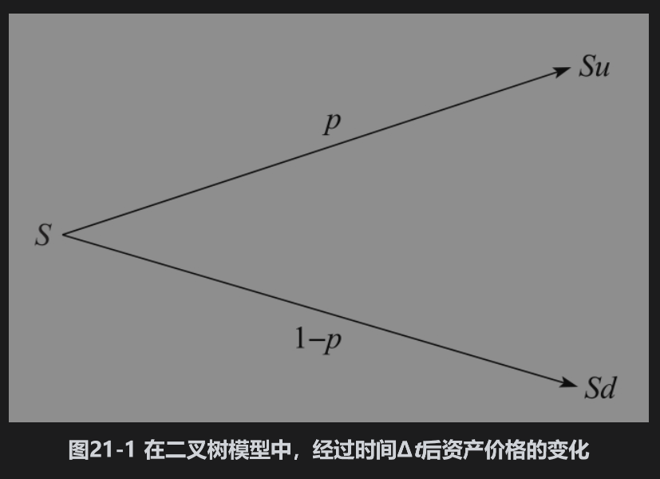

(1)假定所有交易证券的期望收益率均为无风险利率；

(2)计算衍生产品收益的期望值，并以无风险利率对其贴现。

以上描述的过程是采取树形定价的基础。

## 21.1.2 确定p、u和d参数p、u和d的选择

必须保证股票价格在时间Δt内变化的均值与方差都给出正确的值。由于我们假定了风险中性世界，股票的期望收益率为无风险利率r。如果资产提供收益率q的收入，那么资本增值部分的期望收益率必须是r-q。这意味着在时间区间Δt末，资产价格的期望值为Se(r-q)Δt，其中S为资产在时间区间开始时的价格。为了保证二叉树与回报均值相吻合，我们有

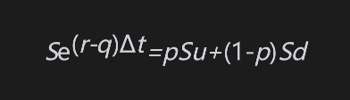

即

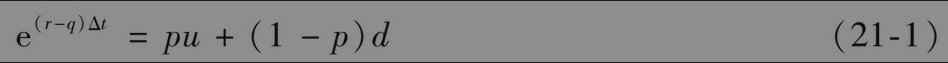

一个变量Q的方差等于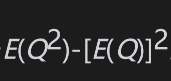。将资产价格在Δt时间内的百分比变化记为R，那么1+R等于u的概率为p，等于d的概率为1-p。从式(21-1)可知，1+R的方差为

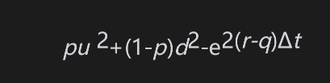

因为任何一个变量加上一个常数并不改变该变量的方差，1+R的方差与R的方差是一样的。如第15.4节所述，这个值等于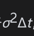，因此

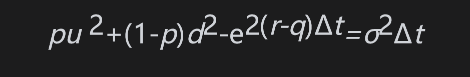

由式(21-1)，e(r-q)Δt(u+d)=pu2+(1-p)d2+ud，因此

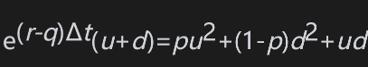

式(21-1)及式(21-2)给出了决定p、u和d的两个条件。考克斯、罗斯和鲁宾斯坦(1979)选取的第3个条件为

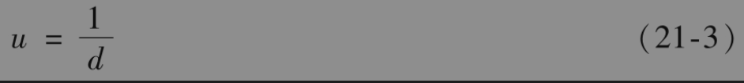

忽略Δt的高阶项时，式(21-1)～式(21-3)的解为

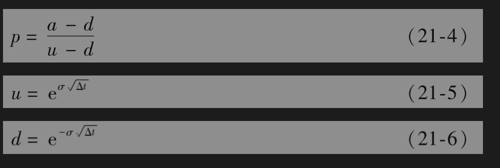

其中

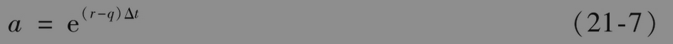

变量a有时被称为增长因子(growth factor)。注意，式(21-4)~式(21-7)与第13.8节和第13.11节里的结果是一致的。

## 21.1.3 资产价格的树形

图21-2展示了资产价格4步树形的完整结构。在时间0，价格S0为已知；在时刻Δt，价格有两种可能的值：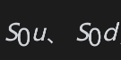；在时刻2Δt，价格有三种可能的值：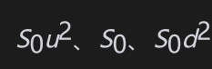；依此类推。在一般情形下，在时刻iΔt，价格有i+1种可能取值，它们是

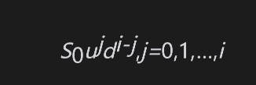

注意在图21-2中，在计算节点上资产价格时我们采用了关系式u=1/d。例如，当j=2和i=3时，资产价格为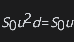。还应注意，树中节点是重合的(recombine)，也就是说资产价格先上涨后下跌与先下跌再上涨所得出的值是一样的。

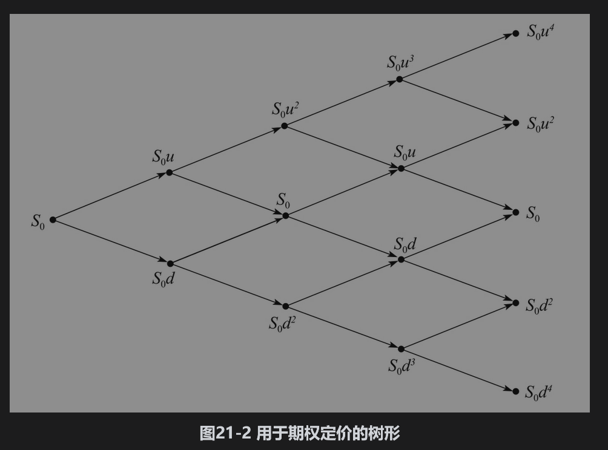

## 21.1.4 在树形上倒推计算

通过在时间T（即树的末端）的期权价格由反向归纳(backward induction)的方式可以对期权定价。期权在时刻T的价值是已知的，例如，看跌期权的价值为max(K-ST,0)，而看涨期权的价格为max(ST-K,0)，其中ST为股票在时刻T的价格，K为执行价格。因为我们假定了风险中性世界，在T-Δt时刻，每个节点上的期权价值等于将T时刻期权价值的期望值以无风险利率r贴现。类似地，在T-2Δt时刻，每个节点上的期权价值可以将T-Δt时刻期权价值的期望值以无风险利率贴现求得，并依此类推。如果期权为美式，在二叉树的每个节点上我们需要检验在这一节点行使期权是否比再继续持有Δt时间的期权更有利。以倒推的形式我们可以最后得出期权在0时刻的价格。

【例21-1】 考虑一个无股息股票上5个月期限的美式看跌期权，股票的当前价格为50美元，执行价格为50美元，无风险利率为每年10%，波动率为每年40%。采用我们常用的符号，这意味着S0=50、K=50、r=0.10、σ=0.40、T=0.4167和q=0。假如在构造二叉树时，我们将期权期限分为5个时间段，每段为1个月（=0.0833年）。这时Δt=0.0833，利用式(21-4)~式(21-7)得出

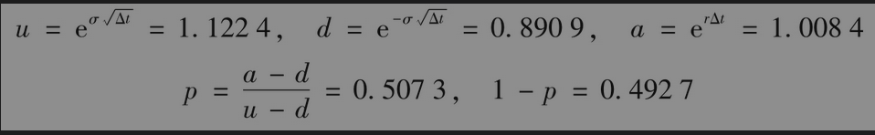

图21-3展示了由DerivaGem产生的二叉树。在每一个节点上有两个数值：上面的数值表示该节点所对应的股票价格，下面的数值代表节点所对应的期权价值。股价上涨的概率总是等于0.5073，而股价下跌的概率总是等于0.4927。

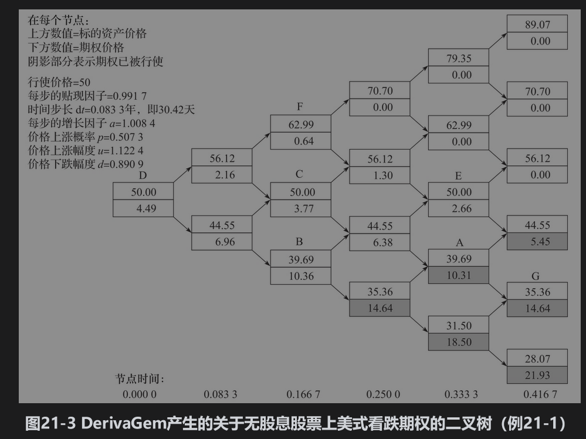

在iΔt时(i=0,1,…,5)，股票在第j个节(j=0,1,…,i)上的价格为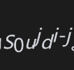。例如，股票在节点A(i=4,j=1)（即树的第4步从下面数起第2个节点）上的价格为。在最后面的节点上，期权价格为max(K-ST,0)。例如，期权在节点G上的价格为50-35.36=14.64（美元）。期权在倒数第2步上的价格可由最后节点上的价格计算得出。首先我们假定在这些节点上不行使期权，这意味着期权价格等于在下一步节点上价格期望值的贴现值。例如，在节点E上，期权价格的计算式为

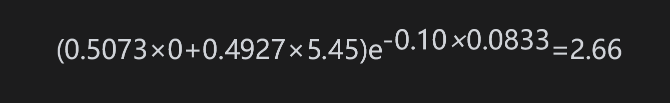

而在节点A上，期权价格的计算式为

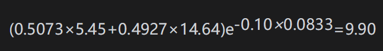

然后我们检验提前行使期权是否比持有期权更为有利。在节点E上，提前行使期权带来的收益为0，因为股价与执行价格均为50美元，很显然我们应该等待，即持有期权，因此在节点E的期权价格为2.66美元。在节点A上，情形会有所不同。如在该节点行使期权，价值为50-39.69，即10.31美元，这一价值大于9.90美元。如果股票价格到达节点A，期权应该被行使，因此A点的期权价值为10.31美元。

前面节点上的期权价值可以采用类似的方式计算。注意，当期权处于实值状态时，提前行使并不总是最佳的。考虑节点B，如果期权被行使，其价值为50-39.69=10.31美元。但是，如果没有提前行使期权，其价值则为

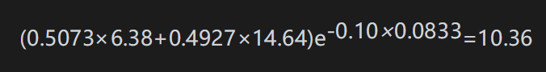

因此，在这一节点上不应该提前行使期权。该节点上期权的正确价格为10.36美元。

从树的最后向前倒推，我们得出在初始节点上期权的价格为4.49美元。这一数量是对期权当前价格的估计。在实际中，我们应采用更小的时间步长Δt和更多的节点。DerivaGem显示30步、50步、100步和500步二叉树所得的期权价格分别为4.263美元、4.272美元、4.278美元和4.283美元。

## 21.1.5 代数表达式

假定将一个美式期权的期限分成了N个长度为Δt的时间区间。我们称在时间iΔt的第j个节点(i,j)节点，其中0≤i≤N，0≤j≤i。这意味着在时间iΔt，树形上最低的节点(i,0)，次低的节点(i,1)，并依此类推。令fi,j为期权(i,j)节点上的值，标的资产(i,j)节点上的价格为S0ujdi-j。如果期权是看涨期权，它在时间T（到期日）的值为max(ST-K,0)，因此

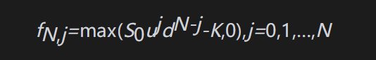

如果期权是看跌期权，它在时间T的值为max(K-ST,0)，因此

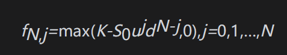

在iΔt时，(i,j)节点移动到(i+1)Δt时(i+1,j+1)节点的概率为p；在iΔt时刻(i,j)节点移动(i+1)Δt时(i+1,j)节点的概率为1-p。假定期权没有被提前行使，由风险中性定价原理可以得出，对0≤i≤N-1和0≤j≤i

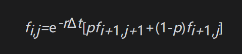

当考虑提前行使期权时，这个fi,j必须同期权的内含价值进行比较，因此对于看涨期权

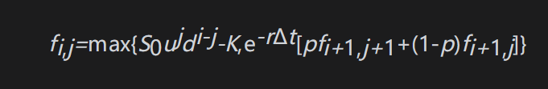

对于看跌期权

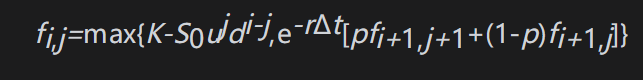

注意，由于定价计算从T时刻开始并以倒推的形式进行，所以在iΔt时刻的期权价值不仅反映了在iΔt时刻提前行使期权的可能性对于期权价值的影响，而且也反映了在将来提前行使期权对于期权价值的影响。

当Δt趋向于0时，我们可以得到美式期权的精确价值。在实际中，N=30的树形结构通常会给出一个合理的价格。图21-4显示了例21-1中期权价格的收敛性，这一图形是由DerivaGem软件的应用工具计算而得出的。

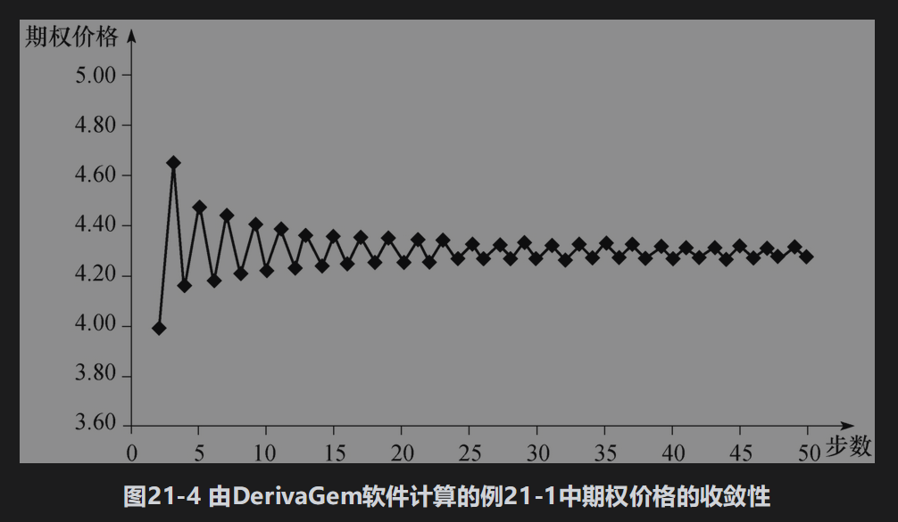

## 21.1.6 估计delta与其他希腊值

根据前面的定义，期权的delta(Δ)为期权价格变化与标的股票价格变化的比率，即

其中ΔS为股票价格的微小变化，Δf为相应期权价格的微小变化。在Δt时刻，当股票价格为S0u时，期权价格估计值为f1，1；当股票价格为S0d时，期权价格的估计值为f1，0。这说明当ΔS=S0u-S0d时，Δf=f1，1-f1，0，因此在Δt的Δ近似值为

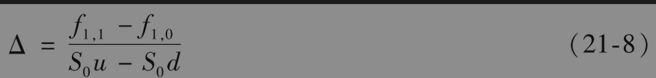

为了确定gamma(Γ)，我们注意在2Δt时刻有两个Δ的估计。当股票价格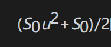时（2Δt时刻的第2个与第3个节点的中间值），$`Δ(f_2,_2-f_2,_1)/(S_0u^2-S_0)`$；当股票价格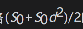时（2Δt时刻的第1个与第2个节点的中间值），Δ(f2,1-f2,0)/(S0-S0d2)。两个股票价格的差为h，其中

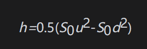

gamma等于delta的变化除以h，即

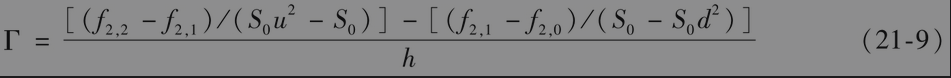

这些计算给出了在Δt时刻的delta估计值和2Δt时刻的gamma估计值。在实际中，这些估计值也用来作为在0时刻的delta和gamma估计值。

从二叉树中另一个可以进一步直接估计的对冲参数为theta(Θ)，这一参数代表在其他条件不变时期权价格变化与时间变化的比率。期权在时刻0的价值是f0，0，时刻2Δt的价值是f2，1。theta的一个估计值为

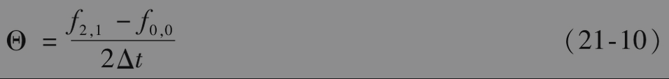

对于vega的计算，我们可以从对波动率做一个微小的变化而得出。当σ的变动量为Δσ时，我们可以重新构造二叉树（Δt的数量应该不变），并对期权重新定价。vega的估计值为

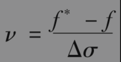

其中f及f*分别为由最初的二叉树和重建的二叉树得出的期权价值。我们也可以采用类似的方法计算rho。

例21-2】 再一次考虑例21-1，由图21-3得出f1，0=6.96和f1，1=2.16。式(21-8)给出的delta估计值为

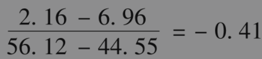

利用式(21-9)，我们可以由在节点B、C及F上的期权价值估计期权的gamma

或每日历天为-0.012。当然，这些结果只是粗略的估计。当采用的步数增加时，这些估计值会越来越精确。当步数取为50时，DerivaGem给出的delta、gamma和theta值分别为-0.415、0.034及-0.0117。改变参数并重新计算期权价格，我们可以得出vega和rho的估计值分别为0.123和-0.072。

