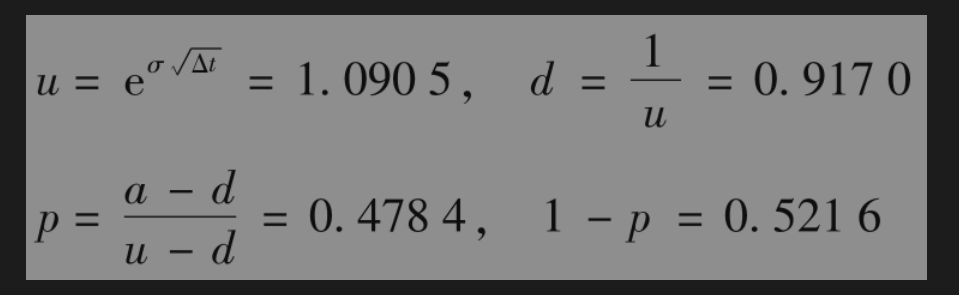
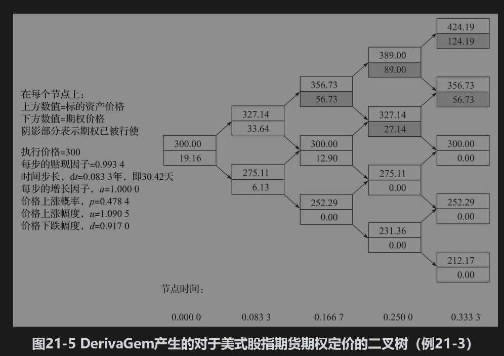
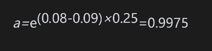
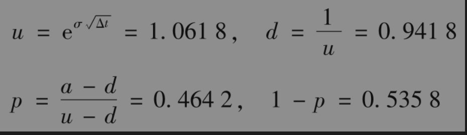
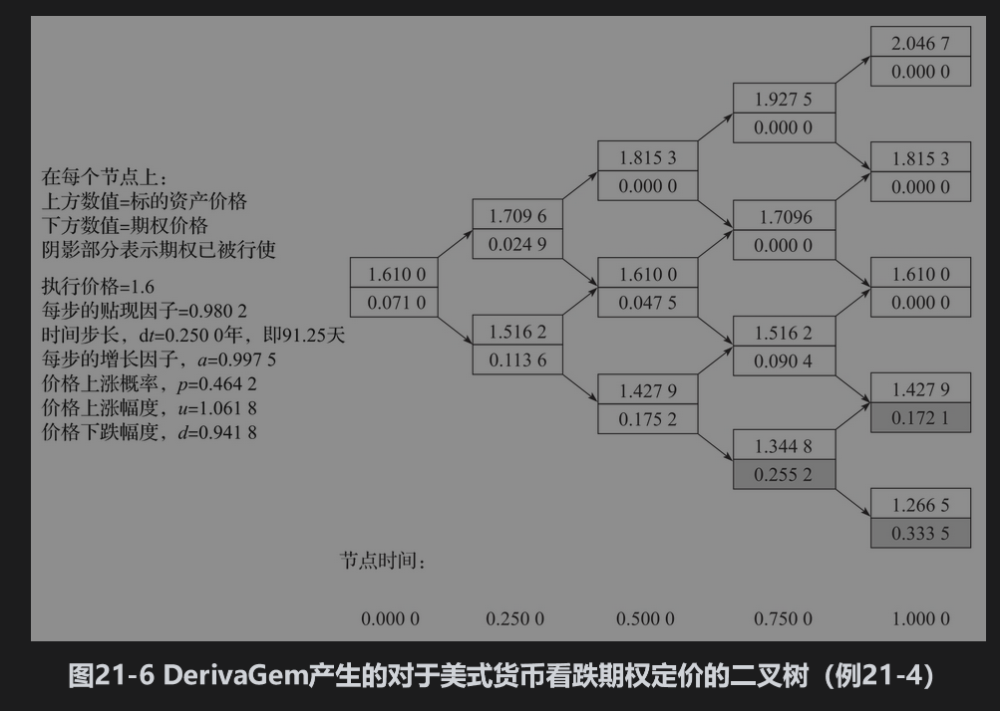

# 21.2 利用二叉树对股指、货币与期货合约上的期权定价

像在第13章、第17章和第18章中解释过的那样，当对股指、货币和期货上的期权定价时，我们可以将这些标的资产看成是提供的已知收益率的资产。对于股指，收益率等于股指中股票组合的股息收益率；对于货币，收益率等于外币无风险利率；对于期货合约，收益率等于本国无风险利率。因此只要适当地选择式(21-7)中的q值，我们就可以将二叉树应用于对股指、货币和期货上的期权定价。

【例21-3】 考虑一个股指期货上4个月期的美式看涨期权，当前期货的价格为300，执行价格为300，年化无风险利率为8%，年化股指波动率为30%。为了构造二叉树，我们将期权期限分成4个长度为1个月的时间段。这时，F0=300,K=300,r=0.08，σ=0.3，T=0.3333和Δt=0.0833。因为可以将期货合同当成一个支付连续股息收益率r的股票，在式(21-7)中应当将q取成r，因此a=1。其他构造二叉树的参数为

利用DerivaGem可以产生如图21-5所示的二叉树（其中节点上面的数值为期货价格，下面的数值为期权价格）。期权的估计值为19.16。当取更多的步数时，我们可以得到更高的精度。例如，当采用50步二叉树时，DerivaGem得出的期权价格为20.18；当采用100步二叉树时，DerivaGem得出的期权价格为20.22。

【例21-4】 考虑英镑上的1年期美式看跌期权。当前汇率为1.6100，执行价格为1.6000，美元无风险利率为每年8%，英镑利率为每年9%，英镑汇率的波动率为每年12%。在这里S0=1.61，K=1.60,r=0.08，rf=0.09，σ=0.12和T=1.0。为了构造二叉树，我们将期权期限分成4个长度为3个月的时间段，因此Δt=0.25。这时q=rf，由式(21-7)得出

构造二叉树所用的其他参数为

我们将用DerivaGem产生的二叉树展示在图21-6中（节点上面的值代表汇率，下面的值代表期权价值）。期权的估计值为0.0710美元（采用50步二叉树，DerivaGem计算的期权价格为0.0738；采用100步二叉树，DerivaGem计算的期权价格也是0.0738）。

