# 21.3 支付股息股票的二叉树模型

我们现在考虑一个较为棘手的问题，即如何用二叉树对支付股息的股票期权定价。像在第15章中指出的那样，为了方便我们讨论，“股息”一词是指在除息日由于股息而导致股票价格下跌的数量。

## 21.3.1 股息收益率是已知的情形

在考虑长期限股票期权时，有时为了方便而假定股票支付连续收益率为q的股息。对这种期权可以采用与股指期权同样的方法定价。

为了取得更精确的结果，我们可以假设已知股息收益率是以离散形式支付的。假定股票只付一次股息，而且股息收益率（即股息为股票价格的百分比）是已知的。参数u、d和p与没有股息情形下一样。如果iΔt在除息日之前的时间，二叉树上对应这个时间的节点上股票价格为

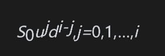

如果iΔt在除息日之后，那么相应节点上的股票价格为

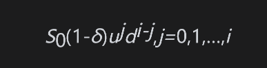

其中δ为股息收益率。树形如图21-7所示。对于期权有效期内有多个已知股息收益率的情形，我们可以采用同样的办法处理。如果δi为0时刻到iΔt时刻之间所有除息日的总股息收益率，那么iΔt时刻节点上的股票价格为

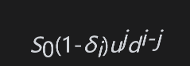

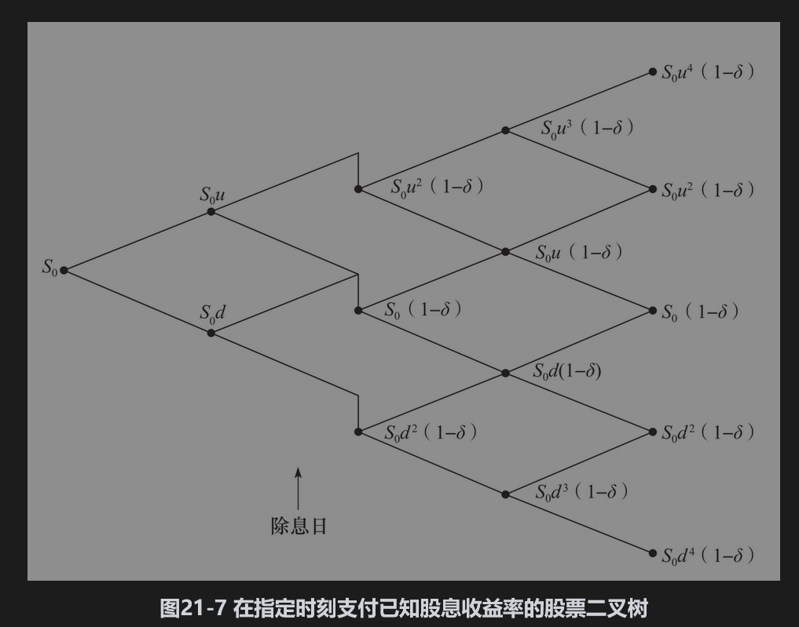

## 21.3.2 已知股息金额数量的情形

在某些情形下，尤其是当期权的期限很短时，最符合现实的做法是假设已知支付的股息金额数量（而不是股息收益率）。假设股票波动率σ为常数，这时二叉树的形状会像图21-8显示的那样。二叉树将不再会重合，这意味着所要估算的节点数量将会变得很大。假设只有一次股息，而且除息日τ介于kΔt(k+1)Δt之间，股息金额数量为D。当i≤k时，在iΔt时刻节点上的股票价格为

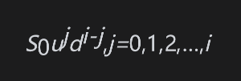

这与以前所述的股价相同；当i=k+1时，相应节点上的股票价格为

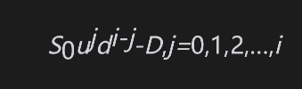

当i=k+2时，相应节点上的股票价格为

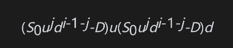

其中j=0,1,2,…,i-1。因此，在iΔt时刻总共有2i个（而不是i+1个）节点。当i=k+m时，在iΔt时刻总共有m(k+2)个节点，而不是k+m+1个节点。如果在期权期限内有多个除息日的话，那么节点数量会增长得更快。

第15.12节说明了在对支付股息的股票上期权进行定价时，可以假定股票价格具有两个组成部分：一部分为不确定，另一部分为期权期限内股息的贴现值。我们还给出了从业者认为这样假设是合理的几个原因。显然，美式期权的定价方法应该完全与欧式期权的定价等同（否则，不应该被提前行使的美式期权的价格不会与欧式期权价格相等）。因此在实践中对支付已知股息的股票上美式期权定价时，所使用的就是第15.12节里所描述的方法。这样做可以解决图21-8所示的节点泛滥问题。

假定在期权期限内只有一个除息日τ，并且kΔt≤τ≤(k+1)Δt。在iΔt时刻，股票的不确定部分价格S*为

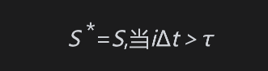

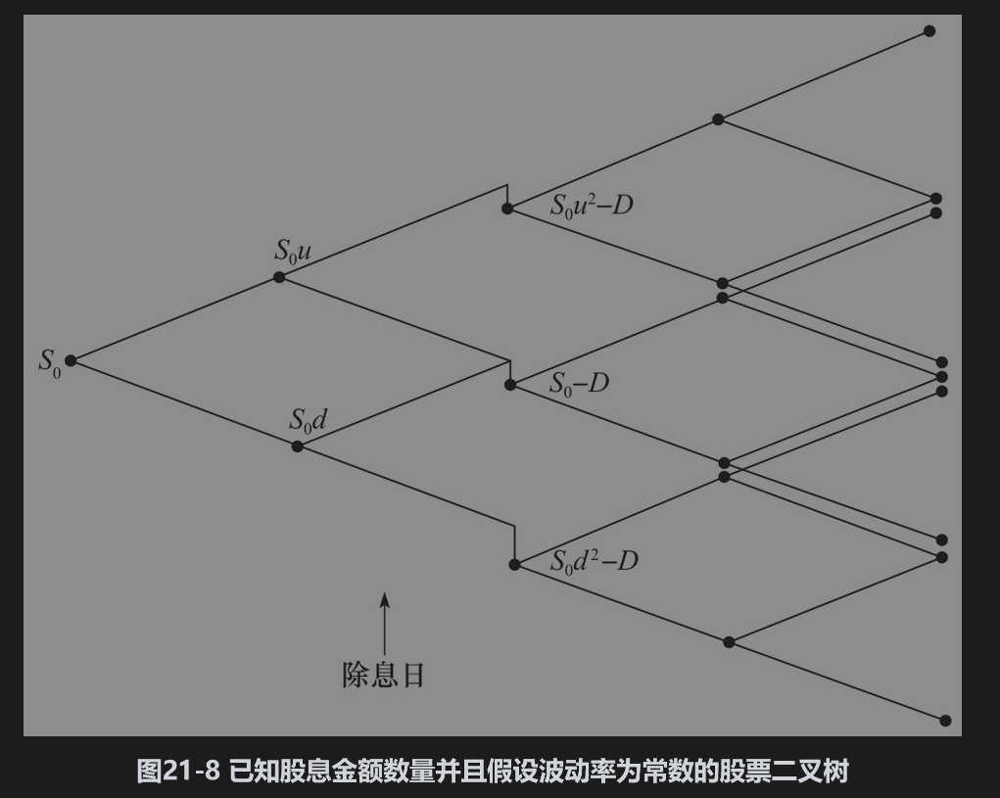

以及

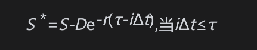

其中D为股息。令σ*为S*的波动率，并假设为常数。参数p、u和d可由式(21-4)～式(21-7)计算（用σ*替代σ）。这样我们可以采用通常的方式构造模拟S*的二叉树。通过在每个节点上把将来股息（如果有的话）的贴现值加回到股票价格上，我们可以将二叉树转化成模拟原股票价格S的二叉树。假定$`S^*_0`$为S*在时刻0的值，在iΔt时刻，如iΔt＜τ，股票价格为

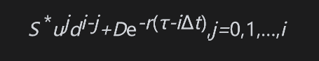

如iΔt＞τ，股票价格为

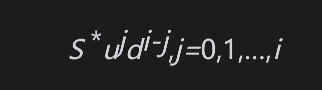

这种方法将二叉树变成了重合状态，即在iΔt时刻只有i+1个节点。我们可以把这种方法推广到存在多个股息的情形中。

【例21-5】 考虑一个某股票上期限为5个月的看跌期权，预计在期权期限内股票将支付2.06美元的股息。股票初始价格为52美元，执行价格为50美元，无风险利率为每年10%，波动率为每年40%，股票除息日在3个半月后。

我们首先构造关于S*的二叉树，这里S*等于原股票价格减去期权有效期内股息的贴现值。股息的贴现值为

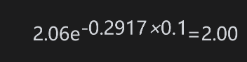

因此，S*的初始值为50。假定所给的每年40%的波动率是关于S*的波动率。图21-3给出了S*的二叉树（S*的初始值与波动率与构成图21-3的股票价格的初始值及波动率相同）。在每个节点上加上股息的现值就可以得到图21-9中关于股票价格S的二叉树。与图21-3一样，树上每个节点上涨的概率为0.5073，下跌的概率为0.4927。按通常的方式在二叉树上向后反推，即可得出期权价格，即4.44美元（利用50步二叉树，DerivaGem给出的期权值是4.208；利用100步二叉树，给出的值是4.214）。

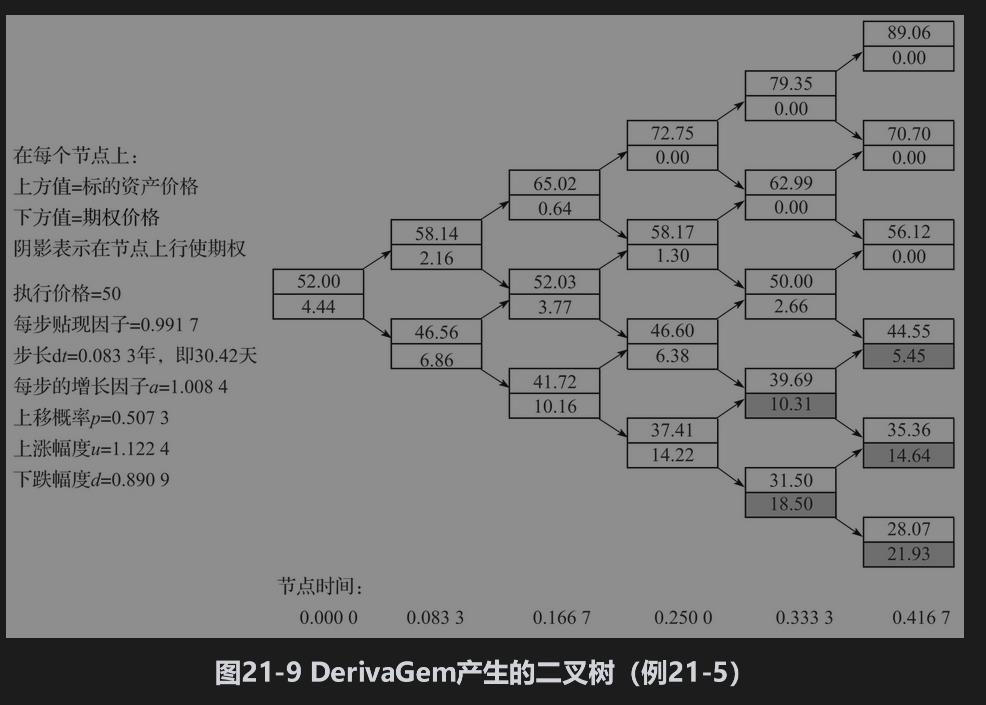

## 21.3.3 控制变量技巧

对美式期权定价时，我们可以采用控制变量技巧(control variate technique)方法提高计算精度，这一方法使用同一个树形计算美式期权价值fA，以及相应的欧式期权价格fE。我们同时也采用布莱克-斯科尔斯-默顿模型计算欧式期权价格fBSM。假设由树形得出的欧式期权误差fBSM-fE与树形所得出的美式期权误差是相同的。因此，美式期权的估计值为

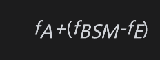

为了说明这一方法，我们利用图21-10对图21-3中的例子定价。计算求得的fE为4.32美元。由布莱克-斯科尔斯-默顿公式计算出的欧式期权fBSM价格为4.08美元，图21-3给出的美式期权估计值为4.49美元，因此由控制变量技巧所估计的美式期权价格为

         4.49+(4.08-4.32)=4.25

利用100步的二叉树可以得出美式期权一个比较精确的估计值为4.278。因此在这个例子中，控制变量技巧所得结果的精确度确实比二叉树（估计值为4.49）有了显著的提高。

控制变量技巧实际上是采用树形计算欧式与美式期权的差值，而非美式期权本身的价格。我们在本章后面讨论蒙特卡罗模拟法时将给出控制变量技巧的进一步的应用。

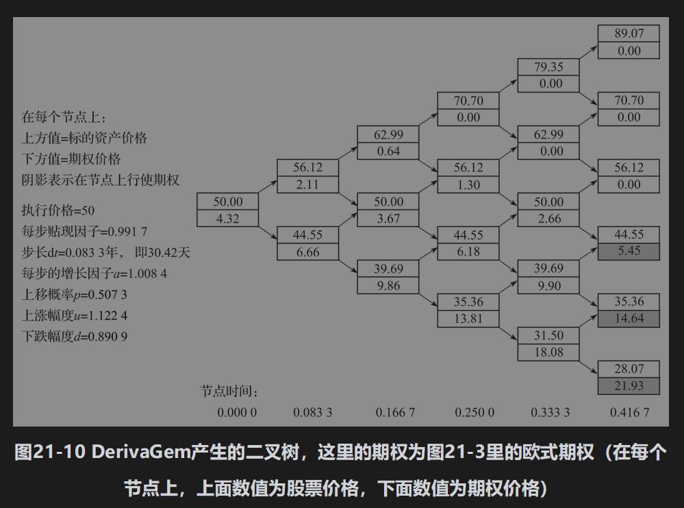