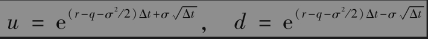
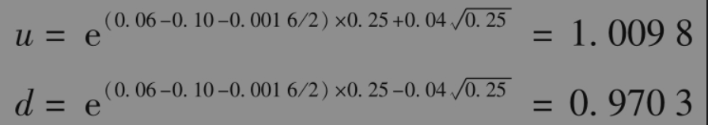
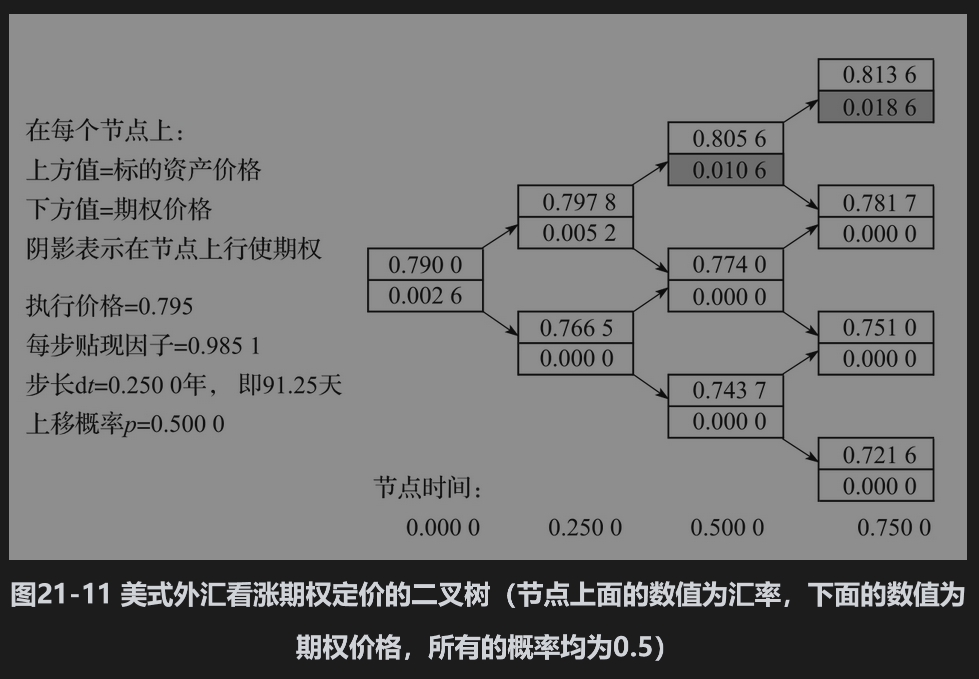
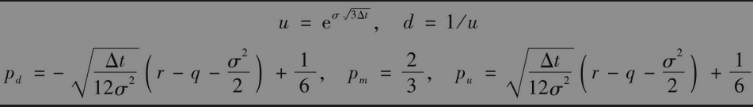
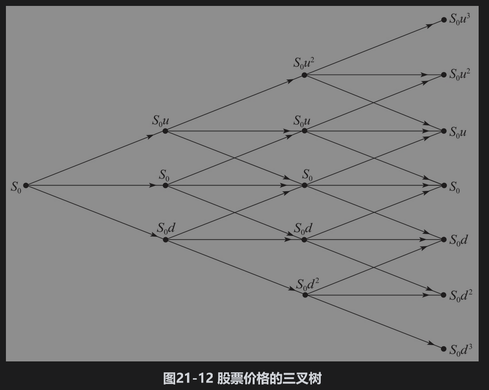
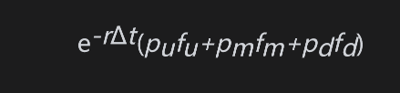

# 21.4 构造树形的其他方法

迄今为止所描述的考克斯、罗斯和鲁宾斯坦方法并不是构造二叉树的唯一方法。在风险中性世界里，变量lnS在时间Δt内变化的均值(r-q-σ2/2)Δt，标准差为σΔt。这些均值与标准差可通过令p=0.5和

相吻合。这种构造树形的方法与考克斯、罗斯和鲁宾斯坦的方法相比具有许多的优点：无论σ取什么值或步长是多少，树形上的概率总是p=0.5。[4]缺点是通过这种树形计算delta、gamma、rho不是那么容易，这是因为最初的股票价格并不再是树形的中心。

【例21-6】 某个9个月期限、执行价格为0.7950的美式外汇期权。当前的汇率为0.7900，国内无风险利率为每年6%，外国无风险利率为每年10%，汇率的波动率为4%，这时S0=0.79，K=0.795，r=0.06，rf=0.10,σ=0.04与T=0.75。我们取Δt=0.25（三步），而且树形上每个分支的概率为0.5，因此

汇率二叉树如图21-11所示。由二叉树得出的期权价格为0.0026。

## 三叉树

三叉树可用来代替二叉树。三叉树的一般形式如图21-12所示。假定在树形的每个节点上价格变化为上升、取中间值、下降的概率分别为pu、pm和pd，树形的时间步长为Δt。假定股票支付股息收益率q，与InS的均值和标准差相吻合的参数为

三叉树的计算过程与二叉树类似：计算由树尾倒推到树的起点。在每一个节点上，我们需要计算行使期权的价值与继续持有期权的价值。继续持有期权的价值等于

其中fu、fm和fd分别为对应于下一步价格上升、取中间值和下降时的节点上的期权价格。可以证明，三叉树与第21.8节中讨论的显式差分方法等价。

Figlewski和Gao提出了一种改进三叉树的方法，他们称此方法为自适应网格模型(adaptive mesh model)。该模型在粗网格（Δt较大）的树形里加入细网格（Δt较小）的树形。对于一般美式期权定价，在期权接近满期、资产价格接近执行价格的区域里加入细网格是最有效的。