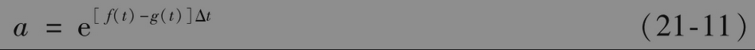
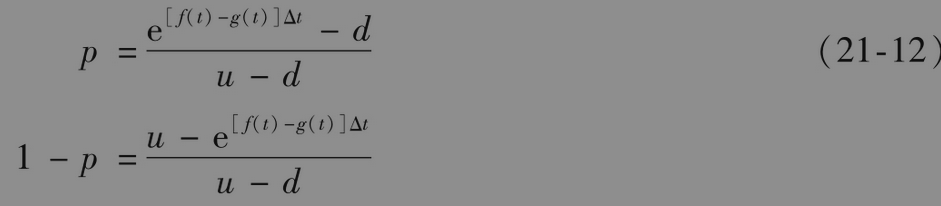
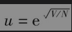

# 21.5 依赖时间的参数

到目前为止，我们一直假定r、q、rf和σ均为常数。在实际中往往假设这些参数与时间有关。一般假设这些参数在时间t与t+Δt之间等于其远期值。

在CRR二叉树上，为了使r和q（或rf）成为时间的函数，我们在时间t的节点上令

其中f(t)为介于t与t+Δt之间的远期利率，g(t)为q介于t与t+Δt之间的远期值。因为u和d与a无关，所以这样的假设并不改变二叉树的形状。从时刻t节点上所生出树叉的概率是

二叉树方法中的其他步骤和前面所介绍的一样，唯一不同之处是在t与t+Δt之间贴现时我们要用f(t)。

当σ为时间函数时，建立二叉树会比较困难。假设σ(t)为期限等于t的期权定价时所用的波动率。一种方法是使时间步长与时间区间内的平均方差率成反比。这时在树形上u和d保持不变，从而保证了树形的再重合。定义V=σ(T)2T，其中T为树形的期限。定义ti为第i步末所对应的时间。树形共有N步，我们可以选择ti而保证σ(ti)2ti=iV/N，并令，d=1/u，p由u、d、r和q表达，其表达形式类似于常数波动率的情形。这里的计算过程可以与处理非常数利率的过程并用，以此我们可以建立利率和波动率均非常数的二叉树。