# 21.6 蒙特卡罗模拟法

我们现在介绍蒙特卡罗模拟法，这与二叉树法有很大不同。通过一个估计π的简单Excel程序，例子21-1展示了蒙特卡罗随机抽样的思路。

## 业界事例21-1

## 利用蒙特卡罗方法计算π

假定图21-13中正方形的边长为1。设想你向这一方块随机地投掷飞镖，并随后计算飞镖落在圆圈中的比率。你会取得什么结果呢？方块的面积为1.0，圆圈的半径为0.5，圆圈的面积为π乘以半径的平方，即π/4。因此，飞镖落在圆圈的比率应等于π/4。将飞镖落在圆圈的比率乘以4即可得到π的估计值。

我们可以利用Excel计算表模拟表21-1中投掷飞镖的情形。我们将计算表的元素A1和B1分别定义为=RAND()。A1和B1为介于0与1之间的随机数，这两个随机数分别定义了飞镖落下的靠右以及靠上的位置，随后我们将计算表的元素C1定义为

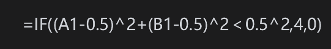

当飞镖落在圆圈内时，C1=4；否则C1=0。

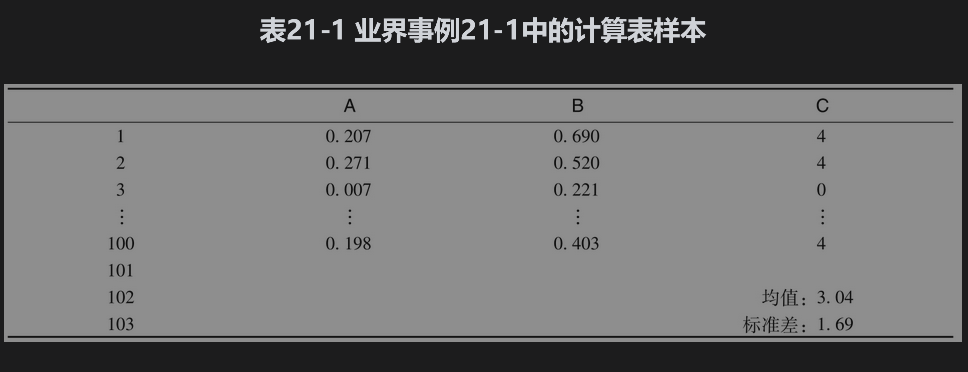

计算表里接下来的99行的定义与第1行类似（这是Excel里的选择和拖动操作）。定义C102为=AVERAGE(C1:C100)，C103为=STDEV(C1:C100)，C102（在表21-1中为3.04）是由100次随机抽样计算出的π估计值，C103是估算值的标准差。在例21-7中我们将会看到，标准差可以被用来检测估计值的精确度。增加抽样次数会改进精确度，但收敛到准确值3.14159的速度很慢。

在计算期权价格时，蒙特卡罗模拟法利用了风险中性理论。我们首先在风险中性世界里随机地产生标的资产价格的路径，并由此取得收益的期望值，然后再对其按无风险利率贴现。考虑依赖某单个市场变量S并在T时刻产生收益的衍生产品。假定利率为常数，我们可以通过以下步骤对衍生产品定价：

(1)在风险中性世界里对S的随机路径进行抽样；

(2)计算衍生产品的收益；

(3)重复第1步和第2步，从而取得许多在风险中性世界里该衍生产品收益的样本；

(4)计算收益的平均值，这是衍生产品在风险中性世界里期望收益值的估计值；

(5)以无风险利率对期望收益值贴现，所得结果即为衍生产品价格的估计值。

以上过程显示在DerivaGem的蒙特卡罗计算表中。

假定在风险中性世界里标的市场变量服从以下过程

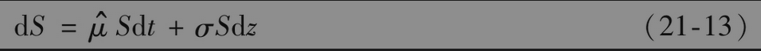

其中dz为维纳过程，为标的变量在风险中性世界里的期望收益率，σ为波动率。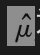为了模拟变量S的路径，我们可以将期权的期限分割成N个长度为Δt的小区间，并将式(21-13)近似为

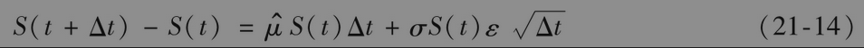

其中S(t)是S在t时的值，ε是从期望值为0、标准差为1.0正态分布中的抽样。这可以使得我们从S的初始值计算出S在Δt时的值，并通过Δt的值计算出S在2Δt的值，等等。在第14.3节里我们曾对这一过程进行过描述。每个模拟样本都需要通过对正态分布进行N次抽样构造S的整个路径。

在实际中，对lnS进行抽样通常比对S进行抽样要更为准确。由伊藤引理得出，lnS服从的过程为

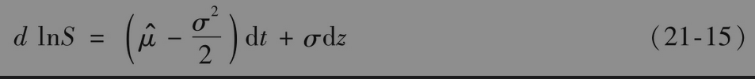

因此

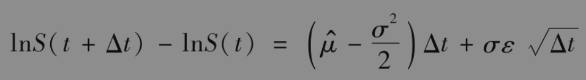

其等价形式为

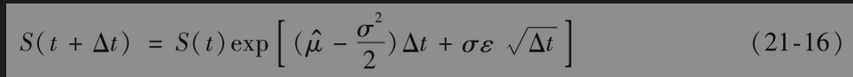

以上方程可用于产生S的路径。

对lnS（而不是S）进行模拟的结果会更加精确，而且如果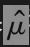和σ是常数，那么对于任何期限T

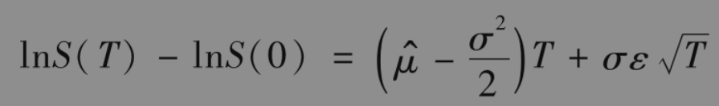

因此

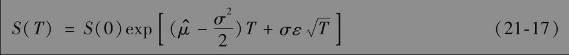

以上方程可用于对在T时刻提供非标准收益形式的衍生产品定价。如业界事例21-2所示，它也可用来检验布莱克-斯科尔斯-默顿模型。

蒙特卡罗模拟法的主要优点在于这一方法既可用于当收益只依赖标的变量S终端值的情形，也可用于当收益依赖标的变量S路径的情形（例如，该方法可用于收益依赖S在0和T之间平均值的情形）。衍生产品的收益可能发生在期限内的若干时间点上（而不是只是期限的末尾）。对任何关于S的随机过程均可以采用这一方法。我们接下来将要说明，这里所描述的方法可推广到收益依赖若干标的变量的情形。蒙特卡罗模拟法的缺点在于该方法的计算速度较慢，并且当可以提前行使期权时，不太容易采用这种方法。

## 业界事例21-2

## 在Excel上检验布莱克-斯科尔斯-默顿公式

对于欧式看涨期权，我们可以采用很多步数的二叉树检验布莱克-斯科尔斯-默顿公式的正确性。另外一种检验布莱克-斯科尔斯-默顿公式正确性的方法是蒙特卡罗模拟。表21-2是一个Excel计算表，计算表的元素C2、D2、E2、F2和G2分别代表S0、K、r、σ和T。元素D4、E4和F4分别用于计算d1、d2和期权价格（计算表中布莱克-斯科尔斯-默顿价格为4.817）。

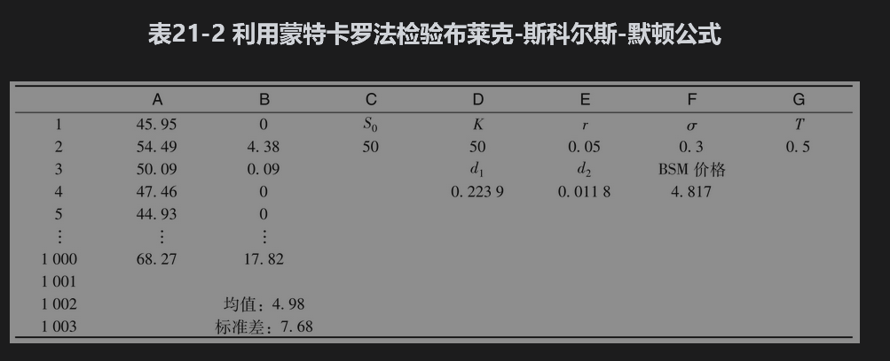

NORMSINV为标准正态分布的逆分布函数，因此，NORMSINV(RAND())给出了一个服从标准正态分布的随机抽样。我们令A1为

      =$C$2＊EXP($E$2-$F$2＊$F$2/2)＊$G$2+$F$2＊NORMSINV(RAND())＊SQRT($G$2)）

这是按式(21-17)所做的计算，得出的是股票在T时刻的随机抽样值。我们将B1设成=EXP(-$E$2＊$G$2)＊MAX(A1-$D$2，0)，这是看涨期权收益的贴现值。我们在接下来的999行进行类似的操作。定义B1002=AVERAGE(B1:B1000)，在计算表中，该值为4.98，这是对期权价格的估计，这一估计应该与布莱克-斯科尔斯-默顿价格的差别不大。B1003定义为STDEV(B1:B1000)，由例21-8我们可以知道，B1003可用于检验估计的精确性。
## 21.6.1 依赖多个市场变量的衍生产品

在第14.5节里，我们曾讨论过相关的随机过程。考虑收益依赖n个变量θi(1≤i≤n)的衍生产品。定义si为θi的波动率，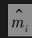为θi在风险中性世界里的期望增长率，ρik为θi与θk之间的相关系数(correlation)。与单个标的变量的情形相似，我们将期权的期限分割成N个长度为Δt的子时间。θi的离散形式为

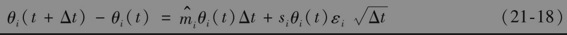

其中εi为标准正态分布的随机样本。εi与εk的相关系数为ρik(1≤i；k≤n)。每一次路径的抽样都需要N个从多元正态分布中提取的εi(1≤i≤n)样本。将这些样本代入式(21-18)后可产生θi的模拟路径，由此我们可以计算衍生产品的抽样值。

## 21.6.2 从正态分布中产生随机样本

如业界事例21-2所示，Excel里的指令=NORMSINV(RAND())可以用来产生一标准正态分布的随机样本。当需要产生二元相关标准正态随机变量ε1、ε2的随机样本时，我们可以采取如下步骤。我们首先像上面讲过的那样生成两个相互独立的一元随机标准正态样本x1和x2，然后利用以下关系式即可生成我们所需要的随机样本

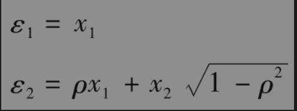

其中ρ为相关系数。

我们现在考虑如何产生n元联合正态分布的随机样本，这里变量i和j之间的相关系数为ρij。首先由一元标准正态分布生成n个相互独立的随机样本xi(1≤i≤n)，然后我们可以将所需要的随机样本εi(1≤i≤n)定义成

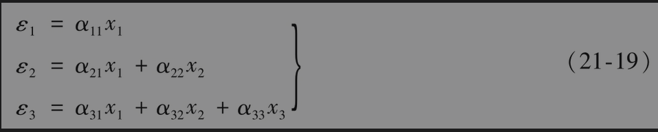

等。在这里我们选取系数αij使得这些变量有正确的相关系数和方差。这些系数可以通过递推方式得到：令α11=1；选择α21使α21α11=ρ21；选择α22使=1；选择α31使α31α11=ρ31；选择α32使α31α21+α32α22=ρ32；选择α33使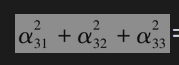=1；依此类推。这里描述的过程叫乔里斯基分解(Cholesky decomposition)。

## 21.6.3 模拟次数

蒙特卡罗模拟法计算结果的精度依赖模拟的次数。在蒙特卡罗模拟法中，我们通常在计算收益贴现的期望值外，还要计算标准差。将期望值和标准差分别由μ和ω表示。变量μ即为衍生产品价值的估计值，这一估计值的标准误差为

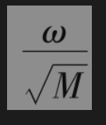

其中M为模拟次数。衍生产品价格f的95%置信区间为

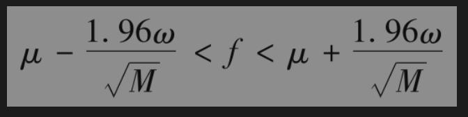

这说明衍生产品价格的不确定性与模拟次数的平方根成反比。如果想将精度提高一倍，我们必须将模拟次数提高4倍；如果想将精度提高10倍，我们必须将模拟次数提高100倍；并依此类推。

【例21-7】 在表21-1中，π是100个数字的平均值，标准差为1.69。这时，ω=1.69，M=100。因此计算结果的标准误差为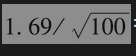=0.169。计算表给出关于π的95%置信区间为(3.04-1.96×0.169)至(3.04+1.96×0.169)，即2.71～3.37（精确值3.14159落在置信区间内）。

【例21-8】 在表21-2中，期权价格是1000个数字的平均值，标准差为7.68。这时，ω=7.68，M=1000，因此计算结果的标准误差为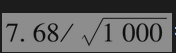=0.24。计算表给出的关于期权价格的95%置信区间为(4.68-1.96×0.24)至(4.68+1.96×0.24)，即4.51～5.45（布莱克-斯科尔斯-默顿价格为4.817，这个值落在置信区间内）。

## 21.6.4 通过树形抽样

在实现蒙特卡罗模拟时，除了从假设标的变量所服从的随机过程上抽取样本外，我们也可以从N步二叉树上的2N条可能路径产生样本。假设在一个二叉树上向上变化的概率是0.6。通过二叉树抽取随机路径样本的步骤如下：在每个节点上，我们抽取一个0～1的随机数。当这个随机数小于0.4时，我们选取向下的树枝，如果大于0.4，我们选向上的树枝。一旦有了从最初的节点到树形末尾的完整路径，我们就可以计算收益。这样就完成了一次抽样。利用类似的程序可以得到更多的样本。收益均值按无风险利率贴现后的值就是我们对衍生产品价格的估计。

【例21-9】 假定用图21-3所示的树形结构计算收益等于max(Save-50,0)的期权价格，其中Save为今后5个月内股票的平均价格（平均值包括股票初始和最终价格）。这种期权叫亚式期权(Asian option)。当进行10次抽样后，表21-3显示了一种可能的结果。期权的价值等于平均收益按无风险利率贴现后的值。这时，收益平均值为7.08美元，无风险利率为10%，因此期权价值为7.08e-0.1×5/12=6.79（这里的讨论只是为了说明问题。在实际中，为了取得更加精确的结果，应采用更多的时间步数和更多次的模拟试验）。

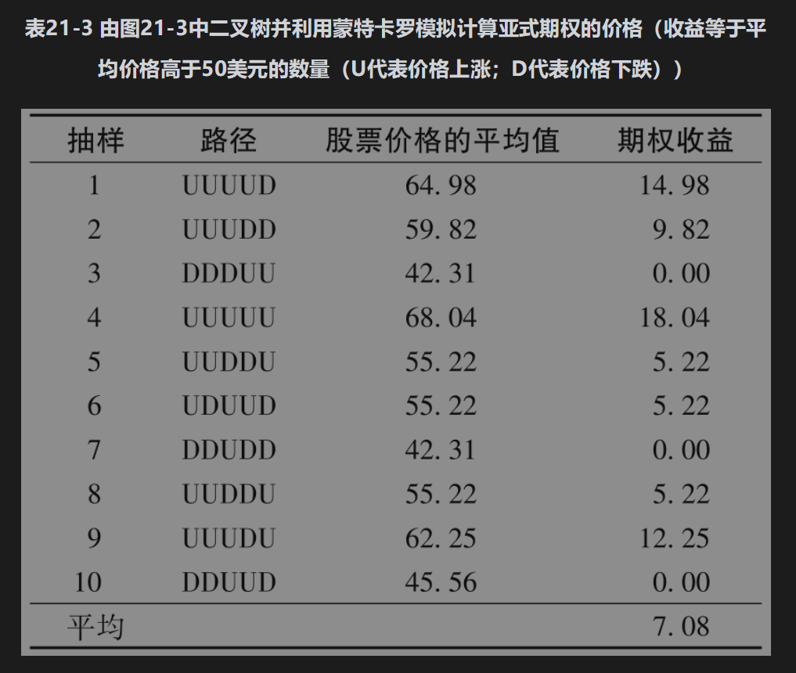

## 21.6.5 计算希腊值

我们可以采用蒙特卡罗模拟法计算第19章中讨论的希腊值。假定我们想计算f对于x的偏导数，其中f为衍生产品的价格，x为标的变量的价格或某个参数。首先，我们可以采取一般的蒙特卡罗法计算衍生产品的价格，然后我们将x值增加Δx，并采用与计算类似的方式得出新价格，对冲参数可由以下方程计算

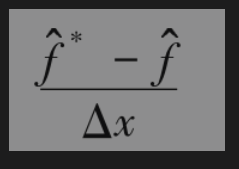

为了减小标准误差，在计算和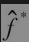时，我们选用的时间区间的个数N、所用的随机样本、模拟运算的次数M都应当相同。

## 21.6.6 应用

当衍生产品涉及3个或更多的随机变量时，蒙特卡罗模拟法比其他数值方法的效率更高。这是因为蒙特卡罗模拟法的运算量与随机变量的数量呈线性关系，而其他数值方法的运算量与随机变量的数量呈指数关系。蒙特卡罗模拟法的一个优点是可以给出估计值的标准误差，另一个优点是可以处理复杂的收益形式以及复杂的随机过程。再有，蒙特卡罗模拟法可用于收益为标的变量所遵循的整个路径（而不只是标的变量终端值）函数的情形。