# 21.7 方差缩减程序

假如像式(21-13)~式(21-18)所述的那样对衍生产品标的变量的随机过程进行模拟，在一般情况下，我们需要做很多次抽样才会将估计值达到合理的精确度。这从计算时间上讲是非常昂贵的。在这一节里，我们将介绍几种方差缩减程序(variance reduction procedure)，利用这些程序可以大大减少计算时间。

## 21.7.1 对偶变量技巧

对偶变量技巧(antithetic variable technique)是指在每一次模拟抽样时，都要计算衍生产品的两个值。第一个值f1是按通常的方式计算得出的；第二个值f2是通过改变所有标准正态分布样本的符号而得出的（如果ε是用来计算f1的一个抽样，那么-ε则是计算f2时相应的抽样）。由此计算出的衍生产品的抽样值等于f1和f2的平均值。因为在以上两个值中当一个高于真实值时，另一个一般会低于真实值，反之亦然，这使得这一方法很有效。

定义为f1和f2的平均值

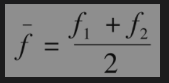

衍生产品价格的估值是所有的平均值。如果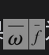为的标准差，M为模拟运算的次数（即所计算的衍生产品价格的次数），估计值的标准误差为

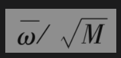

以上的误差量一般会远远小于由2M个随机试验所对应的标准误差。

## 21.7.2 控制变量技巧

在对美式期权定价时，我们已经给出了与树形结构并用的控制变量技巧(control variate technique)例子（见第21.3节）。控制变量技巧适应于有两个相似衍生产品A和B的情形。衍生产品A是我们想定价的衍生产品，衍生产品B与A相似并有解析解。计算过程将使用同样的随机样本和Δt同时计算这两个产品的值。第1项模拟得到对于A的估计值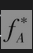；第2项模拟得到对于B的估计值。以下公式会给出一个对于A更好的估计

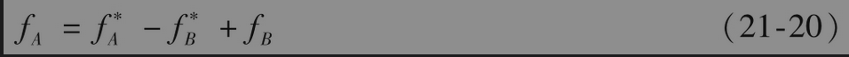

其中fB是由解析公式算出的B的真实值。Hull和White在研究随机波动率(stochastic volatil-ity)对于欧式期权价格的影响时给出了一个使用控制变量技巧的应用例子，在这里，A为在随机波动率假设下的期权，B为在常数波动率假设下的期权。

## 21.7.3 重点抽样法

解释重点抽样法(importance sampling)的最好方法是通过实例。假设我们要为一个执行价格为K、期限为T的深度虚值欧式看涨期权定价。如果我们按通常的办法对标的资产价格在T的值进行抽样，我们得出的大部分路径的终端值都是0。因为0终端值对于期权价格的影响很小，这样做会浪费很多计算时间。因此，我们想尽量选取股票价格在到期日大于K的重要路径。

假定F是股票价格在到期日T的无条件概率分布函数，q为在到期日股票价格大于K的概率，而且已知这一概率的解析式，那么G=F/q即为股票价格在股票价格大于K时的条件概率分布。为了实施重点抽样法，我们在G（而不是F）中进行抽样，期权价格的估计值等于收益贴现后的均值乘以q。

## 21.7.4 间隔抽样法

当我们从概率分布中抽取具有代表性的取值（而不是随机取值时），一般会得到更高的精确度。间隔抽样法(stratified sampling)属于这类处理方法。假定我们想从概率分布中抽取1000个样本，我们可以将分布分割成1000个具有同样概率的区间，然后从这些小区间中选取具有代表性的数值（均值或中位数(median)）。

对分成n个区间的标准正态分布情形，我们可以在第i个区间选取代表值

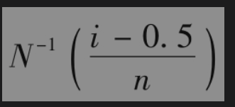

其中为累计正态分布函数的逆函数。例如，当n=4时，4个区间的代表值分别为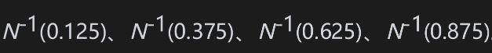。函数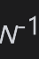可以利用Excel的NORMSINV函数进行计算。

## 21.7.5 矩匹配法

矩匹配法(moment matching)是指对标准正态分布中抽取的样本进行调整，以便使样本与第1阶矩、第2阶矩甚至更高阶矩相匹配。假设为了计算一个变量在一段时间里的变化时需要从均值为0、标准差为1.0的标准正态分布中进行抽样。假定所取的样本值为εi(1≤i≤n)。为了使前两阶矩相匹配，我们首先计算样本值的均值m和标准差s，然后我们定义调整后的样本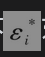如下

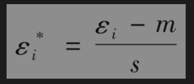

经调整的样本具有正确的均值0与正确的标准差1.0。最后我们采用这些经调整后的样本进行所有的计算。

矩匹配法会节省计算时间，但这种方法加重了存储的负担，这是因为所有的样本值均要存储到模拟过程的最后阶段。矩匹配法有时也被称作为二次再抽样法(quadratic resampling)。这一方法常常与对偶变量技巧结合使用。因为对偶变量技巧自动会使所有的奇数矩相匹配，因此我们只需要在矩匹配法中使得第2节矩和（或许）第4节矩相匹配即可。

## 21.7.6 利用伪随机数序列

伪随机数序列(quasi-random sequence)（也称为低差异序列(low-discrepancy sequence)）是由概率分布中得出的具有代表性样本组成的序列。读者可以在Brotherton-Ratcliffe以及Press等人的文献中找到关于伪随机数序列的描述和应用。伪随机数序列具有以下优点：由伪随机数序列所得模拟结果的标准差与1/M（而不是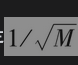）成正比，这里的M代表模拟次数。

伪随机数抽样与间隔抽样法相似，其目的是寻求具有代表意义的标的变量样本值。在间隔抽样法中，我们假定事先已经知道需要抽取样本的确切数量，而伪随机数抽样过程则更加灵活。这种抽样的方式总可以不断地在已经存在的样本之间的间隔里加入更多的样本。因此，在模拟过程的每个阶段，样本点都会大体上均匀地分布在整个概率空间中

图21-14显示了由索博尔提议的方法而产生的二维伪随机数点。我们可以看出，后来抽取的样本总是弥补前面样本所留下的空隙。

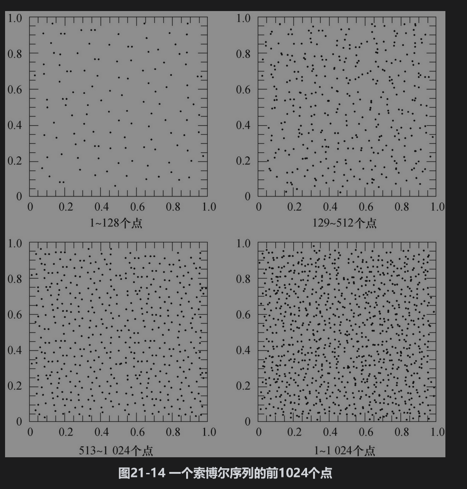

