# 21.8 有限差分法

有限差分法(finite difference)通过求解衍生产品价格所满足的微分方程达到定价的目的，在求解过程中，微分方程被转换成一组差分方程。我们可以通过迭代的方式求出差分方程的解。

为了说明这种方法，我们考虑如何用它对一个股息收益率为q的美式股票看跌期权定价。由式(17-6)得出，期权价格满足微分方程

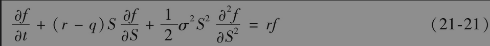

假设期权的期限为T。我们将期限分成N个等间隔、长度为Δt=T/N的时间区间。因此我们需要考虑N+1个时间点

                 0,Δt,2Δt,…,T

假设Smax为足够大的股票价格，一旦股票达到这一价格时，看跌期权的价值几乎为0。定义ΔS=Smax/M，并考虑M+1个具有同样间隔的股票价格

               0,ΔS,2ΔS,…,Smax

在选取Smax时保证这些值中有一个刚好对应于股票的当前价格。

如图21-15所示，选取的股票价格和时间构成了一个共(M+1)(N+1)个点的网格。网格上的(i,j)所对应的时间为iΔt，股票价格为jΔS。我们用变量fi,j代(i,j)点的期权价格。

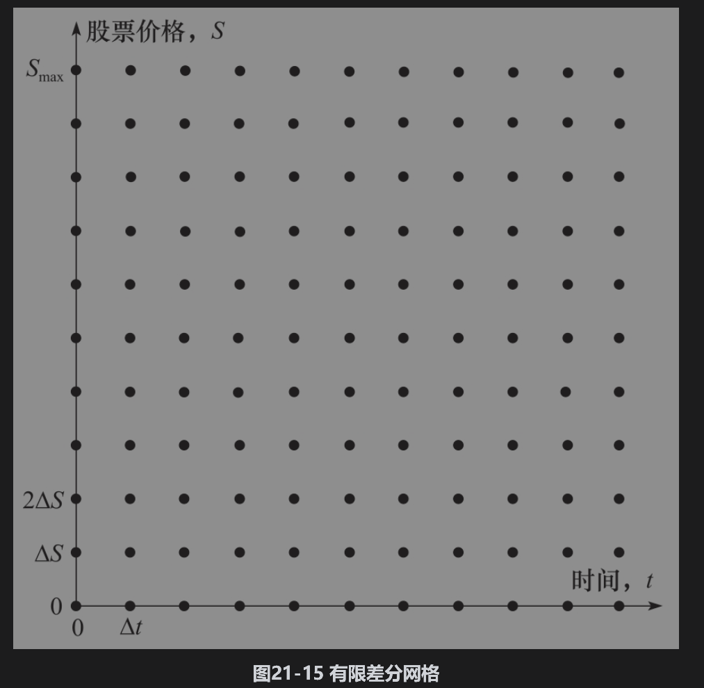

## 21.8.1 隐式有限差分法

对于网格内部的(i,j)，∂f/∂S可近似为

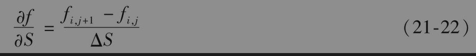

或者

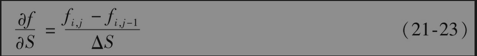

式(21-22)叫作向前差分近似(forward difference approximation)；式(21-23)叫作向后差分近似(backward difference approximation)。将以上两种差分加以平均，我们可以得出一个对称的差分方程

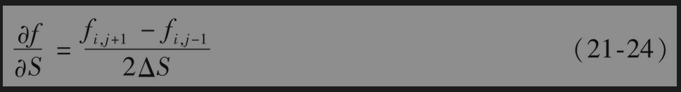

对于∂f/∂t，我们将采用向前差分近似，从而iΔt时刻的值(i+1)Δt的值有关

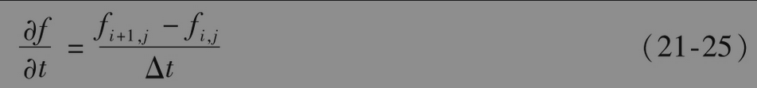

下面考虑$`∂^2f/∂S^2`$。(i,j)点的∂f/∂S向后差分近似地由式(21-23)给出。(i,j+1)点的∂f/∂S向后差分近似为

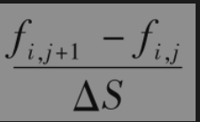

因此(i,j)点$`∂^2f/∂S^2`$的有限差分近似为

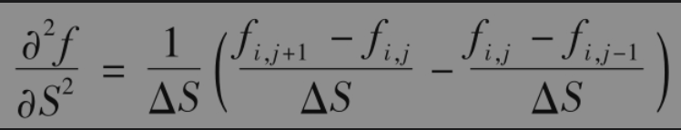

或者

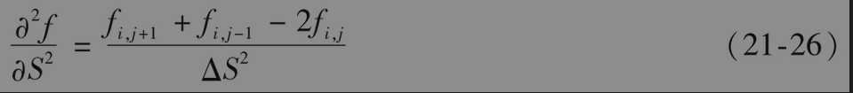

将式(21-24)、式(21-25)和式(21-26)代入微分方程式(21-21)，并且注意S=jΔS，得出

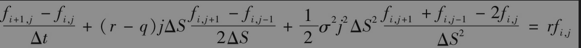

其中j=1,2,…,M-1；i=0,1,…,N-1。将方程进行整理，我们得出

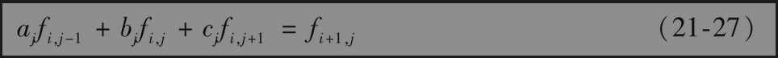

其中

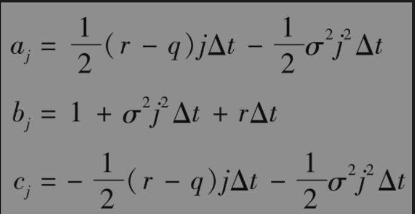

看跌期权在时间T的值为max(K-ST,0)，其中ST为股票在T时刻的价格，因此

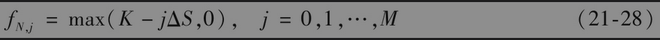

当股票价格为0时，看跌期权的价格为K，因此

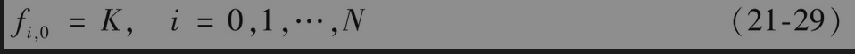

我们假定当S=Smax时，期权价格为0，因此

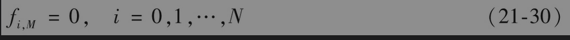

式(21-28)、式(21-29)和式(21-30)定义了看跌期权在图21-15所示网格的三个边上的取值，这三个边分别对应S=0,S=Smax，和t=T。接下来，我们要利用式(21-27)计算f在其他节点的值。当i=N-1时，式(21-27)可写为

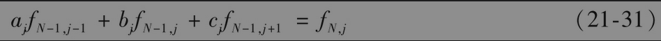

其中j=1,2,…,M-1。由式(21-28)，我们知道方程右端的值。此外，由式(21-29)和式(21-30)我们得出

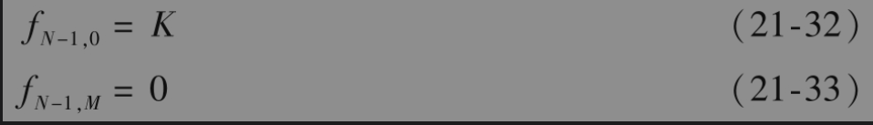

式(21-31)同时给出了关于M-1个未知量的M-1个方程，这些未知量为fN-1，1，fN-1，2,…,fN-1，M-1。[7]一旦以上未知量确定后，我们将fN-1，j与K-jΔS进行比较。如果fN-1，j＜K-jΔS，那么在时间T-Δt行使期权是最优的，这时我们将fN-1，j设定为K-jΔS。在时间T-2Δt的节点可用相似的方式处理，等等。最终，我们可以得出f0，1，f0，2，f0，3,…,f0，M-1，其中的一个价格即为我们寻求的期权价格。

控制变量技巧可以与有限差分法并用。在定价过程中，一旦设定时间和标的资产的网格后，我们采用同样的网格对于一个类似的但具有解析解的期权进行定价，然后利用式(21-20)。

【例21-10】 表21-4显示了由隐式有限差分方法求出的例21-1中美式看跌期权的数值解。在这里，参数M、N和ΔS分别等于20美元、10美元和5美元。因此，在定价过程中，我们将0美元和100美元之间分成了每5美元一个的价格区间，并同时将期权期限分成了每半个月一步的时间段。由这一网格得出的期权的价格为4.07美元，由同一网格给出的欧式期权价格为3.91美元，布莱克-斯科尔斯-默顿公式给出的欧式期权准确值为4.08美元。因此，由控制变量技巧得出的美式期权价格近似值为

            4.07+(4.08-3.91)=4.24（美元）

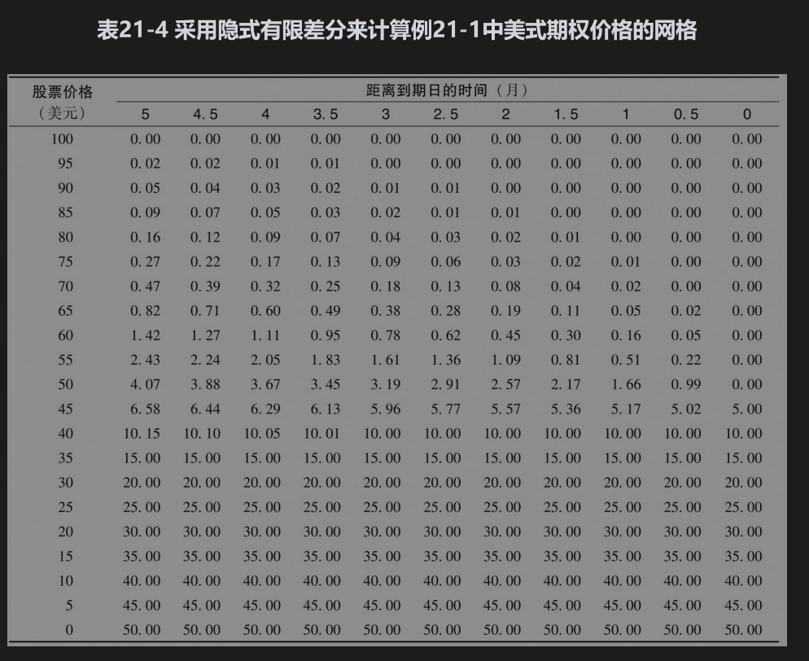

## 21.8.2 显式有限差分法

隐式有限差分方法的优点在于其稳定性：当ΔS和Δt趋于0时，由隐式有限差分方法得出的数值解总是收敛于微分方程的解。但其中一个缺点是由fi+1，j的值计算fi,j时，我们必须同时对M-1个方程求解。当假设∂f/∂S和$`∂^2f/∂S^2`$的值在(i,j)上(i+1,j)上相等时，可以将有限差分法简化。这时式(21-24)和式(21-26)变为

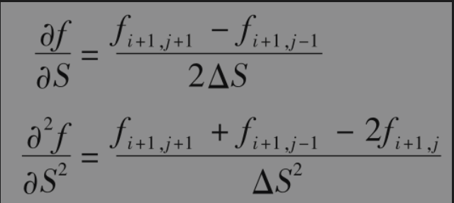

差分方程变为

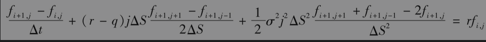

即

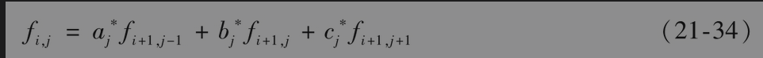

其中

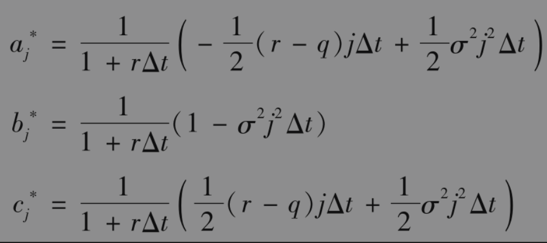

这样我们就产生了所谓的显式有限差分法(explicit finite difference method)。图21-16展示了隐式有限差分法与显式有限差分法的区别：由式(21-27)定义的隐式差分给出了iΔt时刻的3个不同期权值（即fi,j-1、fi,j和fi,j+1）(i+1)Δt时刻的1个期权值（即fi+1，j）之间的关系；由式(21-34)定义的显式有限差分给出了iΔt时刻的1个期权值（即fi,j）(i+1)Δt时刻的3个不同期权值（即fi+1，j-1、fi+1，j和fi+1，j+1）之间的关系。

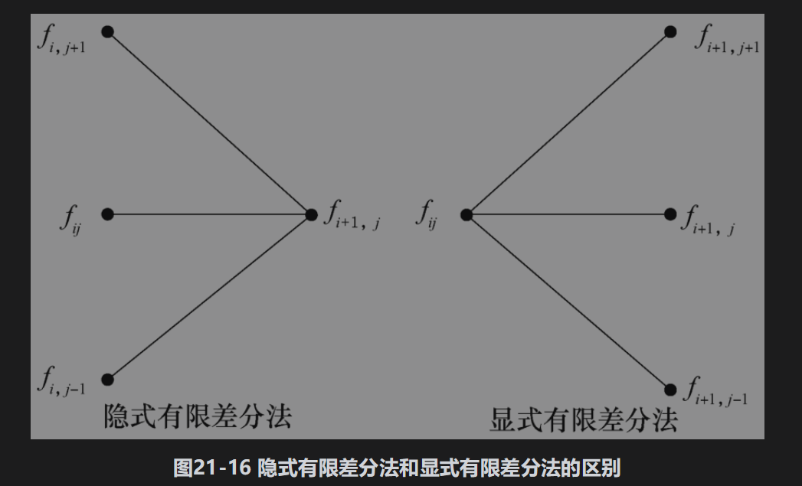

【例21-11】 表21-5给出了通过显式有限差分为例21-1中的美式看跌期权定价的结果。同例21-10中一样，参数M、N和ΔS分别等于20美元、10美元和5美元。由网格所得出的期权价格为4.26美元

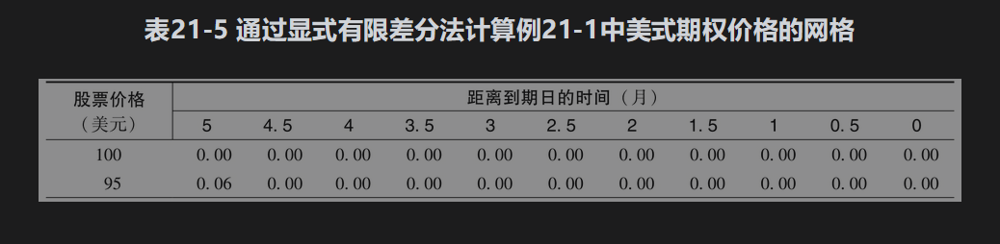

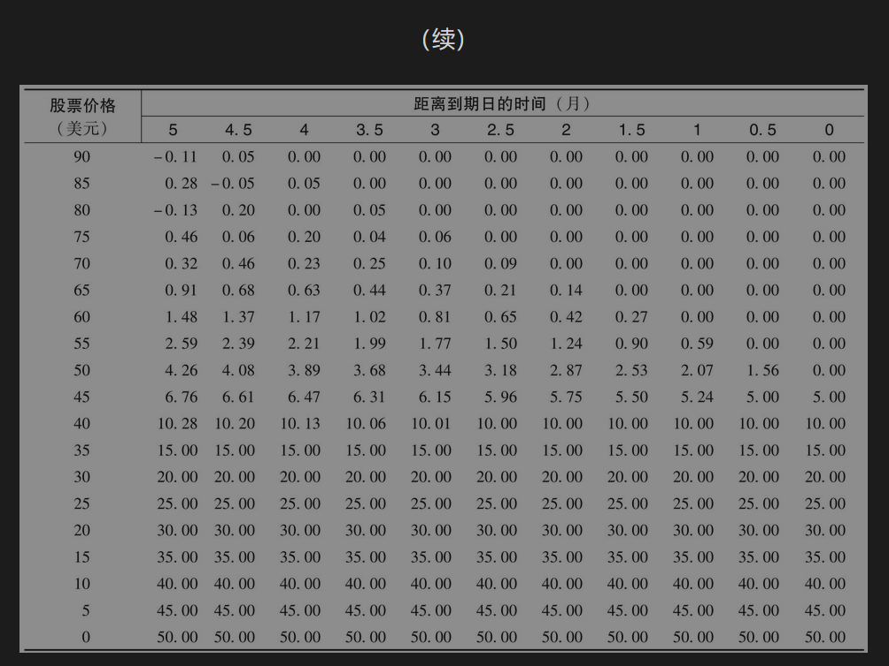

## 21.8.3 变量替换

如果利用几何布朗运动描述标的资产价格，在应用有限差分法时以lnS作为标的变量比以S作为标的变量会更有效。定义Z=lnS，式(21-21)变为

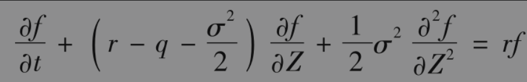

这时，为了给衍生产品定价，我们应该针对Z设定等距离网格（而不是针对S设定等距离网格）。在隐式有限差分法中，微分方程变为

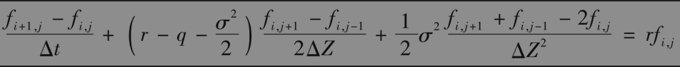

即

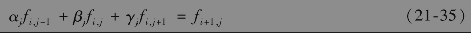

其中

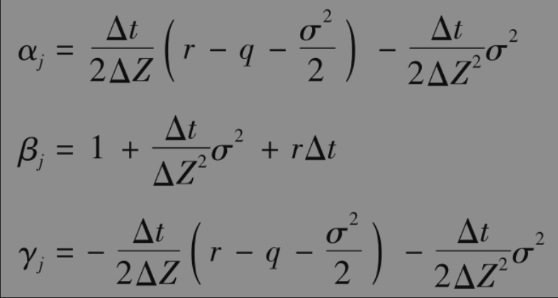

在显式有限差分法中，差分方程为

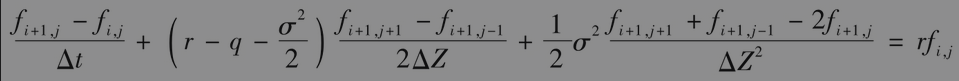

即

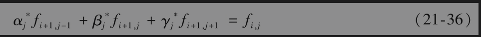

其中

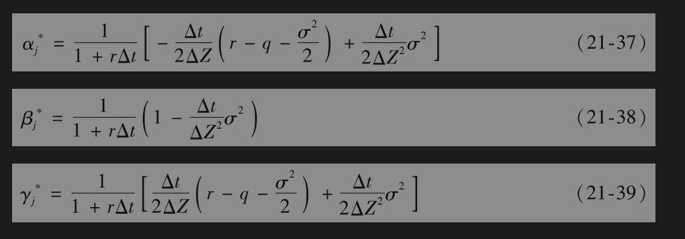

经过变量替换后，参数αj、βj和γj以及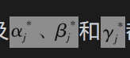都有独立于j的特征。在大多数情况下，是个很好的选择。

## 21.8.4 与三叉树法的关系

显式有限差分法与三叉树法等价。式(21-34)中参数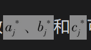可以理解为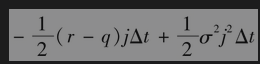：在Δt时间内，股票价格由jΔS跌(j-1)ΔS的概率1-σ2j2Δt：在Δt时间内，股票价格jΔS保持不变的概率

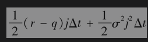：在Δt时间内，股票价格由jΔS升(j+1)ΔS的概率

这种解释展示在图21-17中。这三个概率的和等于1。这些概率保证在Δt时间后股票价格的增长期望(r-q)jΔSΔt=(r-q)SΔt，这恰恰是股票价格在风险中性世界的增长值期望。当Δt很小时，这些概率同时也保证在Δt时间内股票价格变动的方差为$`σ^2j^2ΔS^2Δt=σ^2S^2Δt`$，这恰恰对应于S所服从的随机过程。f在iΔt时刻的值等于(i+1)Δt时刻的f值在风险中性世界里的期望以无风险利率加以贴现。

为了保证能够使用显式有限差分法，以下3个“概率”必须为正

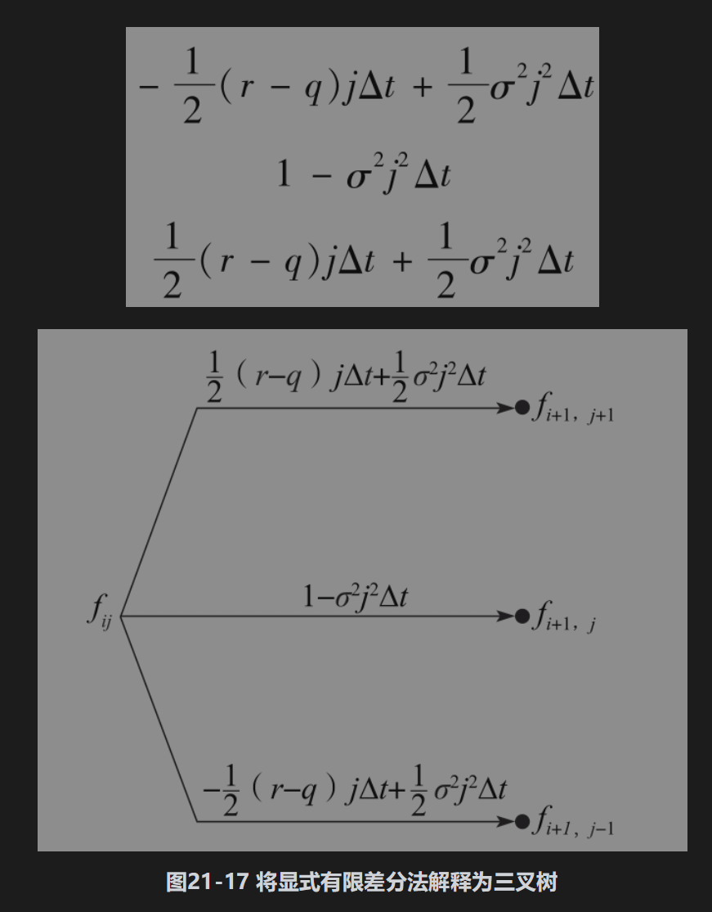

在例21-11中，当j≥13时（即当S≥65时），1-σ2j2Δt为负。这给出了在表21-5的左上角期权价格为负和其他矛盾的原因。这个例子说明了显式有限差分法的主要问题：因为树形结构中的概率可能为负，由此得出的数值解不一定收敛于微分方程的解。

当利用变量替换时（见式(21-36)~式(21-39)），变量Z=lnS减少ΔZ、保持不变、增加ΔZ的概率分别为

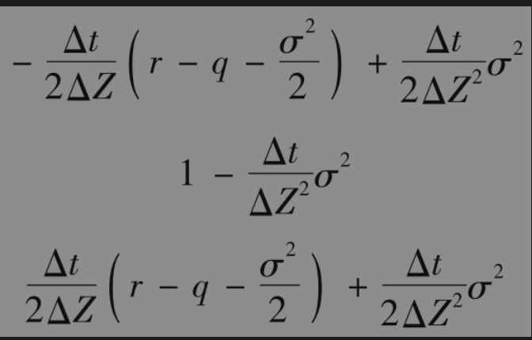

Z的这些变化值分别对应于由S到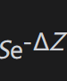，S和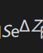的S变化值。如果取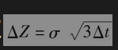，这里得出的树形和概率与第21.4节中的三叉树结果相同。

## 21.8.5 其他差分法

研究人员提出了其他许多种关于求解微分方程的有限差分方法，在很多情况下，这些方法比纯粹的显式有限差分法或者纯粹的隐式计算效率更高。

在所谓的跳格法(hopscotch method)中，当从一个节点转向另一个节点时，我们交替地使用隐式格式和显式格式，图21-18说明了这一方法。在每个时刻，我们首先按通常的显式方法在显式节点(E)完成计算，然后我们可以不需要求解方程组就可以得到在隐式节点(I)上的数值解，这是因为我们已经得出了与隐式节点相邻节点上的值。

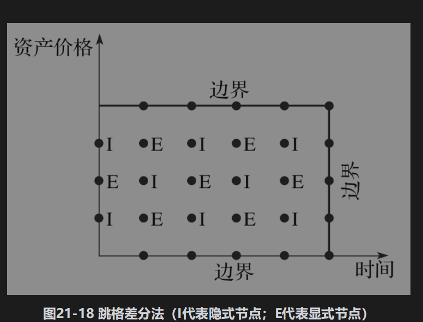

在Crank-Nicolson法(Crank-Nicolson method)中，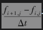设定为隐式法与显式法的平均。

## 21.8.6 有限差分法的应用

有限差分法何以用于任何适合树形方法的衍生产品类型，它们既可以用来处理欧式期权，也可以用来处理美式期权。但当衍生产品收益依赖标的变量历史时，使用有限差分法就会很困难。有限差分可用于多标的变量的情形，但计算时间会大大增加。因为这时图21-15的网格会变成多维的形式。

在有限差分法中，计算希腊值的方法与树形法类似，delta、gamma和theta可以直接由fi、j在网格上的值得出。对于vega，我们需要对波动率做一个很小的变化，然后再由同一个网格计算衍生产品的数值解。
