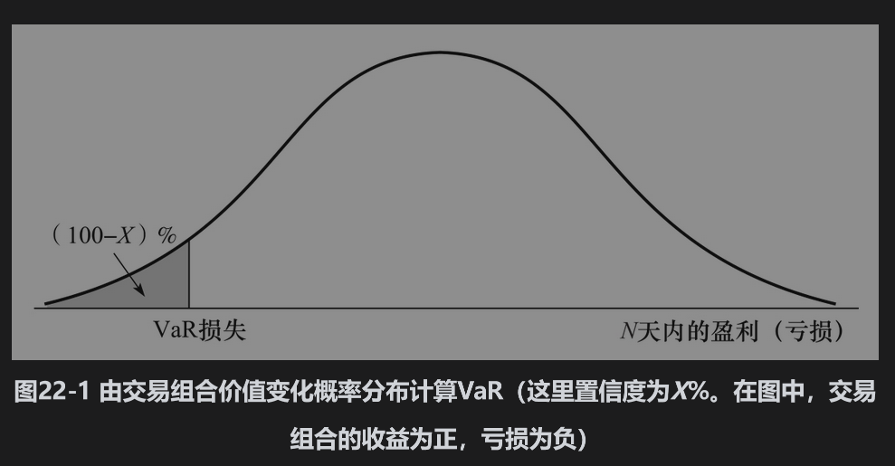
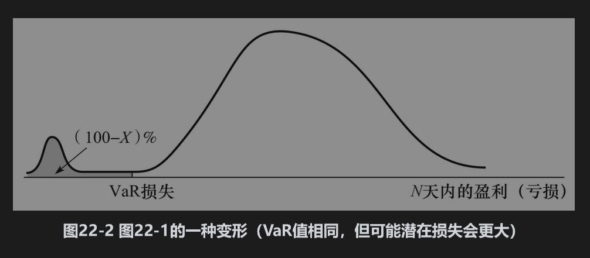
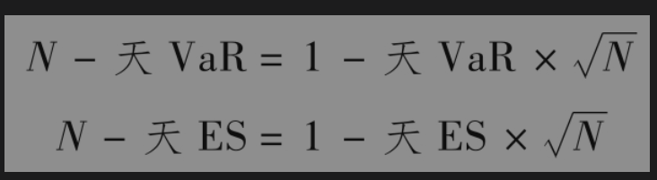

# 22.1 VaR与ES测度

当考虑VaR测度时，分析师所关心的是以下形式的结论：“我有X%的把握，在今后的N天内损失不会大于V。”这里的变量V就是交易组合的VaR。VaR函数有两个参数：持有（N天)和置信(X%）。这一数量说明在今后的N天内，只有(100-X)%的概率，损失会超出这个数量。

银行监管人员通常要求银行在计算市场风险的VaR时采用N=10与X=99（见业界事例22-1）。如果某家银行对应这些参数的VaR为2000万美元，这意味着有99%的把握，在接下来的10天内这家银行的损失不会超过2000万美元。10天损失分布的99个百分位数为2000万美元，换句话说，收益分布的第一个百分位数为-2000万美元。VaR展示在图22-1与图22-2中。

## 业界事例22-1

## 银行监管人员如何应用VaR

巴塞尔银行监管委员会(The Basel Committee on Bank Supervision)由世界上多个国家的银行监管机构组成，在瑞士的巴塞尔定期集会。1988年，委员会颁布了《巴塞尔协议Ⅰ》。通过这一协议，世界上各国的监管机构对于如何计算银行为承担信用风险所需持有的资本达成了共识。此后，委员会又颁布了《1996年修正案》(The 1996 Amendment)，并在1998年进行了实施。此修正案要求银行不仅要计提信用风险资本，也要计提市场风险资本。在修正案中，对银行的交易账户和银行业务账户进行了划分。银行业务账户中包括以贷款为主的资产，对于这些资产，银行并不需要为了满足管理与财务要求而经常重新定价。银行交易账户中包括一系列的日常交易产品（例如股票、债券、互换、远期合约、期权等），这些资产一般每天都要进行重新定价。

在《1996年修正案》中使用VaR对交易账户所需的资本进行计算，其中N=10和X=99，这意味着只有1%的可能在今后10天的损失会超出所计算出的VaR结果。银行需要计提的资本等于k乘以VaR（对所谓的特别风险(specific risk)要做调节），这里的乘数因子k由监管机构裁定，k值在各家银行之间会有所不同，但不会低于3。当银行建立了完善的VaR检测体系后，k很可能会接近最小值3，而对于体系不完善的银行来说，k值会更高一些。

继《巴塞尔协议Ⅰ》后，委员会又陆续发布了《巴塞尔协议Ⅱ》《巴塞尔协议Ⅱ.5》以及《巴塞尔协议Ⅲ》。《巴塞尔协议Ⅱ》（2007年左右被世界大部分地区所采用）使用持有期为1年、置信度为99%的VaR值计量信用风险和操作风险资本。《巴塞尔协议Ⅱ.5》（2012年实施）修订了市场风险资本的计量方法，其中一个变更是引入了压力VaR。压力VaR衡量的是在极端不利的时间区间内市场变量波动形成的VaR值。《巴塞尔协议Ⅲ》增加了银行资本计提的金额，以及股权资本计提比例。监管机构的另外一个修订，被称为交易账户基本原则审查(Fundamental Review of the Trading Book)，其修改包括使用97.5%的预期亏损而非99%的VaR计量市场风险资本。

VaR的概念比较容易理解，所以它很容易吸引人们的注意力。应用VaR时，实际上用户在问以下简单的问题：“情况最坏会到什么地步？”这是所有高级管理人员都想得到答案的问题。将一个交易组合中所有市场变量的希腊值压缩成一个单一数字会使高级管理人员更容易接受。

如果我们认为采用单一风险测度描述交易组合的风险是有帮助的，那么一个有趣的问题是：VaR是否为单一风险测度中最好的一个呢？某些研究人员认为，VaR可能会使交易员选择具有图22-2中分布特性的交易组合。图22-1与图22-2所示的交易组合具有同样的VaR，但图22-2所示交易组合的风险要大得多，这是因为它发生巨大损失的可能性要大得多。

一种可以解决以上问题的方法是我们刚提到的预期亏损(ES)，VaR测度的目的是描述损失会糟成什么样子，而预期亏损是对以下问题的答案：“当市场条件真的变糟时，我们的预期亏损有多大？”ES是指在今后N天内，在亏损高过VaR的条件下的预期亏损。例如，当X=99和N=10时，ES是指在损失超过10天持有期的99%VaR时，公司损失的平均值。如业界事例22-1所述，银行监管政策正在改变，计算市场风险资本是基于ES，而不再是VaR，而置信度则由99%变成了97.5%。

## 持有期

VaR与ES均含有两个参数：持有期N（以天为单位）与置信度X。在实践中，在估计市场风险的VaR与ES时，分析人员常常先将N设定为1。这是因为一般没有足够多的数据用以估计市场变量在一天以上的变化规律。通常所用的假设是

当交易组合价值在相继每天内的变化服从相互独立而期望值为0的相同正态分布时，以上公式正好成立。对于其他情形，这一公式只是一个近似式。