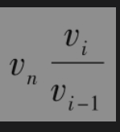
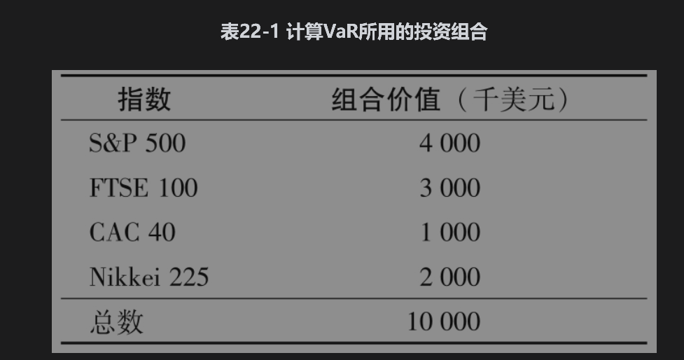
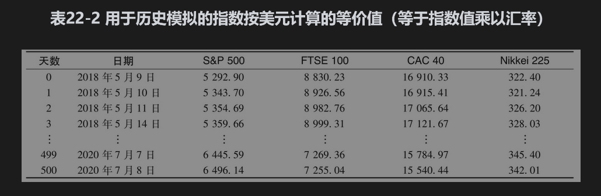
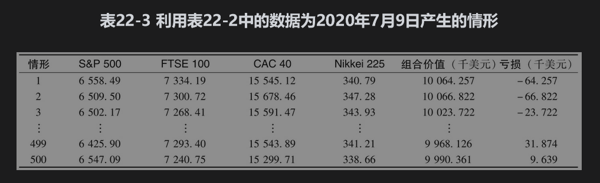
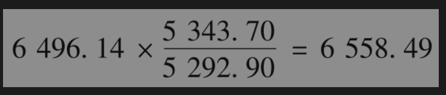
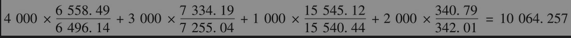
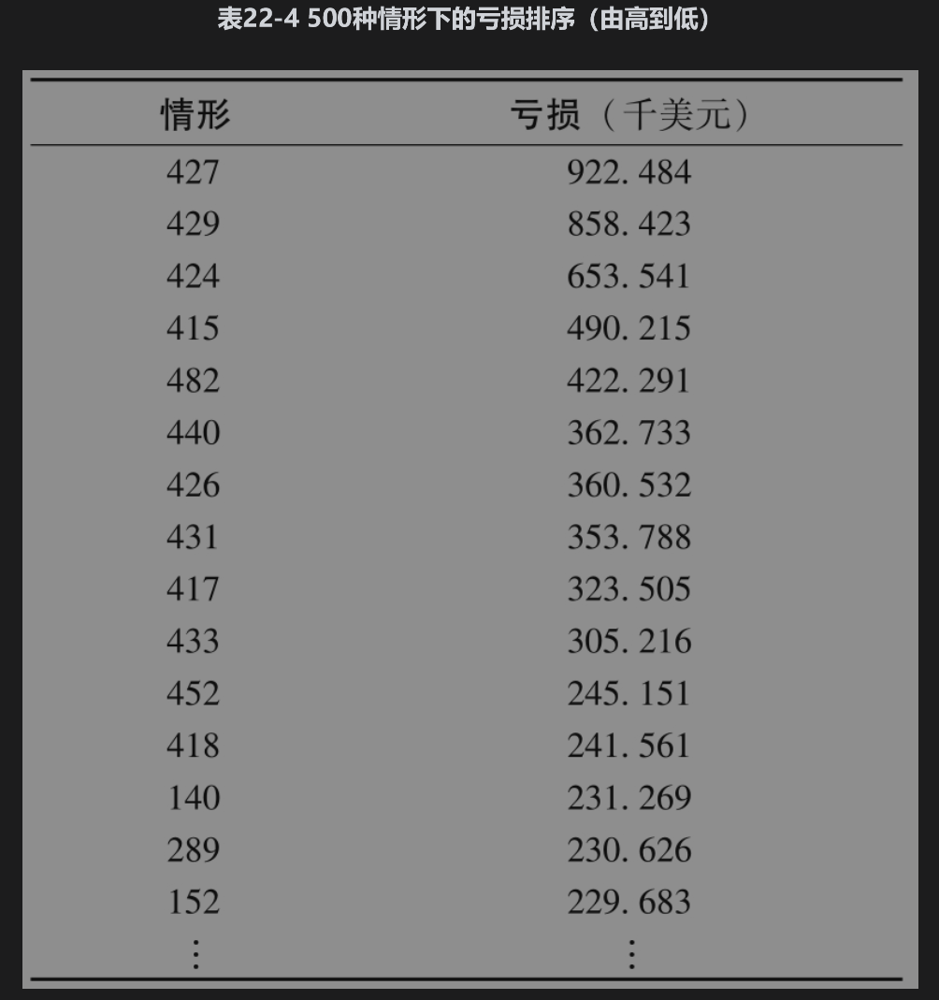
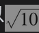
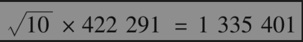
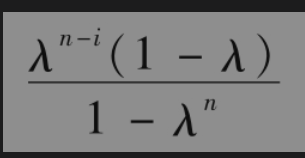

# 22.2 历史模拟法

历史模拟法是计算VaR与ES的一种常用的方法。这种方法是利用历史数据预测将来可能发生的不同情形。假设我们采用过去501天的历史数据计算某公司1天持有期、99%置信度的VaR，历史模拟法的第一步是识别影响交易组合的市场变量，这些变量一般是汇率、股价、利率等。所有的价格都应当按本国货币计算，例如，对一家德国银行来讲，它的一个市场变量可能是以欧元计算的标准普尔500指数。

接下来，我们需要收集这些变量在最近501天内的数据。这些数据为我们提供了从今天到明天市场变量可能发生的500种变化情形。我们将数据开始的第1天记为第0天，数据开始的第2天记为第1天，并依此类推。情形1为所有变量的百分比变化与它们在第0天和第1天之间的变化一样；情形2为所有变量的百分比变化与它们在第1天和第2天之间的变化一样，等等。对于每一个情形，我们可以计算从今天到明天之间的交易组合价值变化，并由此可以得出交易组合在一天内亏损的概率分布，分布上第99个百分位数对应于500个计算数值的第5个最大的亏损，VaR的估计刚好是亏损分布第99个百分比分位数所对应的亏损量。假定过去501天的市场变量变动情况能够预测即将发生在今天和明天之间的变动量，那么公司会有99%的把握肯定，交易组合的亏损将不会超过我们所估计的VaR值。

为了以代数形式表示计算过程，定义vi为市场变量在第i天的值，并且假设今天是第n天。在历史模拟方法中，第i天的情形假设了市场变量在明天的值为

## 22.2.1 示例：在4个股指上的投资

为了说明历史模拟方法的计算过程，假设在2020年7月8日，某个美国的投资者拥有由以下4个指数组成的、价值为1000万美元的投资组合：美国标准普尔500指数(S&P500)、英国富时100指数(FTSE 100)、法国CAC 40指数和日本日经225指数(Nikkei 225)。在2020年7月8日，投资在每个指数上的数量如表22-1所示。在作者网页(www-2.rotman.utoron-to.ca/～hull/OFOD/VaRExample)上的Excel计算表中有关于4个指数在前501天内收盘点数的历史数据、汇率以及一组计算VaR与ES的全部数据。因为我们所考虑的是一个美国投资者，所以富时100、CAC 40和日经225都是根据汇率按美元计算的。例如，在2018年5月9日（这里考虑的501天期间的开始），FTSE 100指数的价格为6515.12，当时的美元兑英镑汇率是1.3553（即1英镑值1.3553美元），这说明按美元计算时，指数为6515.12×1.3553=8830.23。所有指数换算为美元后的部分数据展示在表22-2里。

评价股权资产投资时选择2020年7月8日是很有意思的。新冠肺炎疫情导致股市在2020年3月大幅下跌。截至2020年7月，美国市场已基本恢复，但是疫情将持续多久，以及经济何时复苏仍有很大的不确定性。

表22-3给出的是在2020年7月9日这一天为产生各种情形所需要的市场变量值（按千美元计算）。情形1（表22-3里的第1行）显示的是，假设2020年7月8日~9日市场变量百分比变化与2018年5月9日~10日变化相同时，这些变量在2020年7月9日的值；情形2（表22-3里的第2行）显示的是在假设这些百分比变化与2018年5月10日~11日变化相同时，市场变量在2020年7月9日的值。在一般情况下，情形i假设了这些指数价格在2020年7月8日~9日的百分比变化量与第i-1日到第i日之间的变化相同(1≤i≤500)。表22-3中的500行代表所生成的500个情形。

2020年7月8日，S&P500的点数是6496.14。2018年5月10日，其点数是5343.70，这比2018年5月9日的5292.90要高。因此在情形1下，S&P500的点数为

类似地，FTSE 100，CAC 40和Nikkei 225的点数分别为7334.19，15545.12，和340.79。因此在情景1下，交易组合的价值为（以千美元计）

因此组合价值在情景1下增长了64257美元，对于其他情景可以进行类似的计算。

接下来，我们将500种不同情形下的亏损进行排序，表22-4显示了亏损排序。最坏的情形是第427种情形，对应指数的变化与2020年3月17日与18日之间的变化相同，其他的重大损失也是由2020年3月观察到的变化而造成的，一天99%的VaR可估计为第5个最坏的亏损，即422291美元。

在第22.1节里我们曾解释过，10天99%的VaR通常是将1天99%的VaR乘以，因此在这个例子中，10天99%的VaR为

即1335401美元。

在我们的例子中，每天的VaR均要通过采用最近501天的数据更新。例如，考虑2020年7月9日（第501天）的情况。所有市场变量都有新数据，因此我们可以计算交易组合新的市场价值，然后可以通过上述过程计算新的VaR。在计算中我们采用2018年5月10日~2020年7月9日（即第1天~第501天）的市场变量数据（由此我们可以产生500个市场变量百分比变化的观察值，2018年5月9日，即第0天的数据将不再使用）。类似地，在下一个交易日，2020年7月10日（第502天），我们可以采用2018年5月11日~2020年7月10日（即第2天~第502天）的数据计算VaR，等等。

在实践中，一家金融公司的交易组合当然要比我们这里的例子复杂得多，组合往往是由几千，甚至几万个头寸组成（涉及汇率、商品价格、利率，等等）。银行的头寸一般会包括远期合约、期权与其他衍生产品，而且交易组合本身每天都在变化。如果一家银行的交易导致交易组合的风险变大，VaR一般会增大。如果风险变小，VaR则一般会减小。VaR计算的假设前提是交易组合在下一个交易日里不会改变。

就利率而言，银行对交易组合进行估价时一般会需要多个币种下的零息利率期限结构，而这些期限结构是由市场变量计算出来的（见第4章里有关零息利率期限结构的计算）。银行存在风险敞口的每个零息利率曲线都可能会涉及多至10个市场变量。

## 22.2.2 预期亏损

利用历史模拟法计算预期亏损时，我们将位于亏损分布尾部的观察值平均。在我们的例子中，最坏的5个亏损（以千美元计）对应情形427、429、424、415和482（见表22-4）。这些情形亏损的平均值为669391美元，这正是对预期亏损的估计。

## 22.2.3 观察值权重

在目前呈现的历史模拟法中，过去500个情形所对应的权重都相等。在某些情况下，我们对最近的观察数据赋予更大的权重也许更为合理。一种做法是对应情景i赋予权重为

其中n为观察值的天数，λ是介于0和1之间的参数。权重总和等于1，并按λ比例递减。像以前一样，对于场景进行排序并计算累积权重，99%VaR值就是首次使累计权重超过0.01时对应的损失。

假定这里使用的λ值等于0.995，以此分配给场景427、429、424和415的权重分别为0.003776、0.003814、0.003719和0.003555。累计权重为0.004833、0.007590、0.011309和0.014864。VaR就是第3种情况下对应的损失，即653541美元。通过使用与前3种情况下的损失成比例的权重0.003776、0.003814和0.01-0.003776-0.003814来计算预期亏损，结果大约是833200美元。

## 22.2.4 压力VaR与压力ES

迄今为止，在任何给定日期计算VaR与ES时，我们总是假定使用最近的历史数据。例如，在计算4个指数的例子中，我们使用了最近501天的数据。然而，历史模拟可以基于过去任何时间段的数据：高波动率时间区间会算出高的VaR与ES值，而低波动率时间区间则会算出低的VaR与ES值。

监管部门引进了压力VaR(stressed VaR)与压力ES(stressed ES)的测度。为了计算这些测度，金融公司必须找出在现有交易组合下，一个251天的极端压力时间区间，这251天时间段的数据与我们例子中的501天时间段的数据扮演着同样角色：由251天中的第0天到第1天市场变量的变化产生第1个情形，第1天到第2天市场变量的变化产生第2个情形，等等。这样总共可以产生250个情形，1天99%压力VaR可以通过计算第2个最坏情形与第3个最坏情形对应的亏损中间值得到。而1天99%压力ES可以用$`0.4c_1+0.4c_2+0.2c_3`$计算，其中$`c_1、c_2和c_3`$  为3个最坏的损失，    $`c_1＞c_2＞c_3`$。