# 22.3 模型构建法

除了历史模拟法外，模型构建法(model-building)是另外一种计算VaR的主要方法。在介绍细节之前，我们先说明波动率计量单位的问题。

## 22.3.1 日波动率

对于期权定价，时间一般以“年”为单位，波动率度量单位往往是“年波动率”。当我们采用模型构建法计算VaR与ES时，一般以“日”为时间单位，对资产波动率的度量单位往往采用“日波动率”。

期权定价中的年波动率与计算VaR或ES时的日波动率之间的转换关系是什么呢？定义σ年为某一资产的年波动率，σ天为相应资产的日波动率，假定一年总共有252个交易日，式(15-2)给出了资产收益率在一年期内以连续复利形式计算出的标准差是σ年，或者为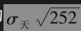，因此

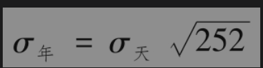

或

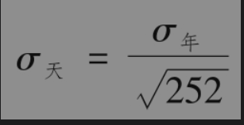

这一方程显示，日波动率大约是年波动率的6%。

如第15.4节所述，σ天大约等于每日资产价格百分比变化的标准差。为了计算VaR或ES，我们假设这里是等式，因此，资产价格（或其他市场变量）的日波动率(daily volatility)被定义为资产价格在一天内百分比变化的标准差。

在接下来几节的讨论中，我们假设已经获取了日波动率以及相关系数的估计值。在第23章里，我们将讨论如何生成这些估计值。

## 22.3.2 单一资产的案例

我们现在考虑如何利用模型构建法计算一个价值为1000万美元、只包含微软公司(Microsoft)股票的交易组合的VaR值。在计算中，我们选择N=10天和X=99%，也就是说，我们感兴趣的是在10天持有期内、在99%置信水平下损失不会超出的数量。在计算过程中，我们首先将持有期选定为1天。

假定微软公司股票的日波动率为2%（对应的年波动率为32%），因为交易头寸的数量为1000万美元，所以交易组合每天价值变化的标准差为1000万美元的2%，即200000美元。

在模型构建法中，通常假设在持有期内市场价格变化的期望值为0。这一假设虽然并不完全正确，但比较合理。同标准差相比，市场变量在一个较小区间内变化的期望值相对较小。例如，假设微软公司的预期年收益是20%，1天的期望收益率大约是0.20/252=0.08%，与此对应每天价格变化的标准差是2%。在10天的持有期下，期望收益为0.08%×10=0.8%，而10天所对应的收益率标准差为2%×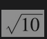，即大约6.3%。

到目前为止，我们已经得出了微软公司股票在1天内价格变化的标准差为200000美元，并且每天价格变化的均值（近似）为0。我们假定价格的变化服从正态分布，通过Excel NORMSINV公式得到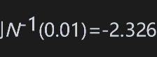，这说明在正态分布下，价格下跌大于2.326倍标准差的概率为1%。另外一种等价的说法是，在正态分布下，我们有99%的把握肯定，价格下跌不会超过2.326倍的标准差，因此，我们得出1000万美元微软股票的1天持有期的99%VaR等于

                  2.326×200000=465300（美元）

假定微软股票在天与天之间的变化相互独立，因此N天的VaR等于1天的VaR乘以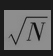，10天的99%VaR等于

接下来我们考虑价值为500万美元的AT&T股票投资组合，假定AT&T股票的日波动率为1%（对应的年波动率大约为16%）。采用与微软股票类似的计算，我们得出AT&T在1天内价格变化的标准差为

                         5000000×0.01=50000

假定价格的变化为正态分布，1天持有期的99%VaR等于

                        50000×2.326=116300（美元）

10天持有期的99%VaR等于

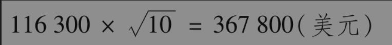

## 22.3.3 两个资产的案例

现在我们考虑由1000万美元微软股票与500万美元AT&T股票所构成的交易组合。我们假定微软与AT&T的股票价格变化服从二元正态分布，分布的相关系数为0.3。如果变量X与Y的标准差分别为σX和σY，相关系数为ρ，由统计学中的标准结果可知X+Y的标准差为

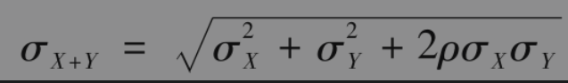

在应用这一结果时，我们令X为微软股票在1天内的价格变化，Y为AT&T股票在1天内的价格变化，那么

                σX=200000和σY=50000

因此，由两种股票所组成的交易组合的一日标准差为

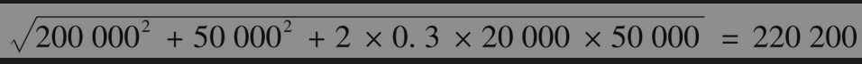

价格变化服从正态分布，假设均值为0，因此1天持有期的99%VaR等于

              220200×2.326=512300（美元）

10天持有期的99%VaR等于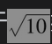乘以以上数量，即1620100美元。

## 22.3.4 风险分散的益处

在上述例子中：

(1)对于由单一微软股票组成的交易组合，其10天持有期的99%VaR等于1471300美元。

(2)对于由单一AT&T股票组成的交易组合，其10天持有期的99%VaR等于367800美元。

(3)对于由微软与AT&T两种股票所组成的交易组合，其10天持有期的99%VaR等于1620100美元。

即

                 1471300+367800-1620100=219000（美元）

代表风险分散的益处。如果微软与AT&T的相关系数等于1，由微软与AT&T共同组成的交易组合VaR等于微软的VaR加上AT&T的VaR，小于1的相关系数会造成部分风险被分散化解(diversified away)。

## 22.3.5 计算ES

当亏损分布服从均值μ、标准差σ的正态分布时，置信度为X的ES可以由下式表

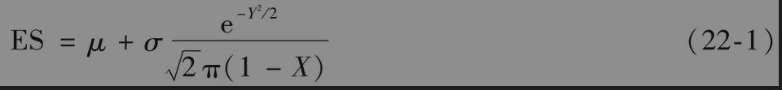

其中Y是标准正态分布的第X个百分位数（即在均值为0、标准差为1的正态分布上，以概率1-X所超过的点）。这说明，与VaR一样，当假设μ为0时，ES与σ成比例。

这个公式说明，在上面微软交易组合中，10天99%置信度的ES为1687000美(X=0.99,Y=2.326)；AT&T交易组合10天99%置信度的ES为421400美元；两家股票合在一起的交易组合10天99%置信度的ES为1856100美元。
