# 22.4 线性模型

以上讨论的例子是采用线性模型计算VaR的特例。假定我们持有的价值为P的交易组合中含有n个不同资产，在资产i(1≤i≤n)上投资的资金数量为αi。定义Δxi为资产i在一天内的回报，在一天内投资于资产i所产生的变化为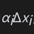，那么

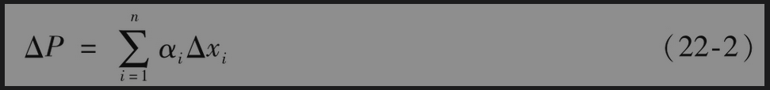

其中ΔP为整个交易组合在一天内的价值变化。

在前一节所示例子中，第1项资产为价值1000万美元的微软股票，第2项资产为价值500万美元的AT&T股票，因此α1=10,α2=5（以百万美元计），那么

$`ΔP=10Δx_1+5Δx_2`$

如果我们假定式(22-2)中的Δxi服从多元正态分布，那么ΔP也服从正态分布。为了计算VaR和ES，我们只需要计算出ΔP的期望值和标准差。在上一节里，我们假定每项Δxi的期望值都为0，因此ΔP的期望值也为0。

为了计算ΔP的标准差，我们假定σi为第i项资产的日波动率，ρij为资产i回报与资产j回报之间的相关系数，这意味着Δxi的标准差为σi，Δxi与Δxj之间的相关系数为ρij。将ΔP的方差记为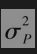，我们有

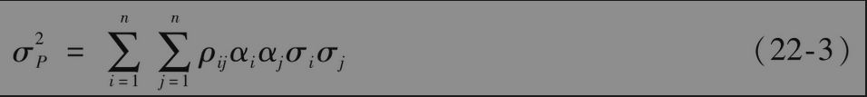

这一等式也可以写成

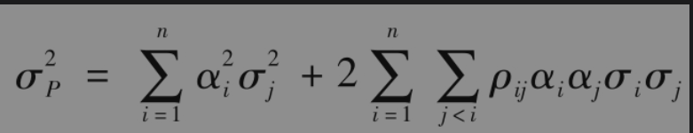

N天内变化的标准差为，因此N天持有期的99%VaR等于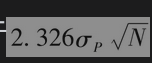。交易组合在一天里的收益率是ΔP/P，由式(22-3)得出其方差为

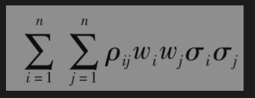

其中wi=αi/P是组合在第i项资产上的投资比重。交易组合管理人员在使用式(22-3)时常常使用这种形式。

在前一节的例子中，σ1=0.02，σ2=0.01，ρ12=0.3，在前面我们曾指出α1=10,α2=5，因此

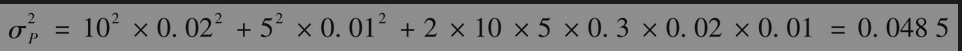

即σP=0.2202，这一数量为交易组合每天价值变化的标准差（以百万美元计），持有期为10天的99%VaR等于2.326×0.2202×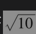=1.62，即162万美元。这与前一节所计算出的结果完全一致。

## 22.4.1 相关系数与协方差矩阵

相关系数矩阵里的第i行和第j列元素ρij是变量i和变量j之间的相关系数，其形式如表22-5所示。因为一个变量与其本身总是完全相关的，所以相关系数的对角线元素总是1。另外，因为ρij=ρji，所以相关系数矩阵是对称的。我们可以将相关系数矩阵与变量的日标准差相结合，利用式(22-3)计算出交易组合的方差。

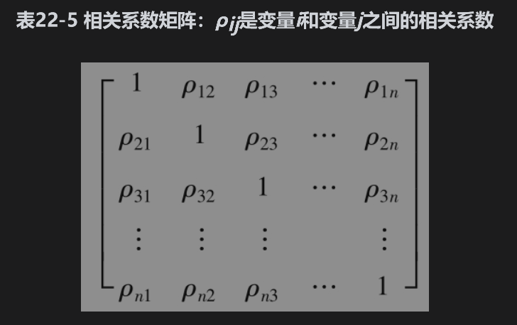

分析师常常使用方差和协方差而不是相关系数与波动率进行计量。变量i的日方差$`var_i`$是日波动率的平方

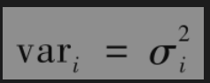

变量i与变量j之间的协方差是变量i的日波动率、变量j的日波动率以及i和j之间相关系数的乘积

计算交易组合方差的式(22-3)可以写成

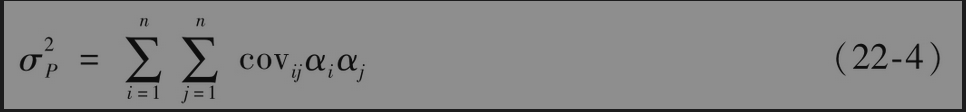

协方差矩阵(covariance matrix)里的第i行和第j列元素是变量i和变量j之间的协方差，如前文所述，一个变量与其自身的协方差等于其方差，因此矩阵中的对角线元素为变量的方差（见表22-6），因此，协方差矩阵有时也被称为方差-协方差矩阵(variance-covariance matrix)。（与相关系数矩阵一样，协方差矩阵也是对称的）。使用矩阵记号，上面所给的组合方差可以写成

其中α是列向量，第i个元素是αi,C是方差-协方差矩阵，$`α^T`$是α的转置(transpose)。

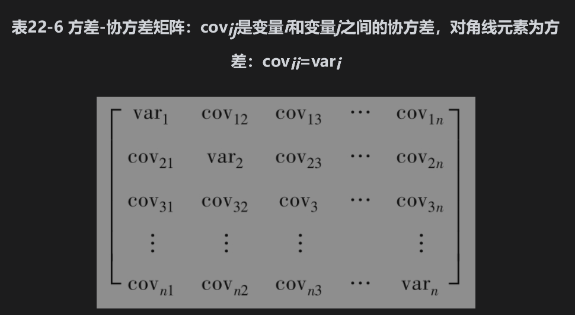

## 22.4.24个股指的例子

现在重新考虑第22.2节里的4个股指例子，这些例子涉及表22-1中的投资组合，这里提供的数据和计算可以在作者的网站上找到。

通过表22-7展示的过去500天的收益，可以求得在2020年7月8日计算得出的相关系数矩阵，协方差矩阵如表22-8所示。由式(22-4)可以得出，从协方差矩阵得出投资组合损益（千美元）的方差为14406.193，投资组合损益的标准差为其平方根，等于120.03。因此，以千美元为单位的1天的99%VaR为2.326×120.03=279.222，根据式(22-1)，以千美元为单位的1天99%ES为319.894，这些数值远低于历史模拟法所给出的结果，这是因为后者受到了2020年3月后发生的少数重大损失的极大影响。

在下一章中我们可以看到在模型构建法中计算波动率和相关性时，观察值的权重如何随着观察值变旧而下降。

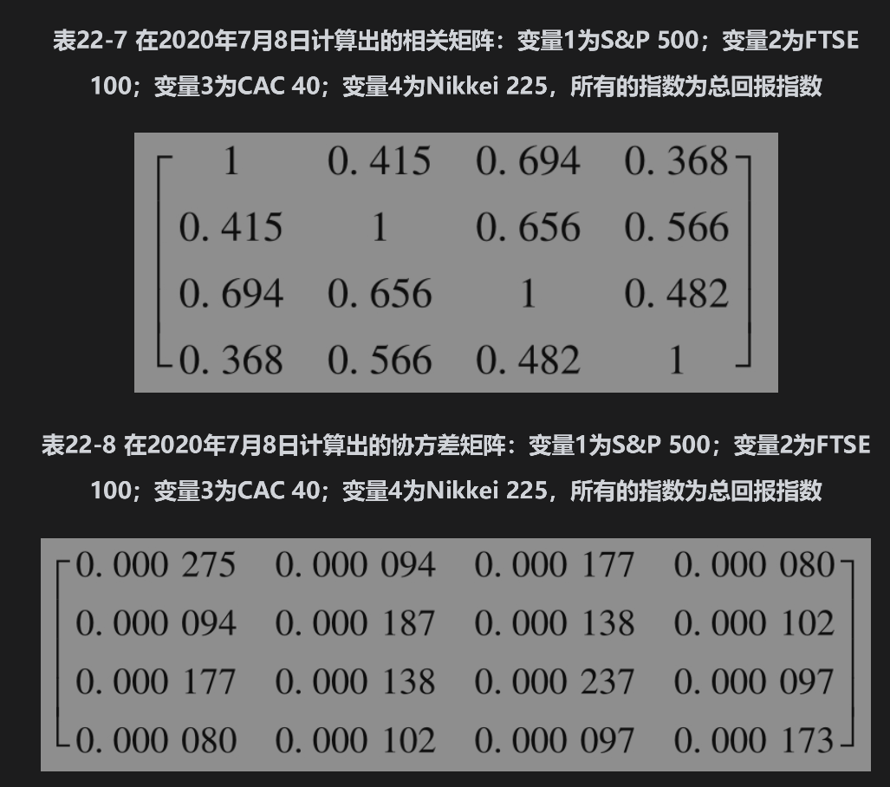

## 22.4.3 如何处理利率

在模型构建法中，我们不可能将每一个债券或公司所面临的每一种利率风险都定义为一个单独的市场变量。在建立模型时，我们必须进行简化。一种方式是假定收益率曲线的变化形式只有平行移动，由此我们只需要定义一个市场变量，即平行移动的大小。我们可以采用以下方程计算一个债券交易组合的价值变化

                         ΔP=-DPΔy

其中P为组合的价值，ΔP为组合价值在一天内的变化，D为组合的修正久期，Δy为收益率在一天内的平移变化。

一般来讲，这种方法的准确性不够好。市场上通常采用的方法是选择以下标准期限的零息债券价格作为市场变量：1月、3月、6月、1年、2年、5年、7年、10年和30年。在计算VaR或ES时，组合中产品的现金流被映射成标准期限上的现金流。假设一个头寸为100万美元的国库券，期限为1.2年，债券的券息为6%，每半年支付一次。债券在0.2年、0.7年和1.2年发放券息，并在1.2年债券偿还本金。此债券可以作为以下3个零息债券的组合：期限为0.2年面值为30000美元的零息债券、期限为0.7年面值为30000美元的零息债券以及期限为1.2年面值为1030000美元的零息债券。在映射过程中，0.2年的头寸被与其等价的1个月和3个月头寸而取代，0.7年的头寸被与其等价的6个月和1年头寸而取代，1.2年的头寸被与其等价的1年和2年头寸而取代。因此，我们持有的1.2年期的附息债券分别被映射为1个月、3个月、6个月、1年和2年的无息债券。

这里描述的过程叫现金流映射(cash-flow mapping)。在网页www-2.rotman.utoronto.ca/~hull/TechnicalNotes上的Technical Note 25中介绍了一种这样的现金流映射方法。注意，当使用历史模拟方法时，没有必要做现金流映射，这是因为对于每个情形，我们都可以采用第4章介绍的推导方法，通过情形里的变量生成完整的期限结构。

## 22.4.4 线性模型的应用

线性模型最简单的应用情形是当交易组合仅由股票与债券组成而且没有衍生产品的时候。利用现金流映射将债券转换成对应于标准期限的零息债券，交易组合价值的变化同股票和这些零息债券收益率呈线性关系。

另一种可以用线性模型处理的金融产品是外汇远期合约，即在未来时间T买入或卖出某种外汇，该合约可以被看作是在时间T到期的外国零息债券与在时间T到期的本国零息债券的交换。为了计算VaR与ES，可以将该远期合约当成是一个外币零息债券的多头与一个本币零息债券的空头来处理，而每一个债券都可以通过现金流映射来处理。

隔夜指数互换也可以使用线性模型处理。我们可以将其看作是固定利率债券对浮动利率债券的互换。浮动利率债券有一个已知价值，即如果在最后一个利率重置日开始的一段时间内以隔夜利率投资，该价值将等于本金增长后的金额。固定利率债券可以使用现金流映射程序进行处理。

## 22.4.5 线性模型与期权

我们现在考虑如何将线性模型用于期权产品。首先假设交易组合由一个单只股票期权组成，标的资产的当前价格为S，期权delta（由第19章里的方式计算得出）为δ，因为δ为交易组合价格变化与S变化的比率，我们有以下近似式

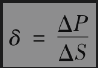

即

其中ΔS为在一天内股票价格的变化，ΔP是交易组合在一天内的价值变化。定义Δx为股票价格在一天内的百分比变化，因此

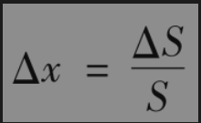

ΔP与Δx有以下近似关系式

                ΔP=SδΔx

当交易组合包含几种不同标的市场变量的期权时，我们可以推导出ΔP与Δxi之间的近似关系式

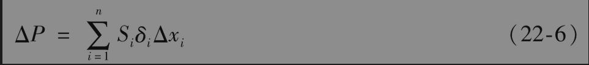

其中$`S_i`$为第i个市场变量的值，$`δ_i`$为交易组合关于第i个变量的delta。类似于式(22-2)的近似关系式为

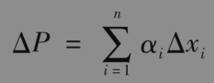

其中αi=Siδi，从而可以利用式(22-3)或式(22-4)计算ΔP的标准差。

【例22-1】 交易组合是由标的资产为微软股票与AT&T股票的期权所组成的，微软期权的delta为1000，AT&T期权的delta为20000，微软股票的价格为120，AT&T的股票价格为30。由式(22-6)，我们得出以下近似式

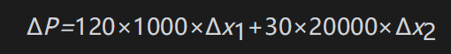

即

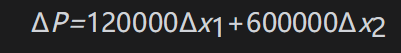

其中Δx1与Δx2分别为微软与AT&T股票在一天内的收益率，ΔP为交易组合价值相应的变化（这相当于在微软投资上有120000美元投资，在AT&T上有600000美元投资）。假设微软日波动率为2%，AT&T日波动率为1%，它们之间的相关系数为0.3，我们得出ΔP的标准差（以千美元计）为

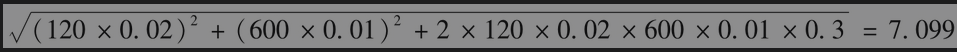

