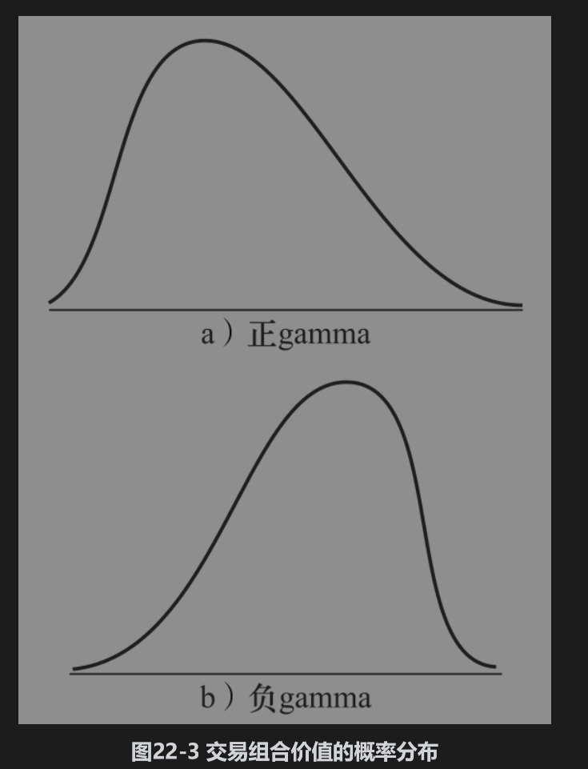
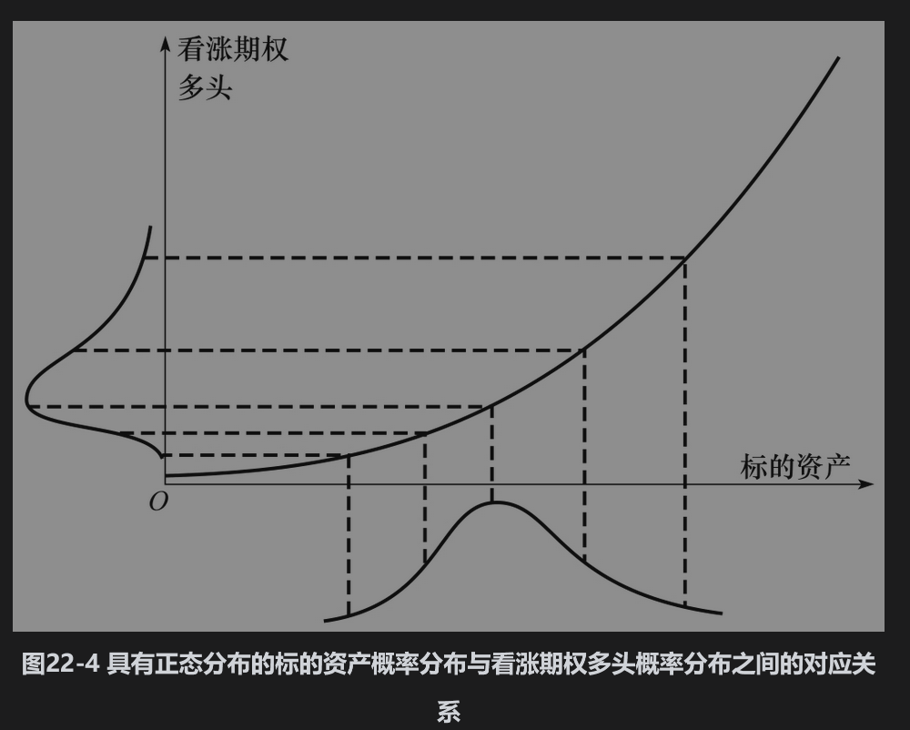
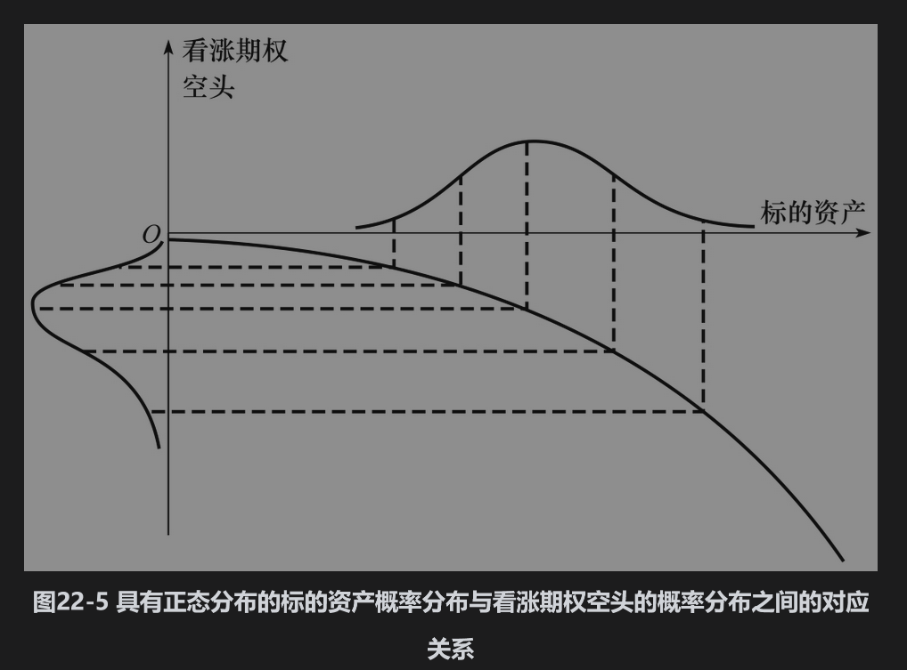
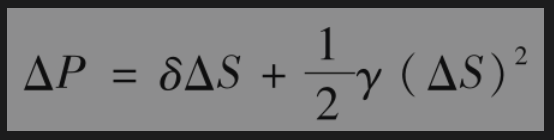
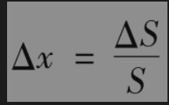
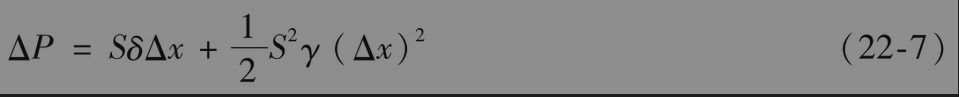
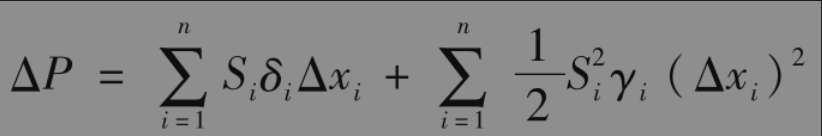
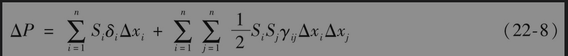
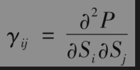

# 22.5 二次模型

当交易组合中含有期权产品时，线性模型只是一个近似，这种模型不考虑交易组合的gamma项。如第19章所述，delta是交易组合价值变化随标的市场变量变化的比率，gamma是交易组合delta随标的市场变量变化的比率。gamma是测量交易组合价值与市场变量关系式中的凸性。

图22-3展示了非零gamma对于交易组合价值概率分布的影响，当gamma为正时，概率分布通常具有正偏性(positively skewed)，而当gamma为负时，概率分布通常具有负偏性(negatively skewed)。图22-4和图22-5解释了产生这一现象的原因。图22-4显示了一个看涨期权多头的价值同标的资产之间的关系。一个看涨期权多头是具有正gamma期权的例子，该图说明当标的资产价格在一天末的概率分布为正态时，相应期权价值的概率分布具有正偏性。图22-5显示了一个看涨期权空头价值与标的资产的关系。看涨期权空头的gamma为负，这时我们看到当标的资产价格在一天末的概率分布为正态分布时，相应期权价值的概率分布具有负偏性。在这种情形下，在一天末标的资产价格的正态分布映射到具有负偏性的期权头寸价值的分布中。

一个投资组合的VaR与ES关键取决于投资组合价值分布左端的尾部。例如，当置信度为99%时，分布左端尾部小于VaR的数量占整体分布的1%。如图22-3a与图22-4所示，同正态分布相比，具有正gamma的交易组合的左端分布较为瘦小。因此在假设ΔP为正态分布时得出的VaR会偏高。类似地，如图22-3b与图22-5所示，同正态分布相比，具有负gamma的交易组合的左端分布较为肥大，因此在假设ΔP为正态分布时得出的VaR会偏低。

为了得到比线性模型更精确的VaR估计，我们可以在ΔP与Δxi关系式中既考虑delta又考虑gamma。考虑一个只依赖一个资产价格S的交易组合，假定δ和γ为交易组合的delta和gamma。由第19章附录A可知，式(22-5)中近似式的一种改进形式为

令

由此得出

假定交易组合价值与n个市场变量有关，并且组合中每个产品只依赖一个市场变量，式(22-7)变为

其中$`S_i`$是第i个市场变量的值，$`δ_i和γ_i`$为交易组合关于第i个变量的delta和gamma。当组合的资产依赖不止一个市场变量时，以上方程变为以下更一般的形式

其中$`γ_ i j`$为“交叉gamma项”，其定义为

与式(22-2)相比，式(22-8)不易于应用，因为ΔP不服从正态分布。如果只有少数变量，式(22-8)可用来计算ΔP的矩(moment)。由这些矩，我们可以利用统计学中的Cor-nish-Fisher展开计算概率分布的分位数。