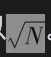

# 22.6 蒙特卡罗模拟法

除了上述已经说明的方法外，我们还可以利用蒙特卡罗模拟法生成模型构建法中ΔP的概率分布。假如我们想计算一个交易组合的持有期为1天的VaR，步骤如下：

(1)按通常使用的方法，利用市场变量的当前值对交易组合定价；

(2)在Δxi服从的多元正态分布中进行一次抽样；

(3)由Δxi的样本值计算市场变量在交易日末的值；

(4)按通常使用的方法，利用日末市场变量值，对交易组合重新定价；

(5)将第4步产生的数值减去第1步的数值，得到ΔP的一个样本；

(6)多次重复第2步至第5步，我们可以建立ΔP的一个概率分布。

ΔP的概率分布中的某个百分位数就是我们需求的VaR。例如，假如我们由以上方法计算出ΔP的5000个不同的样本值，1天持有期的99%VaR对应样本数值中的第50个最坏结果；1天持有期的95%VaR为第250个最坏结果，等等。N天持有期的VaR等于1天持有期的VaR乘以]。

蒙特卡罗模拟法的弱点是其计算速度往往很缓慢，这是因为一个公司的交易组合（由成千上万的不同资产所组成）要被定价很多次。一种加速计算的方法是用式(22-8)描述的ΔP与Δxi的关系，这样在蒙特卡罗模拟法时我们可以由第2步直接跳到第5步，避免了对交易组合完全重新定价，这一方法有时称为局部模拟方法(partial simulation approach)。在实现历史模拟法时，有时采用类似的做法。