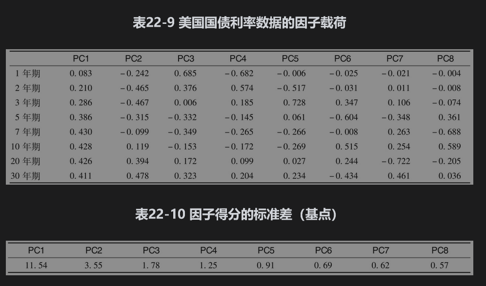
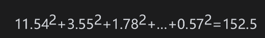
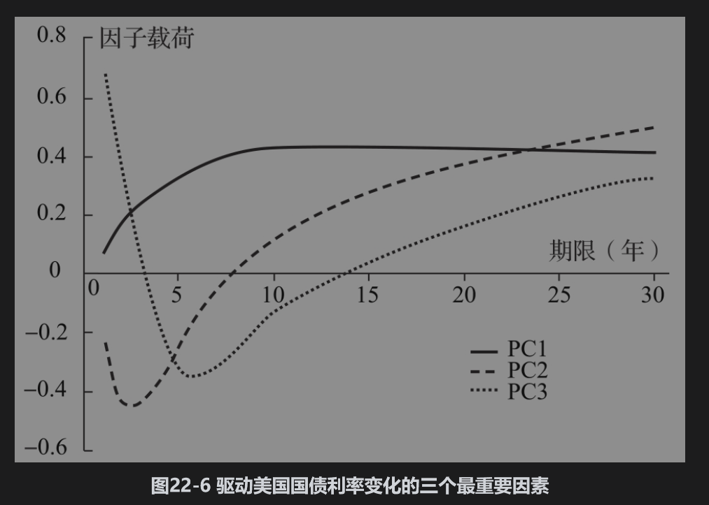
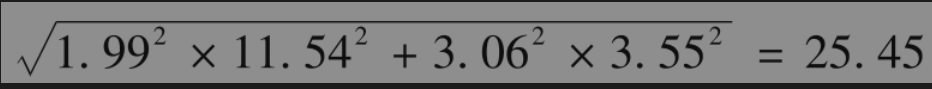
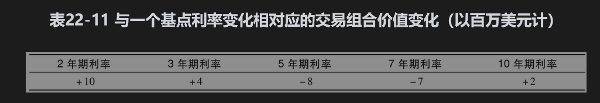

# 22.9 主成分分析法

一种可以用来分析高度相关市场变量风险的方法是主成分分析法(principal component analysis)，这是在风险管理中经常使用的一种标准统计工具。这种方法以市场变量的历史变化数据为依据，试图从中找出解释这些变化的主要成分或因素。

通过一个例子可以更好地解释这一方法。我们考虑的市场变量是期限为1年、2年、3年、5年、7年、10年、20年以及30年的互换利率。表22-9与表22-10展示的是利用2010～2020年2631天的日观察数据所产生的结果。表22-9中第1列显示所考虑利率的期限，其他8列给出的是描述利率变化的8个因子（主要成分）。第1个因子（表中的PC1）对应于利率曲线以大概为平行移动形式的变化。一个单位的PC1对应的1年利率增加量为0.083基点，2年利率的增加量为0.210个基点，并依此类推。第2个因子是表中的PC2列，它对应于收益率曲线的扭动(twist)或曲线斜率的变化，1年与7年之间利率的变化方向相同，10年与30年之间的利率变化为另一个方向。第3个因子PC3对应于利率曲线弓伸(bowing)现象，对应于这一因子的短期和长期利率朝同一方向移动，而中期利率会朝另一个相反的方向移动。对应于某一因子的利率变动被称为因子载荷(factor loading)，在我们的例子中，对于1年期的第1个因子载荷为0.083（注意，因子载荷的符号可以比较随意：我们可以改变对于某一因子的所有因子载荷的符号而模型却不会改变。例如，如果我们对第一个因子这样做，-1单位的因子将会与表22-9中由+1单位的因子所导致的利率曲线变化相同）。

由于有8个利率和8个因子，通过对8个方程求解，任何一天的利率变化都可以表示成这8个因子的线性和。在某一天的利率变化中，一个因子的量称为该天的因子得分(factor score)。

一个因子的重要性由因子得分的标准差衡量。我们例子中的因子得分标准差被列举在表22-10中，其中的因子按其重要性的次序排列。表22-10中的数量以基点表示，因此，第1个因子等于1个标准差对应于1年利率变动0.083×11.54=0.96个基点，2年利率变动0.210×11.54=2.42个基点，等等。

表22-9与表22-10中数值的计算是由网页www-2.rotman.utoronto.ca/～hull/ofod里的软件完成的。这些因子具有如下性质：因子得分在所有数据上互不相关。例如，在我们的例子中，第1个因子的得分（平行移动数量）与第2个因子的得分（扭动数量）在2631个观察日内互不相关。因子得分的方差（也就是标准差的平方）具有如下性质：将其相加后等于整个数据的方差。由表22-10得出，数据的整体方差（也就是1年利率观察值的方差、2年利率观察值的方差等之和）为

由此可以看到，第1个因子解释了$`11.54^2/152.5=87.3% `$ 的原始数据方差；前两个因子解释了$`(11.54^2+3.55^2)/152.5=95.6%`$ 的方差；第3个因子又进一步解释了2.1%的方差。这说明大部分利率变化中的风险可以由前两个或前三个因子解释。这意味着我们可以将利率产品组合的风险同这些主要因子联系起来，而不需要考虑所有8个利率。我们在图22-6中画出了表22-9给出的3个最重要的因子。

利用主成分分析法计算VaR为了说明如何应用主成分分析法来计算VaR，考虑对利率变动的风险敞口如表22-11所示的组合。2年期利率变化一个基点将会触发组合价值增加1000万美元，3年期利率变化一个基点将会触发组合价值增加400万美元，等等。如果使用前两个因子来描述利率变化（如前所述，这两个因子解释了95.6%的利率变化方差），应用表22-9中的数据可算出对于第1个因子的敏感度（对于每一个因子得分的一个基点变动所触发的以百万美元为单位的变动数量）为

               10×0.210+4×0.286-8×0.386-7×0.430+2×0.428=-1.99

和对于第2个因子的敏感度为

                  10×(-0.465)+4×(-0.467)-8×(-0.315)-7×(-0.099)+2×0.119=-3.06

假设f1和f2为因子得分（以基点数计算），交易组合价值变化的一个很好的估计值为

                     $`ΔP=-1.99f_1-3.06f_2`$

因子得分互不相关，表22-10给出了前两个因子的标准差，因此ΔP的标准差为

假设因子服从正态分布，一天持有期的99%VaR等于25.45×2.326=59.2。

从理论上讲，除了对利率变量外，主成分分析法也可用于其他市场变量。假定一家金融机构对于若干股指有风险敞口，主成分分析法可用来识别描述股指变化的因子，并且我们可以用最重要的因子取代股指进行VaR的计算。主成分分析法的有效性取决于市场变量之间的相关性。

如本章前面所述，VaR的计算往往是通过将交易组合的实际变化与市场变量的百分比变化(Δxi)结合起来，因此，为了计算VaR，对于市场变量的百分比变化（而不是其实际变化）进行主成分分析也许更为合理。